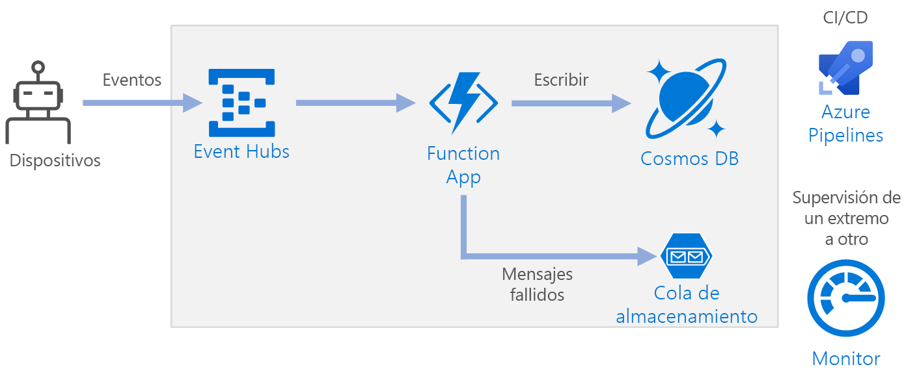

# <a name="serverless-event-processing-using-azure-functions"></a><span data-ttu-id="2bf5b-103">Procesamiento de eventos sin servidor con Azure Functions</span><span class="sxs-lookup"><span data-stu-id="2bf5b-103">Serverless event processing using Azure Functions</span></span>

<span data-ttu-id="2bf5b-104">Esta arquitectura de referencia muestra una arquitectura [sin servidor](https://azure.microsoft.com/solutions/serverless/) orientada a eventos que ingiere un flujo de datos, procesa los datos y escribe los resultados en una base de datos de back-end.</span><span class="sxs-lookup"><span data-stu-id="2bf5b-104">This reference architecture shows a [serverless](https://azure.microsoft.com/solutions/serverless/), event-driven architecture that ingests a stream of data, processes the data, and writes the results to a back-end database.</span></span> <span data-ttu-id="2bf5b-105">Hay disponible una implementación de referencia de esta arquitectura en [GitHub][github].</span><span class="sxs-lookup"><span data-stu-id="2bf5b-105">A reference implementation for this architecture is available on [GitHub][github].</span></span>



## <a name="architecture"></a><span data-ttu-id="2bf5b-107">Arquitectura</span><span class="sxs-lookup"><span data-stu-id="2bf5b-107">Architecture</span></span>

<span data-ttu-id="2bf5b-108">**Event Hubs** ingiere el flujo de datos.</span><span class="sxs-lookup"><span data-stu-id="2bf5b-108">**Event Hubs** ingests the data stream.</span></span> <span data-ttu-id="2bf5b-109">[Event Hubs][eh] está diseñado para escenarios de transmisión de datos de alto rendimiento.</span><span class="sxs-lookup"><span data-stu-id="2bf5b-109">[Event Hubs][eh] is designed for high-throughput data streaming scenarios.</span></span>

> [!NOTE]
> <span data-ttu-id="2bf5b-110">Para escenarios de IoT, se recomienda IoT Hub.</span><span class="sxs-lookup"><span data-stu-id="2bf5b-110">For IoT scenarios, we recommend IoT Hub.</span></span> <span data-ttu-id="2bf5b-111">IoT Hub tiene un punto de conexión integrado que es compatible con la API de Azure Event Hubs, por lo que puede usar cualquiera de los servicios en esta arquitectura sin realizar ningún cambio importante en el procesamiento de back-end.</span><span class="sxs-lookup"><span data-stu-id="2bf5b-111">IoT Hub has a built-in endpoint that’s compatible with the Azure Event Hubs API, so you can use either service in this architecture with no major changes in the backend processing.</span></span> <span data-ttu-id="2bf5b-112">Para más información, consulte [Conexión de dispositivos IoT a Azure: IoT Hub y Event Hubs][iot].</span><span class="sxs-lookup"><span data-stu-id="2bf5b-112">For more information, see [Connecting IoT Devices to Azure: IoT Hub and Event Hubs][iot].</span></span>

<span data-ttu-id="2bf5b-113">**Aplicación de función**.</span><span class="sxs-lookup"><span data-stu-id="2bf5b-113">**Function App**.</span></span> <span data-ttu-id="2bf5b-114">[Azure Functions][functions] es una opción de proceso sin servidor.</span><span class="sxs-lookup"><span data-stu-id="2bf5b-114">[Azure Functions][functions] is a serverless compute option.</span></span> <span data-ttu-id="2bf5b-115">Utiliza un modelo orientado a eventos, en el que un desencadenador invoca un fragmento de código (una "función").</span><span class="sxs-lookup"><span data-stu-id="2bf5b-115">It uses an event-driven model, where a piece of code (a “function”) is invoked by a trigger.</span></span> <span data-ttu-id="2bf5b-116">En esta arquitectura, cuando los eventos llegan a Event Hubs, desencadenan una función que procesa los eventos y escribe los resultados en el almacenamiento.</span><span class="sxs-lookup"><span data-stu-id="2bf5b-116">In this architecture, when events arrive at Event Hubs, they trigger a function that processes the events and writes the results to storage.</span></span>

<span data-ttu-id="2bf5b-117">Las aplicaciones de función son convenientes para procesar registros individuales procedentes de Event Hubs.</span><span class="sxs-lookup"><span data-stu-id="2bf5b-117">Function Apps are suitable for processing individual records from Event Hubs.</span></span> <span data-ttu-id="2bf5b-118">Para escenarios de procesamiento de secuencias más complejas, considere la posibilidad de usar Apache Spark con Azure Databricks o Azure Stream Analytics.</span><span class="sxs-lookup"><span data-stu-id="2bf5b-118">For more complex stream processing scenarios, consider Apache Spark using Azure Databricks, or Azure Stream Analytics.</span></span>

<span data-ttu-id="2bf5b-119">**Cosmos DB**.</span><span class="sxs-lookup"><span data-stu-id="2bf5b-119">**Cosmos DB**.</span></span> <span data-ttu-id="2bf5b-120">[Cosmos DB][cosmosdb] es un servicio de base de datos multi-modelo.</span><span class="sxs-lookup"><span data-stu-id="2bf5b-120">[Cosmos DB][cosmosdb] is a multi-model database service.</span></span> <span data-ttu-id="2bf5b-121">En este escenario, la función de procesamiento de eventos almacena registros JSON, con [SQL API][cosmosdb-sql] de Cosmos DB.</span><span class="sxs-lookup"><span data-stu-id="2bf5b-121">For this scenario, the event-processing function stores JSON records, using the Cosmos DB [SQL API][cosmosdb-sql].</span></span>

<span data-ttu-id="2bf5b-122">**Queue Storage**.</span><span class="sxs-lookup"><span data-stu-id="2bf5b-122">**Queue storage**.</span></span> <span data-ttu-id="2bf5b-123">[Queue Storage][queue] se usa para los mensajes fallidos.</span><span class="sxs-lookup"><span data-stu-id="2bf5b-123">[Queue storage][queue] is used for dead letter messages.</span></span> <span data-ttu-id="2bf5b-124">Si se produce un error al procesar un evento, la función almacena los datos del evento en una cola de mensajes fallidos para su procesamiento posterior.</span><span class="sxs-lookup"><span data-stu-id="2bf5b-124">If an error occurs while processing an event, the function stores the event data in a dead letter queue for later processing.</span></span> <span data-ttu-id="2bf5b-125">Para más información, consulte [Consideraciones de resistencia](#resiliency-considerations).</span><span class="sxs-lookup"><span data-stu-id="2bf5b-125">For more information, see [Resiliency Considerations](#resiliency-considerations).</span></span>

<span data-ttu-id="2bf5b-126">**Azure Monitor**.</span><span class="sxs-lookup"><span data-stu-id="2bf5b-126">**Azure Monitor**.</span></span> <span data-ttu-id="2bf5b-127">[Monitor][monitor] recopila métricas de rendimiento sobre los servicios de Azure implementados en la solución.</span><span class="sxs-lookup"><span data-stu-id="2bf5b-127">[Monitor][monitor] collects performance metrics about the Azure services deployed in the solution.</span></span> <span data-ttu-id="2bf5b-128">Puede visualizarlas en un panel para obtener visibilidad del mantenimiento de la solución.</span><span class="sxs-lookup"><span data-stu-id="2bf5b-128">By visualizing these in a dashboard, you can get visibility  into the health of the solution.</span></span>

<span data-ttu-id="2bf5b-129">**Azure Pipelines**.</span><span class="sxs-lookup"><span data-stu-id="2bf5b-129">**Azure Pipelines**.</span></span> <span data-ttu-id="2bf5b-130">[Pipelines][pipelines] es un servicio de integración continua (CI) y entrega continua (CD) que compila, prueba e implementa la aplicación.</span><span class="sxs-lookup"><span data-stu-id="2bf5b-130">[Pipelines][pipelines] is a continuous integration (CI) and continuous delivery (CD) service that builds, tests, and deploys the application.</span></span>

## <a name="scalability-considerations"></a><span data-ttu-id="2bf5b-131">Consideraciones sobre escalabilidad</span><span class="sxs-lookup"><span data-stu-id="2bf5b-131">Scalability considerations</span></span>

### <a name="event-hubs"></a><span data-ttu-id="2bf5b-132">Event Hubs</span><span class="sxs-lookup"><span data-stu-id="2bf5b-132">Event Hubs</span></span>

<span data-ttu-id="2bf5b-133">La capacidad de procesamiento de Event Hubs se mide en [unidades de procesamiento][eh-throughput].</span><span class="sxs-lookup"><span data-stu-id="2bf5b-133">The throughput capacity of Event Hubs is measured in [throughput units][eh-throughput].</span></span> <span data-ttu-id="2bf5b-134">Para escalar un centro de eventos automáticamente, puede habilitar el [inflado automático][eh-autoscale], que permite escalar las unidades de procesamiento en función del tráfico, hasta un máximo configurado.</span><span class="sxs-lookup"><span data-stu-id="2bf5b-134">You can autoscale an event hub by enabling [auto-inflate][eh-autoscale], which automatically scales the throughput units based on traffic, up to a configured maximum.</span></span>

<span data-ttu-id="2bf5b-135">El [desencadenador de Event Hubs][eh-trigger] de la aplicación de función se escala según el número de particiones del centro de eventos.</span><span class="sxs-lookup"><span data-stu-id="2bf5b-135">The [Event Hub trigger][eh-trigger] in the function app scales according to the number of partitions in the event hub.</span></span> <span data-ttu-id="2bf5b-136">Se asigna una instancia de la función a cada partición cada vez.</span><span class="sxs-lookup"><span data-stu-id="2bf5b-136">Each partition is assigned one function instance at a time.</span></span> <span data-ttu-id="2bf5b-137">Para maximizar el rendimiento, es posible recibir los eventos en un lote, en lugar de uno cada vez.</span><span class="sxs-lookup"><span data-stu-id="2bf5b-137">To maximize throughput, receive the events in a batch, instead of one at a time.</span></span>

### <a name="cosmos-db"></a><span data-ttu-id="2bf5b-138">Cosmos DB</span><span class="sxs-lookup"><span data-stu-id="2bf5b-138">Cosmos DB</span></span>

<span data-ttu-id="2bf5b-139">La capacidad de rendimiento de Cosmos DB se mide en [unidades de solicitud][ru] (RU).</span><span class="sxs-lookup"><span data-stu-id="2bf5b-139">Throughput capacity for Cosmos DB is measured in [Request Units][ru] (RU).</span></span> <span data-ttu-id="2bf5b-140">Para escalar un contenedor de Cosmos DB más allá de 10 000 RU, debe especificar una [clave de partición][partition-key] al crear el contenedor e incluir la clave de partición en todos los documentos que cree.</span><span class="sxs-lookup"><span data-stu-id="2bf5b-140">In order to scale a Cosmos DB container past 10,000 RU, you must specify a [partition key][partition-key] when you create the container, and include the partition key in every document that you create.</span></span>

<span data-ttu-id="2bf5b-141">Estas son algunas características de una buena clave de partición:</span><span class="sxs-lookup"><span data-stu-id="2bf5b-141">Here are some characteristics of a good partition key:</span></span>

- <span data-ttu-id="2bf5b-142">El espacio de valores de la clave es grande.</span><span class="sxs-lookup"><span data-stu-id="2bf5b-142">The key value space is large.</span></span>
- <span data-ttu-id="2bf5b-143">Habrá una distribución uniforme de lecturas y escrituras por valor de clave, evitando las claves frecuentes.</span><span class="sxs-lookup"><span data-stu-id="2bf5b-143">There will be an even distribution of reads/writes per key value, avoiding hot keys.</span></span>
- <span data-ttu-id="2bf5b-144">El máximo de datos almacenados para cualquier valor de clave único no superará el tamaño de partición física máximo (10 GB).</span><span class="sxs-lookup"><span data-stu-id="2bf5b-144">The maximum data stored for any single key value will not exceed the maximum physical partition size (10 GB).</span></span>
- <span data-ttu-id="2bf5b-145">La clave de partición de un documento no cambiará.</span><span class="sxs-lookup"><span data-stu-id="2bf5b-145">The partition key for a document won't change.</span></span> <span data-ttu-id="2bf5b-146">No se puede actualizar la clave de partición de un documento existente.</span><span class="sxs-lookup"><span data-stu-id="2bf5b-146">You can't update the partition key on an existing document.</span></span>

<span data-ttu-id="2bf5b-147">En el escenario de esta arquitectura de referencia, la función almacena exactamente un documento por cada dispositivo que envía datos.</span><span class="sxs-lookup"><span data-stu-id="2bf5b-147">In the scenario for this reference architecture, the function stores exactly one document per device that is sending data.</span></span> <span data-ttu-id="2bf5b-148">La función actualiza continuamente los documentos con el estado del dispositivo más reciente mediante una operación de actualización e inserción de datos.</span><span class="sxs-lookup"><span data-stu-id="2bf5b-148">The function continually updates the documents with latest device status, using an upsert operation.</span></span> <span data-ttu-id="2bf5b-149">El identificador de dispositivo es una buena clave de partición para este escenario, ya que las escrituras se distribuirán uniformemente entre las claves y el tamaño de cada partición estará enlazado estrictamente porque hay un documento único por cada valor de clave.</span><span class="sxs-lookup"><span data-stu-id="2bf5b-149">Device ID is a good partition key for this scenario, because writes will be evenly distributed across the keys, and the size of each partition will be strictly bounded, because there is a single document for each key value.</span></span> <span data-ttu-id="2bf5b-150">Para más información sobre las claves de partición, consulte [Particionado y escalado en Azure Cosmos DB][cosmosdb-scale].</span><span class="sxs-lookup"><span data-stu-id="2bf5b-150">For more information about partition keys, see [Partition and scale in Azure Cosmos DB][cosmosdb-scale].</span></span>

## <a name="resiliency-considerations"></a><span data-ttu-id="2bf5b-151">Consideraciones de resistencia</span><span class="sxs-lookup"><span data-stu-id="2bf5b-151">Resiliency considerations</span></span>

<span data-ttu-id="2bf5b-152">Al usar el desencadenador de Event Hubs con Azure Functions, debe detectar las excepciones dentro del bucle de procesamiento.</span><span class="sxs-lookup"><span data-stu-id="2bf5b-152">When using the Event Hubs trigger with Functions, catch exceptions within your processing loop.</span></span> <span data-ttu-id="2bf5b-153">Si se produce una excepción no controlada, el runtime de Azure Functions no vuelve a intentar el envío de los mensajes.</span><span class="sxs-lookup"><span data-stu-id="2bf5b-153">If an unhandled exception occurs, the Functions runtime does not retry the messages.</span></span> <span data-ttu-id="2bf5b-154">Si no se puede procesar un mensaje, coloque el mensaje en una cola de mensajes fallidos.</span><span class="sxs-lookup"><span data-stu-id="2bf5b-154">If a message cannot be processed, put the message into a dead letter queue.</span></span> <span data-ttu-id="2bf5b-155">Utilice un proceso fuera de banda para examinar los mensajes y determinar la acción correctiva.</span><span class="sxs-lookup"><span data-stu-id="2bf5b-155">Use an out-of-band process to examine the messages and determine corrective action.</span></span>

<span data-ttu-id="2bf5b-156">El código siguiente muestra cómo se detectan las excepciones en la función de ingesta y cómo se colocan los mensajes no procesados en una cola de mensajes fallidos.</span><span class="sxs-lookup"><span data-stu-id="2bf5b-156">The following code shows how the ingestion function catches exceptions and puts unprocessed messages onto a dead letter queue.</span></span>

```csharp
[FunctionName("RawTelemetryFunction")]
[StorageAccount("DeadLetterStorage")]
public static async Task RunAsync(
    [EventHubTrigger("%EventHubName%", Connection = "EventHubConnection", ConsumerGroup ="%EventHubConsumerGroup%")]EventData[] messages,
    [Queue("deadletterqueue")] IAsyncCollector<DeadLetterMessage> deadLetterMessages,
    ILogger logger)
{
    foreach (var message in messages)
    {
        DeviceState deviceState = null;

        try
        {
            deviceState = telemetryProcessor.Deserialize(message.Body.Array, logger);
        }
        catch (Exception ex)
        {
            logger.LogError(ex, "Error deserializing message", message.SystemProperties.PartitionKey, message.SystemProperties.SequenceNumber);
            await deadLetterMessages.AddAsync(new DeadLetterMessage { Issue = ex.Message, EventData = message });
        }

        try
        {
            await stateChangeProcessor.UpdateState(deviceState, logger);
        }
        catch (Exception ex)
        {
            logger.LogError(ex, "Error updating status document", deviceState);
            await deadLetterMessages.AddAsync(new DeadLetterMessage { Issue = ex.Message, EventData = message, DeviceState = deviceState });
        }
    }
}
```

<span data-ttu-id="2bf5b-157">Observe que la función utiliza el [enlace de salida de Queue Storage][queue-binding] para colocar los elementos en la cola.</span><span class="sxs-lookup"><span data-stu-id="2bf5b-157">Notice that the function uses the [Queue storage output binding][queue-binding] to put items in the queue.</span></span>

<span data-ttu-id="2bf5b-158">El código mostrado anteriormente también registra las excepciones en Application Insights.</span><span class="sxs-lookup"><span data-stu-id="2bf5b-158">The code shown above also logs exceptions to Application Insights.</span></span> <span data-ttu-id="2bf5b-159">Puede usar el número de secuencia y la clave de partición para correlacionar los mensajes fallidos con las excepciones en los registros.</span><span class="sxs-lookup"><span data-stu-id="2bf5b-159">You can use the partition key and sequence number to correlate dead letter messages with the exceptions in the logs.</span></span>

<span data-ttu-id="2bf5b-160">Los mensajes de la cola de mensajes fallidos deben tener suficiente información para que pueda entender el contexto del error.</span><span class="sxs-lookup"><span data-stu-id="2bf5b-160">Messages in the dead letter queue should have enough information so that you can understand the context of error.</span></span> <span data-ttu-id="2bf5b-161">En este ejemplo, la clase `DeadLetterMessage` contiene el mensaje con la excepción, los datos del evento original y el mensaje del evento deserializado (si está disponible).</span><span class="sxs-lookup"><span data-stu-id="2bf5b-161">In this example, the `DeadLetterMessage` class contains the exception message, the original event data, and the deserialized event message (if available).</span></span>

```csharp
public class DeadLetterMessage
{
    public string Issue { get; set; }
    public EventData EventData { get; set; }
    public DeviceState DeviceState { get; set; }
}
```

<span data-ttu-id="2bf5b-162">Use [Azure Monitor][monitor] para supervisar el centro de eventos.</span><span class="sxs-lookup"><span data-stu-id="2bf5b-162">Use [Azure Monitor][monitor] to monitor the event hub.</span></span> <span data-ttu-id="2bf5b-163">Si ve que hay entrada pero no hay salida, significa que no se están procesando los mensajes.</span><span class="sxs-lookup"><span data-stu-id="2bf5b-163">If you see there is input but no output, it means that messages are not being processed.</span></span> <span data-ttu-id="2bf5b-164">En ese caso, vaya a [Log Analytics][log-analytics] y busque excepciones u otros errores.</span><span class="sxs-lookup"><span data-stu-id="2bf5b-164">In that case, go into [Log Analytics][log-analytics] and look for exceptions or other errors.</span></span>

## <a name="disaster-recovery-considerations"></a><span data-ttu-id="2bf5b-165">Consideraciones acerca de la recuperación ante desastres</span><span class="sxs-lookup"><span data-stu-id="2bf5b-165">Disaster recovery considerations</span></span>

<span data-ttu-id="2bf5b-166">La implementación que se muestra aquí reside en una sola región de Azure.</span><span class="sxs-lookup"><span data-stu-id="2bf5b-166">The deployment shown here resides in a single Azure region.</span></span> <span data-ttu-id="2bf5b-167">Para un enfoque más resistente a la recuperación ante desastres, aproveche las ventajas de las características de distribución geográfica de los distintos servicios:</span><span class="sxs-lookup"><span data-stu-id="2bf5b-167">For a more resilient approach to disaster-recovery, take advantage of geo-distribution features in the various services:</span></span>

- <span data-ttu-id="2bf5b-168">**Event Hubs**.</span><span class="sxs-lookup"><span data-stu-id="2bf5b-168">**Event Hubs**.</span></span> <span data-ttu-id="2bf5b-169">Cree dos espacios de nombres de Event Hubs, un espacio de nombres principal (activo) y un espacio de nombres secundario (pasivo).</span><span class="sxs-lookup"><span data-stu-id="2bf5b-169">Create two Event Hubs namespaces, a primary (active) namespace and a secondary (passive) namespace.</span></span> <span data-ttu-id="2bf5b-170">Los mensajes se enrutan automáticamente al espacio de nombres activo a menos que realice una conmutación por error al espacio de nombres secundario.</span><span class="sxs-lookup"><span data-stu-id="2bf5b-170">Messages are automatically routed to the active namespace unless you fail over to the secondary namespace.</span></span> <span data-ttu-id="2bf5b-171">Para más información, consulte [Recuperación ante desastres con redundancia geográfica de Azure Event Hubs][eh-dr].</span><span class="sxs-lookup"><span data-stu-id="2bf5b-171">For more information, see [Azure Event Hubs Geo-disaster recovery][eh-dr].</span></span>

- <span data-ttu-id="2bf5b-172">**Aplicación de función**.</span><span class="sxs-lookup"><span data-stu-id="2bf5b-172">**Function App**.</span></span> <span data-ttu-id="2bf5b-173">Implemente una segunda aplicación de función que está a la espera para leer desde el espacio de nombres secundario de Event Hubs.</span><span class="sxs-lookup"><span data-stu-id="2bf5b-173">Deploy a second function app that is waiting to read from the secondary Event Hubs namespace.</span></span> <span data-ttu-id="2bf5b-174">Esta función escribe en una cuenta de almacenamiento secundaria para la cola de mensajes fallidos.</span><span class="sxs-lookup"><span data-stu-id="2bf5b-174">This function writes to a secondary storage account for dead letter queue.</span></span>

- <span data-ttu-id="2bf5b-175">**Cosmos DB**.</span><span class="sxs-lookup"><span data-stu-id="2bf5b-175">**Cosmos DB**.</span></span> <span data-ttu-id="2bf5b-176">Cosmos DB admite [varias regiones maestras][cosmosdb-geo], lo que permite operaciones de escritura en cualquier región que se agregue a la cuenta de Cosmos DB.</span><span class="sxs-lookup"><span data-stu-id="2bf5b-176">Cosmos DB supports [multiple master regions][cosmosdb-geo], which enables writes to any region that you add to your Cosmos DB account.</span></span> <span data-ttu-id="2bf5b-177">Si no habilita la funcionalidad de arquitectura multimaestro, todavía puede conmutar por error a la región de escritura principal.</span><span class="sxs-lookup"><span data-stu-id="2bf5b-177">If you don’t enable multi-master, you can still fail over the primary write region.</span></span> <span data-ttu-id="2bf5b-178">Los SDK de cliente de Cosmos DB y los enlaces de la función de Azure controlan automáticamente la conmutación por error, por lo que no es necesario actualizar los parámetros de configuración de la aplicación.</span><span class="sxs-lookup"><span data-stu-id="2bf5b-178">The Cosmos DB client SDKs and the Azure Function bindings automatically handle the failover, so you don’t need to update any application configuration settings.</span></span>

- <span data-ttu-id="2bf5b-179">**Azure Storage**.</span><span class="sxs-lookup"><span data-stu-id="2bf5b-179">**Azure Storage**.</span></span> <span data-ttu-id="2bf5b-180">Use almacenamiento [RA-GRS][ra-grs] para la cola de mensajes fallidos.</span><span class="sxs-lookup"><span data-stu-id="2bf5b-180">Use [RA-GRS][ra-grs] storage for the dead letter queue.</span></span> <span data-ttu-id="2bf5b-181">Esto crea una réplica de solo lectura en otra región.</span><span class="sxs-lookup"><span data-stu-id="2bf5b-181">This creates a read-only replica in another region.</span></span> <span data-ttu-id="2bf5b-182">Si la región primaria deja de estar disponible, puede leer los elementos que hay actualmente en la cola.</span><span class="sxs-lookup"><span data-stu-id="2bf5b-182">If the primary region becomes unavailable, you can read the items currently in the queue.</span></span> <span data-ttu-id="2bf5b-183">Además, aprovisione otra cuenta de almacenamiento en la región secundaria en la que la función pueda escribir después de una conmutación por error.</span><span class="sxs-lookup"><span data-stu-id="2bf5b-183">In addition, provision another storage account in the secondary region that the function can write to after a fail-over.</span></span>

## <a name="deploy-the-solution"></a><span data-ttu-id="2bf5b-184">Implementación de la solución</span><span class="sxs-lookup"><span data-stu-id="2bf5b-184">Deploy the solution</span></span>

<span data-ttu-id="2bf5b-185">Para implementar esta arquitectura de referencia, consulte el [Léame de GitHub][readme].</span><span class="sxs-lookup"><span data-stu-id="2bf5b-185">To deploy this reference architecture, view the [GitHub readme][readme].</span></span>

<!-- links -->

[cosmosdb]: /azure/cosmos-db/introduction
[cosmosdb-geo]: /azure/cosmos-db/distribute-data-globally
[cosmosdb-scale]: /azure/cosmos-db/partition-data
[cosmosdb-sql]: /azure/cosmos-db/sql-api-introduction
[eh]: /azure/event-hubs/
[eh-autoscale]: /azure/event-hubs/event-hubs-auto-inflate
[eh-dr]: /azure/event-hubs/event-hubs-geo-dr
[eh-throughput]: /azure/event-hubs/event-hubs-features#throughput-units
[eh-trigger]: /azure/azure-functions/functions-bindings-event-hubs
[functions]: /azure/azure-functions/functions-overview
[iot]: /azure/iot-hub/iot-hub-compare-event-hubs
[log-analytics]: /azure/log-analytics/log-analytics-queries
[monitor]: /azure/azure-monitor/overview
[partition-key]: /azure/cosmos-db/partition-data
[pipelines]: /azure/devops/pipelines/index
[queue]: /azure/storage/queues/storage-queues-introduction
[queue-binding]: /azure/azure-functions/functions-bindings-storage-queue#output
[ra-grs]: /azure/storage/common/storage-redundancy-grs
[ru]: /azure/cosmos-db/request-units

[github]: https://github.com/mspnp/serverless-reference-implementation
[readme]: https://github.com/mspnp/serverless-reference-implementation/blob/master/README.md
