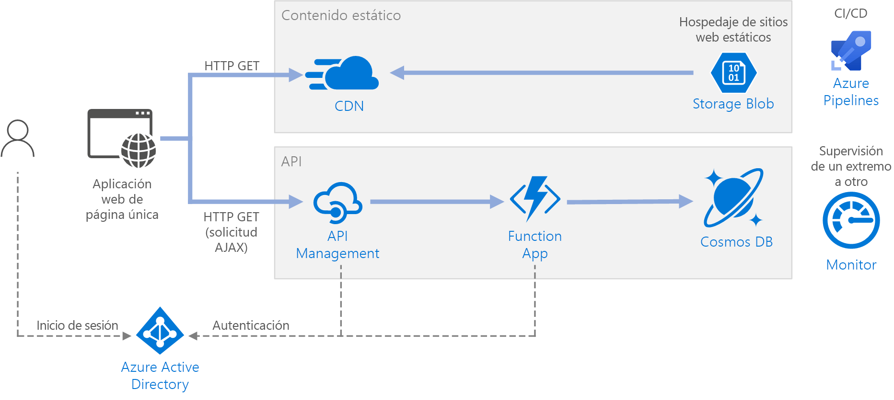

# <a name="serverless-web-application"></a>Aplicación web sin servidor 

Esta arquitectura de referencia muestra una aplicación web sin servidor. La aplicación proporciona contenido estático desde Azure Blob Storage e implementa una API con Azure Functions. La API lee datos de Cosmos DB y devuelve los resultados a la aplicación web. Hay disponible una implementación de referencia de esta arquitectura en [GitHub][github].


 
El término sin servidor tiene dos significados diferentes pero relacionados:

- **Back-end como servicio** (BaaS). Los servicios de back-end en la nube, como el almacenamiento y las bases de datos, proporcionan API que permiten que las aplicaciones cliente se conecten directamente a estos servicios. 
- **Funciones como servicio** (FaaS). En este modelo, una "función" es un fragmento de código que se implementa en la nube y se ejecuta en un entorno de hospedaje que abstrae completamente los servidores que ejecutan el código. 

Ambas definiciones tienen en común la idea de que los desarrolladores y el personal de DevOps no necesitan implementar, configurar ni administrar servidores. Esta arquitectura de referencia se centra en FaaS con Azure Functions, aunque la entrega de contenido web desde Azure Blob Storage es un ejemplo de BaaS. Algunas características importantes de FaaS son:

1. La plataforma asigna dinámicamente los recursos de proceso según sea necesario.
1. Precios basados en el consumo: se le cobrará solo por los recursos de proceso utilizados para ejecutar el código.
1. Los recursos de proceso se escalan a petición en función del tráfico, sin necesidad de que el desarrollador realice ninguna configuración.

Las funciones se ejecutan cuando se produce un desencadenador externo, como una solicitud HTTP o un mensaje que llega a una cola. Esto hace que se trate de un [estilo de arquitectura orientada a eventos][event-driven] para arquitecturas sin servidor. Para coordinar el trabajo entre los componentes de la arquitectura, considere el uso de agentes de mensajes o patrones de publicación y suscripción. Para elegir entre las tecnologías de mensajería de Azure, consulte [Elección entre los servicios de Azure que entregan mensajes][azure-messaging].

## <a name="architecture"></a>Arquitectura
La arquitectura consta de los siguientes componentes:

**Blob Storage**. El contenido web estático, como los archivos HTML, CSS y JavaScript, se almacena en Azure Blob Storage y se entrega a los clientes mediante el uso del [hospedaje de sitios web estáticos][static-hosting]. Toda la interacción dinámica se produce mediante código JavaScript que hace llamadas a las API de back-end. No hay código en el servidor para representar la página web. El hospedaje de sitios web estáticos admite la indexación de documentos y páginas de error 404 personalizadas.

> [!NOTE]
> El hospedaje de sitios web estáticos está actualmente en [versión preliminar][static-hosting-preview].

**CDN**. Use [Azure Content Delivery Network][cdn] (CDN) para almacenar en caché el contenido y así reducir la latencia y acelerar la entrega de contenido, además de proporcionar un punto de conexión HTTPS.

**Aplicaciones de función**. [Azure Functions][functions] es una opción de proceso sin servidor. Utiliza un modelo orientado a eventos, en el que un desencadenador invoca un fragmento de código (una "función"). En esta arquitectura, la función se invoca cuando un cliente realiza una solicitud HTTP. La solicitud siempre se enruta mediante una puerta de enlace de API, como se describe a continuación.

**API Management**. [API Management][apim] proporciona una puerta de enlace de API que se coloca delante de la función HTTP. Puede usar API Management para publicar y administrar las API que usan las aplicaciones cliente. El uso de una puerta de enlace ayuda a desacoplar la aplicación de front-end de las API de back-end. Por ejemplo, API Management puede reescribir las direcciones URL, transformar las solicitudes antes de alcanzar el back-end, establecer los encabezados de solicitud o respuesta y así sucesivamente.

API Management también se puede utilizar para implementar cuestiones transversales, como:

- Aplicación de cuotas de uso y límites de frecuencia
- Validación de tokens de OAuth para la autenticación
- Habilitación de solicitudes entre orígenes (CORS)
- Almacenamiento en caché de las respuestas
- Supervisión y registro de solicitudes  

Si no necesita toda la funcionalidad proporcionada por API Management, otra opción es usar [Functions Proxies][functions-proxy]. Esta característica de Azure Functions le permite definir una única superficie de API para varias aplicaciones de función, mediante la creación de rutas a las funciones de back-end. Functions Proxies también puede realizar transformaciones limitadas en la solicitud y la respuesta HTTP. Sin embargo, no proporciona las mismas funcionalidades enriquecidas basadas en directivas de API Management.

**Cosmos DB**. [Cosmos DB][cosmosdb] es un servicio de base de datos multi-modelo. En este escenario, la aplicación de función recupera documentos de Cosmos DB en respuesta a solicitudes HTTP GET del cliente.

**Azure Active Directory** (Azure AD). Los usuarios inician sesión en la aplicación web con sus credenciales de Azure AD. Azure AD devuelve un token de acceso para la API que la aplicación web utiliza para autenticar las solicitudes de API (consulte [Autenticación](#authentication)).

**Azure Monitor**. [Monitor][monitor] recopila métricas de rendimiento sobre los servicios de Azure implementados en la solución. Puede visualizarlas en un panel para obtener visibilidad del mantenimiento de la solución. También se recopilan los registros de aplicación.

**Azure Pipelines**. [Pipelines][pipelines] es un servicio de integración continua (CI) y entrega continua (CD) que compila, prueba e implementa la aplicación.

## <a name="recommendations"></a>Recomendaciones

### <a name="function-app-plans"></a>Planes de Function App

Azure Functions admite dos modelos de hospedaje. Con el **plan de consumo**, la potencia de proceso se asigna automáticamente cuando se ejecuta el código.  Con el plan de **App Service**, se asigna un conjunto de máquinas virtuales para el código. El plan de App Service define el número de máquinas virtuales y el tamaño de máquina virtual. 

Tenga en cuenta que el plan de App Service no es estrictamente *sin servidor*, según la definición proporcionada anteriormente. Sin embargo, el modelo de programación es el mismo y el mismo código de la función se puede ejecutar en un plan de consumo y en un plan de App Service.

Estos son algunos de los factores a tener en cuenta al elegir qué tipo de plan se va a usar:

- **Arranque en frío**. Con el plan de consumo, una función que no se ha invocado recientemente requerirá cierta latencia adicional la próxima vez que se ejecute. Esta latencia adicional se debe a la asignación y preparación del entorno de tiempo de ejecución. Normalmente está en el orden de segundos, pero depende de varios factores, como el número de dependencias que se deban cargar. Consulte [Descripción del arranque en frío sin servidor][functions-cold-start] para más información. El arranque en frío es normalmente más una cuestión de cargas de trabajo interactivas (desencadenadores HTTP) que de cargas de trabajo controladas por mensajes asincrónicas (desencadenadores de colas o de Event Hubs), porque los usuarios observan directamente la latencia adicional.
- **Período de tiempo de expiración**.  En el plan de consumo, la ejecución de una función agota el tiempo de espera tras un período de tiempo [configurable][functions-timeout] (hasta un máximo de 10 minutos)
- **Aislamiento de red virtual**. El uso de un plan de App Service permite la ejecución de las funciones dentro de un [Entorno de App Service][ase], que es un entorno de hospedaje dedicado y aislado.
- **Modelo de precios**. El plan de consumo se factura por el número de ejecuciones y el consumo de recursos (memoria y tiempo de ejecución). El plan de App Service se factura por horas en función de la SKU de las instancias de máquina virtual. A menudo, el plan de consumo puede ser más económico que un plan de App Service, ya que solo se paga por los recursos de proceso utilizados. Esto es especialmente cierto si el tráfico sufre puntos máximos y mínimos. Sin embargo, si una aplicación experimenta un rendimiento de alto volumen constante, un plan de App Service puede costar menos que el plan de consumo.
- **Escalado**. Una gran ventaja del modelo de consumo es que se escala dinámicamente según sea necesario, en función del tráfico entrante. Aunque este escalado sucede rápidamente, hay un período de inicialización. Para algunas cargas de trabajo, puede aprovisionar en exceso deliberadamente las máquinas virtuales de manera que pueda controlar ráfagas de tráfico con un tiempo de inicialización igual a cero. En ese caso, considere la posibilidad de un plan de App Service.

### <a name="function-app-boundaries"></a>Límites de una aplicación de función

Una *aplicación de función* hospeda la ejecución de una o más *funciones*. Puede usar una aplicación de función para agrupar varias funciones como una unidad lógica. Dentro de una aplicación de función, las funciones comparten la misma configuración de aplicación, plan de hospedaje y ciclo de vida de implementación. Cada aplicación de función tiene su propio nombre de host.  

Use aplicaciones de función para agrupar funciones que comparten el mismo ciclo de vida y configuración. Las funciones que no comparten el mismo ciclo de vida deben hospedarse en distintas aplicaciones de función. 

Considere la posibilidad de adoptar un enfoque de microservicios, en el que cada aplicación de función representa un microservicio, que posiblemente se compone de varias funciones relacionadas. En una arquitectura de microservicios, los servicios deben tener un acoplamiento flexible y una alta cohesión funcional. Un acoplamiento *flexible* significa que puede cambiar un servicio sin necesidad de que los demás se actualicen al mismo tiempo. *Cohesiva* significa que un servicio tiene un propósito único y bien definido. Para más información sobre estas ideas, consulte [Diseño de microservicios: análisis del dominio][microservices-domain-analysis].

### <a name="function-bindings"></a>Enlaces de funciones

Utilice [enlaces][functions-bindings] de funciones cuando sea posible. Los enlaces proporcionan una forma declarativa de conectar el código a los datos e integrar con otros servicios de Azure. Un enlace de entrada rellena un parámetro de entrada a partir de un origen de datos externo. Un enlace de salida envía el valor devuelto de la función a un receptor de datos, como una cola o una base de datos.

Por ejemplo, la función `GetStatus` de la implementación de referencia usa el [enlace de entrada][cosmosdb-input-binding] de Cosmos DB. Este enlace está configurado para buscar un documento en Cosmos DB mediante los parámetros de consulta que se toman de la cadena de consulta de la solicitud HTTP. Si se encuentra el documento, se pasa a la función como un parámetro.

```csharp
[FunctionName("GetStatusFunction")]
public static Task<IActionResult> Run(
    [HttpTrigger(AuthorizationLevel.Function, "get", Route = null)] HttpRequest req, 
    [CosmosDB(
        databaseName: "%COSMOSDB_DATABASE_NAME%",
        collectionName: "%COSMOSDB_DATABASE_COL%",
        ConnectionStringSetting = "COSMOSDB_CONNECTION_STRING",
        Id = "{Query.deviceId}",
        PartitionKey = "{Query.deviceId}")] dynamic deviceStatus, 
    ILogger log)
{
    ...
}
```

Mediante el uso de enlaces, no es necesario escribir código que se comunique directamente con el servicio, lo que simplifica el código de la función y también abstrae los detalles del origen o el receptor de datos. En algunos casos, sin embargo, puede que necesite una lógica más compleja que la que proporciona el enlace. En ese caso, use directamente los SDK de cliente de Azure.

## <a name="scalability-considerations"></a>Consideraciones sobre escalabilidad

**Funciones**. Para el plan de consumo, el desencadenador HTTP se escala según el tráfico. Hay un límite para el número de instancias simultáneas de la función, pero cada instancia puede procesar más de una solicitud a la vez. Para un plan de App Service, el desencadenador HTTP se escala según el número de instancias de máquina virtual, que puede ser un valor fijo o se puede escalar automáticamente basándose en un conjunto de reglas de escalado automático. Para más información, consulte [Escalado y hospedaje de Azure Functions][functions-scale]. 

**Cosmos DB**. La capacidad de rendimiento de Cosmos DB se mide en [unidades de solicitud][ru] (RU). 1 RU corresponde al rendimiento necesario para una solicitud GET de un documento de 1 KB. Para escalar un contenedor de Cosmos DB más allá de 10 000 RU, debe especificar una [clave de partición][partition-key] al crear el contenedor e incluir la clave de partición en todos los documentos que cree. Para más información sobre las claves de partición, consulte [Particionado y escalado en Azure Cosmos DB][cosmosdb-scale].

**API Management**. API Management se puede escalar horizontalmente y admite el escalado automático basado en reglas. Tenga en cuenta que el proceso de escalado tarda al menos 20 minutos. Si se trata de tráfico por ráfagas, se debe aprovisionar para la máxima ráfaga de tráfico esperada. Sin embargo, el escalado automático es útil para controlar las variaciones horarias o diarias del tráfico. Para más información, consulte [Escalado automático de una instancia de Azure API Management][apim-scale].

## <a name="disaster-recovery-considerations"></a>Consideraciones acerca de la recuperación ante desastres

La implementación que se muestra aquí reside en una sola región de Azure. Para un enfoque más resistente a la recuperación ante desastres, aproveche las ventajas de las características de distribución geográfica de los distintos servicios:

- API Management admite la implementación en varias regiones, lo que se puede utilizar distribuir una única instancia de API Management en cualquier número de regiones de Azure. Para más información, consulte [Implementación de una instancia del servicio Azure API Management en varias regiones de Azure][api-geo].

- Use [Traffic Manager][tm] para enrutar las solicitudes HTTP a la región primaria. Si la aplicación de función que se ejecuta en dicha región no está disponible, Traffic Manager conmuta por error a la región secundaria.

- Cosmos DB admite [varias regiones maestras][cosmosdb-geo], lo que permite operaciones de escritura en cualquier región que se agregue a la cuenta de Cosmos DB. Si no habilita la funcionalidad de arquitectura multimaestro, todavía puede conmutar por error a la región de escritura principal. Los SDK de cliente de Cosmos DB y los enlaces de la función de Azure controlan automáticamente la conmutación por error, por lo que no es necesario actualizar los parámetros de configuración de la aplicación.

## <a name="security-considerations"></a>Consideraciones sobre la seguridad

### <a name="authentication"></a>Autenticación

La API `GetStatus` de la implementación de referencia usa Azure AD para autenticar las solicitudes. Azure AD admite el protocolo OpenID Connect, que es un protocolo de autenticación que se basa en el protocolo OAuth 2.

En esta arquitectura, la aplicación cliente es una aplicación de página única (SPA) que se ejecuta en el explorador. Este tipo de aplicación cliente no puede contener un secreto de cliente ni un código de autorización oculto, por lo que el flujo de concesión implícita es adecuado. (Consulte [¿Qué flujo de OAuth 2.0 debo usar?][oauth-flow]). Este es el flujo general:

1. El usuario hace clic en el vínculo "Iniciar sesión" de la aplicación web.
1. El explorador se redirige la página de inicio de sesión de Azure AD. 
1. El usuario inicia sesión.
1. Azure AD redirige de vuelta a la aplicación cliente, incluyendo un token de acceso en el fragmento de dirección URL.
1. Cuando la aplicación web llama a la API, incluye el token de acceso en el encabezado de autenticación. El identificador de aplicación se envía como notificación de audiencia ("aud") en el token de acceso. 
1. La API de back-end valida el token de acceso.

Para configurar la autenticación:

- Registre una aplicación en el inquilino de Azure AD. Esto genera un identificador de aplicación, que el cliente incluye con la dirección URL de inicio de sesión.

- Habilite la autenticación de Azure AD en la aplicación de función. Para más información, consulte [Autenticación y autorización en Azure App Service][app-service-auth].

- Agregue una directiva a API Management para autorizar previamente la solicitud mediante la validación del token de acceso:

    ```xml
    <validate-jwt header-name="Authorization" failed-validation-httpcode="401" failed-validation-error-message="Unauthorized. Access token is missing or invalid.">
        <openid-config url="https://login.microsoftonline.com/[Azure AD tenant ID]/.well-known/openid-configuration" />
        <required-claims>
            <claim name="aud">
                <value>[Application ID]</value>
            </claim>
        </required-claims>
    </validate-jwt>
    ```

Para más información, consulte el [Léame de GitHub][readme].

### <a name="authorization"></a>Autorización

En muchas aplicaciones, la API de back-end debe comprobar si un usuario tiene permiso para realizar una acción determinada. Se recomienda el uso de la [autorización basada en notificaciones][claims], en la que el proveedor de identidades (en este caso, Azure AD) conduce la información sobre el usuario utilizada para tomar decisiones de autorización. 

Se proporcionan algunas notificaciones dentro del token de identificador que Azure AD devuelve al cliente. Puede obtener estas notificaciones procedentes de la aplicación de función mediante el examen del encabezado X-MS-CLIENT-PRINCIPAL de la solicitud. Para otras notificaciones, use [Microsoft Graph][graph] para consultar Azure AD (requiere consentimiento del usuario durante el inicio de sesión). 

Por ejemplo, al registrar una aplicación en Azure AD, puede definir un conjunto de roles de aplicación en el manifiesto de registro de la aplicación. Cuando un usuario inicia sesión en la aplicación, Azure AD incluye una notificación "roles" por cada rol que se ha concedido al usuario (incluidos los roles heredados por la pertenencia a grupos). 

En la implementación de referencia, la función comprueba si el usuario autenticado es miembro del rol de aplicación `GetStatus`. Si no es así, la función devuelve una respuesta HTTP no autorizado (401). 

```csharp
[FunctionName("GetStatusFunction")]
public static Task<IActionResult> Run(
    [HttpTrigger(AuthorizationLevel.Function, "get", "post", Route = null)] HttpRequest req, 
    [CosmosDB(
        databaseName: "%COSMOSDB_DATABASE_NAME%",
        collectionName: "%COSMOSDB_DATABASE_COL%",
        ConnectionStringSetting = "COSMOSDB_CONNECTION_STRING",
        Id = "{Query.deviceId}",
        PartitionKey = "{Query.deviceId}")] dynamic deviceStatus, 
    ILogger log)
{
    log.LogInformation("Processing GetStatus request.");

    return req.HandleIfAuthorizedForRoles(new[] { GetDeviceStatusRoleName },
        async () =>
        {
            string deviceId = req.Query["deviceId"];
            if (deviceId == null)
            {
                return new BadRequestObjectResult("Missing DeviceId");
            }

            return await Task.FromResult<IActionResult>(deviceStatus != null
                    ? (ActionResult)new OkObjectResult(deviceStatus)
                    : new NotFoundResult());
        },
        log);
}
```

En este ejemplo de código, `HandleIfAuthorizedForRoles` es un método de extensión que comprueba la notificación de rol y devuelve HTTP 401 si no se encuentra la notificación. Puede encontrar el código fuente [aquí][HttpRequestAuthorizationExtensions]. Observe que `HandleIfAuthorizedForRoles` toma un parámetro `ILogger`. Debe registrar las solicitudes no autorizadas para disponer de un registro de auditoría y poder diagnosticar problemas si es necesario. Al mismo tiempo, evite incluir información detallada dentro de la respuesta HTTP 401.

### <a name="cors"></a>CORS

En esta arquitectura de referencia, la aplicación web y la API no comparten el mismo origen. Esto significa que, cuando la aplicación llama a la API, es una solicitud entre orígenes. La seguridad del explorador impide que una página web realice solicitudes AJAX a otro dominio. Esta restricción se conoce como la *directiva de mismo origen* y evita que un sitio malintencionado lea información confidencial de otro sitio. Para habilitar una solicitud entre orígenes, agregue una [directiva][cors-policy] de uso compartido de recursos entre orígenes (CORS) a la puerta de enlace de API Management:

```xml
<cors allow-credentials="true">
    <allowed-origins>
        <origin>[Website URL]</origin>
    </allowed-origins>
    <allowed-methods>
        <method>GET</method>
    </allowed-methods>
    <allowed-headers>
        <header>*</header>
    </allowed-headers>
</cors>
```

En este ejemplo, el atributo **allow-credentials** es **true**. Esto autoriza al explorador para el envío de las credenciales (incluidas las cookies) con la solicitud. En caso contrario, el explorador no envía las credenciales con una solicitud entre orígenes de forma predeterminada.

> [!NOTE] 
> Sea muy cuidadoso al establecer **allow-credentials** en **true**, ya que significa que un sitio web puede enviar las credenciales del usuario a la API en nombre del usuario, sin que el usuario sea consciente de ello. Debe confiar en el origen permitido.

### <a name="enforce-https"></a>Aplicación de HTTPS

Para mayor seguridad, puede requerir HTTPS en toda la canalización de la solicitud:

- **CDN**. Azure CDN admite HTTPS en el subdominio `*.azureedge.net` de manera predeterminada. Para habilitar HTTPS en la red CDN para los nombres de dominio personalizados, consulte [Tutorial: Configuración de HTTPS en un dominio personalizado de Azure CDN][cdn-https]. 

- **Hospedaje de sitios web estáticos**. Habilite la opción "[Se requiere transferencia segura][storage-https]" en la cuenta de Storage. Cuando esta opción está habilitada, la cuenta de almacenamiento solo permite solicitudes de conexiones HTTPS seguras. 

- **API Management**. Configure las API para que solo utilicen el protocolo HTTPS. Puede configurar esto en Azure Portal o mediante una plantilla de Resource Manager:

    ```json
    {
        "apiVersion": "2018-01-01",
        "type": "apis",
        "name": "dronedeliveryapi",
        "dependsOn": [
            "[concat('Microsoft.ApiManagement/service/', variables('apiManagementServiceName'))]"
        ],
        "properties": {
            "displayName": "Drone Delivery API",
            "description": "Drone Delivery API",
            "path": "api",
            "protocols": [ "HTTPS" ]
        },
        ...
    }
    ```

- **Azure Functions**. Habilitar la opción de configuración "[Solo HTTPS][functions-https]". 

### <a name="lock-down-the-function-app"></a>Bloqueo de la aplicación de función

Todas las llamadas a la función deben pasar a través de la puerta de enlace de la API. Para ello, haga lo siguiente:

- Configure la aplicación de función para que requiera una clave de función. La puerta de enlace de API Management incluirá la clave de función cuando llame a la aplicación de función. Esto evita que los clientes llamen a la función directamente, omitiendo la puerta de enlace. 

- La puerta de enlace de API Management tiene una [dirección IP estática][apim-ip]. Puede restringir la función de Azure para permitir solo las llamadas desde esa dirección IP estática. Para más información, consulte [Restricciones de las direcciones IP estáticas de Azure App Service][app-service-ip-restrictions]. (Esta característica está disponible solo para los servicios de nivel Estándar). 

### <a name="protect-application-secrets"></a>Protección de los secretos de aplicación

No almacene secretos de aplicación, como las credenciales de la base de datos, en el código ni en los archivos de configuración. En su lugar, use la configuración de la aplicación, que se almacena cifrada en Azure. Para más información, consulte [Seguridad en Azure App Service y Azure Functions][app-service-security].

Como alternativa, puede almacenar los secretos de aplicación en Key Vault. Esto permite centralizar el almacenamiento de secretos, controlar su distribución y supervisar cómo y cuándo se accede a los secretos. Para más información, consulte [Configuración de una aplicación web de Azure para que lea un secreto desde Key Vault][key-vault-web-app]. Sin embargo, tenga en cuenta que los enlaces y desencadenadores de funciones cargan sus valores de configuración de la configuración de la aplicación. No hay ningún medio integrado para configurar los desencadenadores y los enlaces para que usen secretos de Key Vault.

## <a name="devops-considerations"></a>Consideraciones sobre DevOps

### <a name="api-versioning"></a>Control de versiones de la API

Una API es un contrato entre un servicio y los clientes o los consumidores de ese servicio. Permita el control de versiones en el contrato de API. Si el cambio de API puede afectar, introduzca una nueva versión de API. Implemente la nueva versión en paralelo con la versión original, en una aplicación de función independiente. Esto le permite migrar los clientes existentes a la nueva API sin interrumpir las aplicaciones cliente. Finalmente, puede dejar de utilizar la versión anterior. Para más información acerca del control de versiones de API, consulte [Control de versiones de una API web RESTful][api-versioning].

Para actualizaciones que no son cambios importantes en la API, implemente la nueva versión en un espacio de ensayo en la misma aplicación de función. Compruebe que la implementación se realizó correctamente y, a continuación, cambie la versión de ensayo por la versión de producción.

## <a name="deploy-the-solution"></a>Implementación de la solución

Para implementar esta arquitectura de referencia, consulte el [Léame de GitHub][readme]. 

<!-- links -->

[api-versioning]: ../../best-practices/api-design.md#versioning-a-restful-web-api
[apim]: /azure/api-management/api-management-key-concepts
[apim-ip]: /azure/api-management/api-management-faq#is-the-api-management-gateway-ip-address-constant-can-i-use-it-in-firewall-rules
[api-geo]: /azure/api-management/api-management-howto-deploy-multi-region
[apim-scale]: /azure/api-management/api-management-howto-autoscale
[app-service-auth]: /azure/app-service/app-service-authentication-overview
[app-service-ip-restrictions]: /azure/app-service/app-service-ip-restrictions
[app-service-security]: /azure/app-service/app-service-security
[ase]: /azure/app-service/environment/intro
[azure-messaging]: /azure/event-grid/compare-messaging-services
[claims]: https://en.wikipedia.org/wiki/Claims-based_identity
[cdn]: https://azure.microsoft.com/services/cdn/
[cdn-https]: /azure/cdn/cdn-custom-ssl
[cors-policy]: /azure/api-management/api-management-cross-domain-policies
[cosmosdb]: /azure/cosmos-db/introduction
[cosmosdb-geo]: /azure/cosmos-db/distribute-data-globally
[cosmosdb-input-binding]: /azure/azure-functions/functions-bindings-cosmosdb-v2#input
[cosmosdb-scale]: /azure/cosmos-db/partition-data
[event-driven]: ../../guide/architecture-styles/event-driven.md
[functions]: /azure/azure-functions/functions-overview
[functions-bindings]: /azure/azure-functions/functions-triggers-bindings
[functions-cold-start]: https://blogs.msdn.microsoft.com/appserviceteam/2018/02/07/understanding-serverless-cold-start/
[functions-https]: /azure/app-service/app-service-web-tutorial-custom-ssl#enforce-https
[functions-proxy]: /azure-functions/functions-proxies
[functions-scale]: /azure/azure-functions/functions-scale
[functions-timeout]: /azure/azure-functions/functions-scale#consumption-plan
[graph]: https://developer.microsoft.com/graph/docs/concepts/overview
[key-vault-web-app]: /azure/key-vault/tutorial-web-application-keyvault
[microservices-domain-analysis]: ../../microservices/domain-analysis.md
[monitor]: /azure/azure-monitor/overview
[oauth-flow]: https://auth0.com/docs/api-auth/which-oauth-flow-to-use
[partition-key]: /azure/cosmos-db/partition-data
[pipelines]: /azure/devops/pipelines/index
[ru]: /azure/cosmos-db/request-units
[static-hosting]: /azure/storage/blobs/storage-blob-static-website
[static-hosting-preview]: https://azure.microsoft.com/blog/azure-storage-static-web-hosting-public-preview/
[storage-https]: /azure/storage/common/storage-require-secure-transfer
[tm]: /azure/traffic-manager/traffic-manager-overview

[github]: https://github.com/mspnp/serverless-reference-implementation
[HttpRequestAuthorizationExtensions]: https://github.com/mspnp/serverless-reference-implementation/blob/master/src/DroneStatus/dotnet/DroneStatusFunctionApp/HttpRequestAuthorizationExtensions.cs
[readme]: https://github.com/mspnp/serverless-reference-implementation/blob/master/README.md