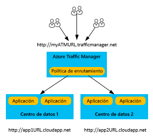
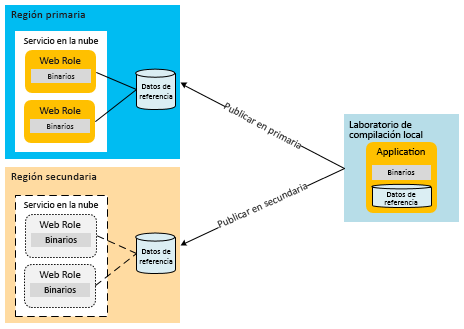
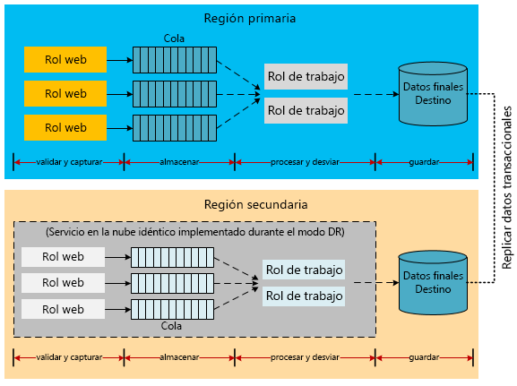
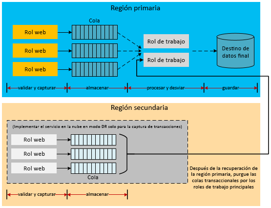
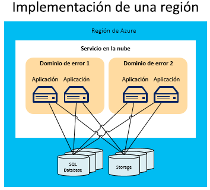
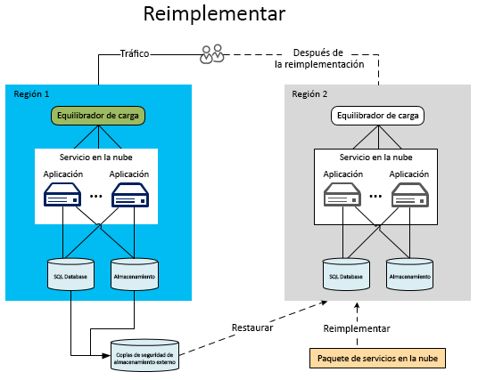
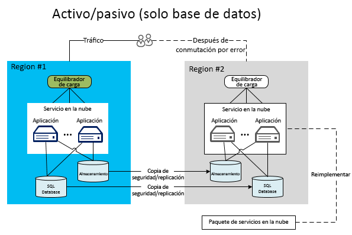
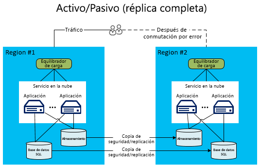
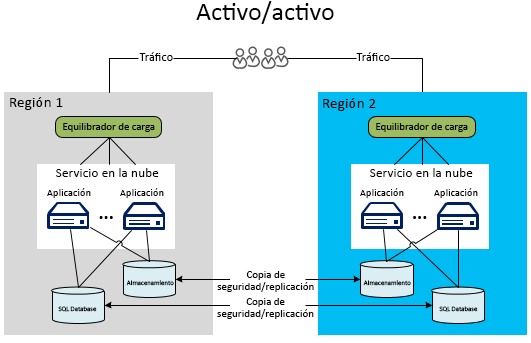

# Recuperación ante desastres para aplicaciones de Azure

La recuperación ante desastres se ocupa de recuperarse tras una pérdida catastrófica de funcionalidad de la aplicación. Por ejemplo, si una región de Azure que hospeda la aplicación deja de estar disponible, necesita un plan para ejecutar la aplicación o acceder a los datos en otra región. 

Los propietarios de la tecnología y el negocio deberán determinar qué grado de funcionalidad es necesario durante un desastre. El nivel de funcionalidad puede adoptar diversas formas: total falta de disponibilidad, disponibilidad parcial (funcionalidad reducida o procesamiento diferido) o disponibilidad total.

Las estrategias de alta disponibilidad y resistencia están diseñadas para controlar condiciones de error temporales.  La ejecución de este plan implica a personas, procesos y aplicaciones auxiliares que permiten que el sistema siga funcionando. En el plan deben ensayarse errores y probarse la recuperación de bases de datos para garantizar que el plan sea efectivo. 

## Características de recuperación ante desastres de Azure

Al igual que sucede con las consideraciones de disponibilidad, Azure ofrece [manuales técnicos de resistencia](./index.md) diseñados para dar soporte técnico para la recuperación ante desastres. También existe una relación entre las características de disponibilidad de Azure y la recuperación ante desastres. Por ejemplo, la administración de roles en dominios de error aumenta la disponibilidad de una aplicación. Sin esa administración, un error de hardware no controlado se convertiría en un escenario de "desastre". La utilización de estas características y estrategias de disponibilidad desempeña un importante papel a la hora de preparar una aplicación a prueba de desastres. Sin embargo, este artículo va más allá de los problemas de disponibilidad general, ya que trata eventos de desastres más graves (y menos frecuentes).

## Regiones con varios centros de datos
Azure mantiene centros de datos en muchas regiones del mundo. Esta infraestructura da soporte a varios escenarios de recuperación ante desastres, como la replicación geográfica que proporciona el sistema de Azure Storage a regiones secundarias. También se puede implementar fácil y económicamente un servicio en la nube en varias ubicaciones de todo el mundo. Compare esto con el costo y la dificultad que supone crear y mantener sus propios centros de datos en varias regiones. La implementación de datos y servicios en varias regiones contribuye a proteger la aplicación frente a interrupciones importantes en una sola región. Al diseñar el plan de recuperación ante desastres, es importante comprender el concepto de regiones emparejadas. Para más información, consulte [Continuidad empresarial y recuperación ante desastres (BCDR): regiones emparejadas de Azure](/azure/best-practices-availability-paired-regions).

## Azure Site Recovery

[Azure Site Recovery](/azure/site-recovery/) cuenta con un sencillo mecanismo para replicar máquinas virtuales de Azure entre regiones. La sobrecarga de administración es mínima, ya que no es necesario aprovisionar otros recursos en la región secundaria. Cuando se habilita la replicación, Site Recovery crea automáticamente los recursos necesarios en la región de destino, con arreglo a la configuración de la máquina virtual de origen. Proporciona una replicación continua y automatizada, y permite realizar la conmutación por error de las aplicaciones con un solo clic. También puede ejecutar simulacros de recuperación ante desastres con conmutaciones por error de prueba, sin que la replicación en curso o las cargas de trabajo de producción se vean afectadas. 

## Administrador de tráfico de Azure
Si se produce un error en una región concreta, el tráfico debe redirigirse a los servicios o implementaciones de otra región. Es más eficaz controlar esta situación a través de servicios como Azure Traffic Manager, que automatiza la conmutación por error del tráfico de usuario en otra región si se produce un error en la región principal. Es importante entender los conceptos básicos de Traffic Manager al diseñar una estrategia eficaz de recuperación ante desastres.

Traffic Manager usa el sistema de nombres de dominio (DNS) para dirigir las solicitudes del cliente al punto de conexión más adecuado en función de un método de enrutamiento del tráfico y el estado de los puntos de conexión. En el diagrama siguiente, los usuarios se conectan a una dirección URL de Traffic Manager (`http://myATMURL.trafficmanager.net`) que abstrae las direcciones URL de sitio reales (`http://app1URL.cloudapp.net` y `http://app2URL.cloudapp.net`). Las solicitudes de usuario se enrutan a la dirección URL subyacente adecuada en función del [método de enrutamiento de Traffic Manager](/azure/traffic-manager/traffic-manager-routing-methods) configurado. Para este artículo, solo nos centraremos en la opción de conmutación por error.

Cuando se configura Traffic Manager, se proporciona un nuevo prefijo de DNS de Traffic Manager, que utilizarán los usuarios para acceder al servicio. Traffic Manager ahora abstrae el equilibrio de carga en un nivel por encima del nivel regional. El DNS del Administrador de tráfico se asigna a un CNAME en todas las implementaciones que administra.

En Traffic Manager, especifique una lista de prioridades con las implementaciones a las que se enrutarán los usuarios cuando se produce un error. Traffic Manager supervisa los puntos de conexión de la implementación. Si la implementación principal deja de estar disponible, Traffic Manager enruta a los usuarios a la siguiente implementación de la lista de prioridades.

Aunque Traffic Manager decide adónde debe ir en una conmutación por error, usted puede decidir si su dominio de conmutación por error está inactivo o activo mientras no está en modo de conmutación por error (lo que no guarda relación con Traffic Manager). Traffic Manager detecta un error en el sitio principal y cambia al sitio de conmutación por error, independientemente de si ese sitio sirve actualmente a los usuarios.

Para más información sobre el funcionamiento del Administrador de tráfico de Azure, consulte:

* [Información general sobre el Administrador de tráfico](/azure/traffic-manager/traffic-manager-overview/)
* [Métodos de enrutamiento del Administrador de tráfico](/azure/traffic-manager/traffic-manager-routing-methods)
* [Configuración del método de enrutamiento de conmutación por error](/azure/traffic-manager/traffic-manager-configure-failover-routing-method/)

## Escenarios de desastre de Azure
Las siguientes secciones tratan varios tipos de escenarios de desastre. Las interrupciones del servicio a nivel de toda la región no son la única causa de errores en toda la aplicación. Un diseño deficiente y errores de administración también pueden provocar interrupciones. Es importante tener en cuenta las posibles causas de un error durante las fases de prueba y de diseño del plan de recuperación. Un buen plan saca provecho a las características de Azure y las aumenta con estrategias específicas de la aplicación. La respuesta elegida viene determinada por la importancia de la aplicación, el objetivo de punto de recuperación (RPO) y el objetivo de tiempo de recuperación (RTO).

### Error de la aplicación
El Administrador de tráfico de Azure controla automáticamente los errores generados por el software subyacente o el sistema operativo de la máquina virtual host. Azure crea una nueva instancia de rol y la añade al grupo disponible. Si ya había más de una instancia de rol en ejecución, Azure desplaza el procesamiento a las otras instancias de rol en ejecución mientras se reemplaza el nodo con error.

Pueden producirse errores de aplicación graves sin necesidad de que exista un error de hardware o del sistema operativo subyacente. La aplicación podría dejar de funcionar debido a las excepciones catastróficas causadas por una lógica defectuosa o por problemas en la integridad de los datos. Debe incluir suficiente telemetría en el código de la aplicación para que un sistema de supervisión pueda detectar condiciones de error y enviar las notificaciones pertinentes a un administrador de aplicaciones. Un administrador que tenga pleno conocimiento de los procesos de recuperación ante desastres puede decidir si desencadenar un proceso de conmutación por error o aceptar una interrupción de disponibilidad al resolver los errores críticos.

### Datos dañados
Azure almacena automáticamente los datos de Azure SQL Database y Azure Storage tres veces en distintos dominios de error de la misma región. Si utiliza la replicación geográfica, los datos se almacenan tres veces más en una región distinta. Sin embargo, si los usuarios o la aplicación dañan los datos de la copia principal, los datos se replican rápidamente en las restantes copias. Lamentablemente, esto genera varias copias de datos dañados.

Para administrar el posible daño de los datos, tiene dos opciones. En primer lugar, puede administrar una estrategia de copia de seguridad personalizada. Puede almacenar las copias de seguridad en Azure o de forma local, en función de los requisitos empresariales o las regulaciones gubernamentales. Otra posibilidad es utilizar la opción de restauración a un momento dado para recuperar una base de datos SQL. Para más información, consulte la sección sobre las [estrategias de datos para la recuperación ante desastres](#data-strategies-for-disaster-recovery) más adelante.

### Interrupción de la red
Si algunas partes de la red de Azure no están accesibles, es posible que no pueda acceder a su aplicación o a los datos. Si una o varias instancias de rol no están disponibles debido a problemas en la red, Azure usa las restantes instancias disponibles de la aplicación. Si la aplicación no puede acceder a los datos debido a una interrupción en la red de Azure, puede usar datos almacenados en caché para trabajar localmente con la funcionalidad de la aplicación reducida. Debe diseñar la estrategia de recuperación ante desastres para que se ejecute con funcionalidad reducida en la aplicación. En algunas aplicaciones, esto puede no resultar práctico.

Otra opción es almacenar los datos en una ubicación alternativa hasta que se restaure la conectividad. Si reducir la funcionalidad no se contempla, las restantes opciones son el tiempo de inactividad de la aplicación o la conmutación por error a otra región. El diseño de una aplicación que se ejecuta con funcionalidad reducida es mucho más una decisión empresarial que técnica. Esto se explica más detalladamente en la sección sobre [funcionalidad de aplicación reducida](#reduced-application-functionality).

### Error de un servicio dependiente
Azure proporciona muchos servicios que pueden experimentar tiempos de inactividad periódicamente. Por ejemplo, [Azure Redis Cache](https://azure.microsoft.com/services/cache/) es un servicio multiinquilino que proporciona funcionalidad de almacenamiento en caché a la aplicación. Es importante tener en cuenta lo que ocurre en la aplicación si el servicio dependiente no está disponible. En muchos sentidos, este escenario es similar al escenario de interrupción de la red. Sin embargo, si se considera cada servicio de forma independiente, se consiguen mejoras potenciales en el plan global.

Azure Redis Cache proporciona almacenamiento en caché a una aplicación desde la implementación del servicio en la nube, lo que proporciona beneficios en la recuperación ante desastres. En primer lugar, el servicio se ejecuta en roles locales de cara a la implementación. Por consiguiente, tiene mayor capacidad para supervisar y administrar el estado de la memoria caché como parte de los procesos de administración global del servicio en la nube. Este tipo de almacenamiento en caché también expone nuevas características, como la alta disponibilidad para los datos en caché que, si se produce un error en un solo nodo, conserva estos datos manteniendo copias duplicadas en otros nodos.

Tenga en cuenta que la alta disponibilidad reduce el rendimiento y aumenta la latencia debido a que las operaciones de escritura también deben actualizar todas las copias secundarias. De hecho, la cantidad de memoria necesaria para almacenar los datos en caché se duplica, lo que debe tenerse en cuenta al planificar la capacidad requerida.  Este ejemplo muestra que cada servicio dependiente puede tener funcionalidades que mejoran la disponibilidad general y resistencia a errores catastróficos.

Con cada servicio dependiente, debe comprender las implicaciones de una interrupción del servicio. En el ejemplo del almacenamiento en la caché, es posible acceder a los datos directamente desde una base de datos hasta que se restaure la memoria caché. Esto reduciría el rendimiento al tiempo que proporcionaría acceso completo a los datos de la aplicación.

### Interrupción del servicio en toda la región
Los anteriores han sido principalmente errores que pueden administrarse en la misma región de Azure. Sin embargo, también debe prepararse para la posibilidad de que se produzca una interrupción del servicio en toda la región. Si se produce una interrupción del servicio en toda la región, las copias redundantes locales de los datos no estarán disponibles. Si ha habilitado la replicación geográfica, hay tres copias adicionales de los blobs y las tablas en una región distinta. Si Microsoft declara la región perdida, Azure reasignará todas las entradas de DNS a la región con replicación geográfica.

> [!NOTE]
> Tenga en cuenta que no tiene ningún control sobre este proceso y que solo se producirá si se produce una interrupción del servicio en toda la región. Considere la posibilidad de utilizar [Azure Site Recovery](/azure/site-recovery/) para conseguir un RPO y un RTO más altos. Site Recovery deja que la aplicación decida qué se considera una interrupción aceptable y cuándo debe conmutar por error a las máquinas virtuales replicadas.

### Interrupción de un servicio en todo Azure
En el planeamiento de desastres, es preciso tener en cuenta toda la gama de posibles desastres. Una de las interrupciones de servicio más graves implicaría a todas las regiones de Azure de manera simultánea. Al igual que con otras interrupciones de servicio, puede decidir asumir el riesgo de una inactividad temporal del evento. Las interrupciones de servicio generalizadas que abarcan regiones son mucho menos habituales que las aisladas que afectan a servicios dependientes o regiones individuales.

No obstante, puede decidir que ciertas aplicaciones críticas necesitan un plan de copia de seguridad para una interrupción del servicio en varias regiones. Este plan puede incluir la conmutación por error de servicios en una [nube alternativa](#alternative-cloud) o en una [solución híbrida local y en la nube](#hybrid-on-premises-and-cloud-solution).

### Funcionalidad de aplicación reducida
Una aplicación bien diseñada suele utilizar servicios que se comunican entre sí a través de la implementación de patrones de intercambio de información de acoplamiento flexible. Las aplicaciones compatibles con recuperación ante desastres requieren la separación de responsabilidades en el nivel de servicio. De este modo, se evita que la interrupción de un servicio dependiente desactive toda la aplicación. Por ejemplo, piense en una aplicación de comercio electrónico para la empresa Y. Los módulos siguientes podrían constituir la aplicación:

* **Catálogo de productos** : permite a los usuarios examinar los productos.
* **Carro de la compra** : permite a los usuarios agregar productos al carro de la compra o quitarlos de él.
* **Estado del pedido** : muestra el estado de envío de los pedidos de los usuarios.
* **Envío del pedido** : finaliza la sesión de compra enviando el pedido con el pago.
* **Procesamiento del pedido** : valida la integridad de los datos del pedido y realiza la comprobación de la disponibilidad de la cantidad solicitada.

Cuando una dependencia de servicio en esta aplicación deja de estar disponible, ¿cómo funciona el servicio hasta que se recupera la dependencia? Un sistema bien diseñado implementa los límites de aislamiento mediante la separación de responsabilidades tanto en el tiempo de diseño como en el tiempo de ejecución. Todos los errores se pueden clasificar como recuperables y no recuperables. Los errores no recuperables harán que el servicio deje de funcionar, pero los errores recuperables se pueden mitigar mediante ciertas alternativas. Determinados problemas que se solucionan mediante el tratamiento automático de errores y medidas alternativas son transparentes para el usuario. Durante una interrupción del servicio más grave, la aplicación podría estar completamente no disponible. Una tercera opción es seguir atendiendo las solicitudes de usuario con funcionalidad reducida.

Por ejemplo, si la base de datos para hospedar los pedidos deja de funcionar, el servicio Procesamiento del pedido pierde su capacidad para procesar transacciones de ventas. En función de la arquitectura, puede que sea difícil o imposible que los servicios Envío del pedido y Procesamiento del pedido de la aplicación sigan funcionando. Si la aplicación no está diseñada para controlar este escenario, toda ella puede quedarse sin conexión. Sin embargo, si los datos de productos se almacenan en una ubicación diferente, el módulo Catálogo de productos puede seguir utilizándose para ver productos. Sin embargo, otras partes de la aplicación no están disponibles, como los pedidos o las consultas al inventario.

Decidir qué funcionalidad reducida de la aplicación estará disponible es una decisión tanto empresarial como técnica. Debe decidir cómo informará la aplicación a los usuarios de los problemas temporales. En el ejemplo anterior, la aplicación puede permitir ver productos y añadirlos a un carro de la compra. Sin embargo, cuando el usuario intenta realizar una compra, la aplicación notifica al usuario que la funcionalidad de pedidos no está disponible temporalmente. No es lo ideal para el cliente, pero evita una interrupción del servicio en toda la aplicación.

## estrategias de datos para la recuperación ante desastres
Un adecuado tratamiento de los datos supone un desafío para un plan de recuperación ante desastres. Durante el proceso de recuperación, la restauración de datos suele ser la operación que tarda más tiempo. Las diversas opciones para reducir la funcionalidad plantean retos difíciles para la recuperación de datos y la coherencia después de un error.

Uno de los factores que se debe tener en cuenta es la necesidad de restaurar o mantener una copia de los datos de la aplicación. Estos datos se usarán como referencia y para transacciones en un sitio secundario. Una implementación local requiere un proceso de planeamiento costoso y largo para implementar una estrategia de recuperación ante desastres en varias regiones. Afortunadamente, la mayoría de los proveedores de nube, incluido Azure, permiten que las aplicaciones se implementen fácilmente en varias regiones. Estas regiones están distribuidas geográficamente de tal forma que la interrupción del servicio en varias regiones sea muy poco habitual. La estrategia para el control de datos entre regiones es uno de los factores que contribuyen el éxito de cualquier plan de recuperación ante desastres.

En Las secciones siguientes se describen las técnicas de recuperación ante desastres relacionadas con las copias de seguridad de datos, los datos de referencia y los datos transaccionales.

### Copia de seguridad y restauración
Copias de seguridad periódicas de los datos de la aplicación pueden dar soporte a algunos escenarios de recuperación ante desastres. Recursos de almacenamiento diferentes requieren técnicas diferentes.

#### SQL Database
En los niveles Basic, Standard y Premium de SQL Database, se puede sacar provecho de la función de restauración a un momento dado para recuperar una base de datos. Para más información, consulte [Información general: continuidad del negocio en la nube y recuperación ante desastres con la SQL Database](/azure/sql-database/sql-database-business-continuity/). Otra opción es usar la replicación geográfica activa para SQL Database. Con esta función se replican automáticamente los cambios de la base de datos en bases de datos secundarias de la misma región de Azure, o incluso de una región distinta. Esto proporciona una posible alternativa a algunas de las técnicas de sincronización de datos más manuales que se presentan en este artículo. Para más información, consulte [Información general: Replicación geográfica activa para Azure SQL Database](/azure/sql-database/sql-database-geo-replication-overview/).

También puede utilizar un enfoque más manual para realizar copias de seguridad y restauraciones. Utilice el comando DATABASE COPY para crear una copia de seguridad de la base de datos con coherencia transaccional. También puede usar el servicio de importación y exportación de Azure SQL Database, que permite exportar bases de datos a archivos BACPAC (archivos comprimidos que contienen el esquema de base de datos y los datos asociados) que se almacenan en Azure Blob Storage.

La redundancia integrada de Azure Storage crea dos réplicas del archivo de copia de seguridad en la misma región. Sin embargo, la frecuencia de ejecución del proceso de copia de seguridad determina el RPO, que es la cantidad de datos que se pueden perder en escenarios de desastres. Por ejemplo, suponga que realiza una copia de seguridad cada hora en punto y se produce un desastre dos minutos antes de la hora en punto. Perderá los 58 minutos de datos registrados después de la última copia de seguridad. Además, para protegerse contra una interrupción del servicio en toda una región, debe copiar los archivos BACPAC en otra región. A continuación, tiene la opción de restaurar dichas copias de seguridad en la otra región. Para más información, consulte [Información general: continuidad del negocio en la nube y recuperación ante desastres con la SQL Database](/azure/sql-database/sql-database-business-continuity/).

#### Azure Storage
En el caso de Azure Storage, puede desarrollar un proceso de copia de seguridad personalizado, o bien utilizar una de las muchas herramientas de copia de seguridad de terceros. Tenga en cuenta que la mayoría de los diseños de aplicaciones presentan complejidades adicionales donde los recursos de almacenamiento se hacen referencia entre sí. Por ejemplo, piense en una instancia de SQL Database que tenga una columna vinculada a un blob de Azure Storage. Si las copias de seguridad no se realizan simultáneamente, la base de datos puede tener un puntero a un blob del que no se había realizado una copia de seguridad antes del error. La aplicación o el plan de recuperación ante desastres debe implementar procesos que controlen esta incoherencia tras una recuperación.

#### Otras plataformas de datos
Otras plataformas de datos hospedadas en infraestructura como servicio (IaaS), como Elasticsearch o MongoDB, tienen sus propias funcionalidades y consideraciones que tener en cuenta al crear un proceso de copia de seguridad y restauración integrado. Para estas plataformas de datos, la recomendación general es usar cualquier funcionalidad nativa o disponible de replicación basada en integración o de toma de instantáneas. Si esas funcionalidades no existen o no son adecuadas, considere la posibilidad de usar el servicio Azure Backup o instantáneas de disco administrado o no administrado para crear una copia de un momento específico de los datos de la aplicación. En todos los casos, es importante determinar cómo realizar copias de seguridad coherentes, especialmente cuando los datos de aplicación abarcan varios sistemas de archivos, o cuando se combinan varias unidades en un solo sistema de archivos mediante administradores de volúmenes o sistemas RAID basados en software.

### Patrón de datos de referencia para la recuperación ante desastres
Los datos de referencia son de solo lectura y admiten la funcionalidad de la aplicación. Normalmente no cambian con frecuencia. Aunque la copia de seguridad y restauración es un método para controlar las interrupciones del servicio en toda una región, el RTO es relativamente largo. Al implementar la aplicación en una región secundaria, algunas estrategias pueden mejorar el RTO de los datos de referencia.

Dado que los datos de referencia cambian con poca frecuencia, el RTO se puede mejorar manteniendo una copia permanente de los datos de referencia en la región secundaria. Esto elimina el tiempo requerido para restaurar copias de seguridad en caso de desastre. Para cumplir los requisitos de recuperación ante desastres en varias regiones, es preciso implementar la aplicación y los datos de referencia juntos en varias regiones. Como se ha mencionado en [Patrón de datos de referencia para la alta disponibilidad](high-availability-azure-applications.md#reference-data-pattern-for-high-availability), puede implementar datos de referencia al propio rol, a un almacenamiento externo o una combinación de ambos.

El modelo de implementación de datos de referencia en los nodos de proceso cumple implícitamente los requisitos de recuperación ante desastres. La implementación de datos de referencia en SQL Database requiere que se implemente una copia de los datos de referencia en cada región. La misma estrategia se aplica a Azure Storage. Debe implementar una copia de todos los datos de referencia almacenados en Azure Storage en las regiones principal y secundaria.

Debe implementar sus propias rutinas de copia de seguridad específicas de la aplicación para todos los datos, incluidos los datos de referencia. Las copias con replicas geográficas entre regiones solo se utilizan en una interrupción del servicio en toda una región. Para evitar un tiempo de inactividad prolongado, implemente las partes críticas de los datos de la aplicación en la región secundaria. Para obtener un ejemplo de esta topología, consulte el [modelo activo-pasivo](#active-passive).

### Patrón de datos transaccionales para la recuperación ante desastres
La implementación de una estrategia del modo de desastres totalmente funcional requiere la replicación asincrónica de los datos transaccionales en la región secundaria. Las ventanas de tiempo prácticas en las que puede producirse la replicación determinarán las características RPO de la aplicación. En la ventana de la replicación se pueden recuperar los datos perdidos de la región principal. También puede combinarlos con los de la región secundaria más adelante.

Los siguientes ejemplos de arquitectura proporcionan algunas ideas de distintas formas de controlar los datos transaccionales en un escenario de conmutación por error. Es importante tener en cuenta que estos ejemplos no son exhaustivos. Por ejemplo, las ubicaciones de almacenamiento intermedias, como las colas, pueden reemplazarse por Azure SQL Database. Las propias colas pueden ser colas de Azure Storage o de Service Bus (consulte [Colas de Service Bus y colas de Azure: comparación y diferencias](/azure/service-bus-messaging/service-bus-azure-and-service-bus-queues-compared-contrasted/)). Los destinos de almacenamiento del servidor también pueden variar, como las tablas de Azure, en lugar de SQL Database. Además, pueden insertarse roles de trabajo como intermediarios en varios pasos. El objetivo es no emular estas arquitecturas exactamente, sino considerar diversas alternativas en la recuperación de datos transaccionales y los módulos relacionados.

#### Replicación de datos transaccionales en preparación para la recuperación ante desastres
Considere una aplicación que utiliza las colas de Azure Storage para contener datos transaccionales. Esto permite que los roles de trabajo procesen dichos datos transaccionales en la base de datos de servidor en una arquitectura desacoplada. Esto requiere que las transacciones utilicen alguna forma de caché temporal si los roles de front-end requieren la consulta inmediata de dichos datos. En función del nivel de tolerancia de la pérdida de datos, puede elegir replicar las colas, la base de datos o todos los recursos de almacenamiento. Con solo la replicación de la base de datos, si la región principal deja de funcionar, puede recuperar los datos de las colas cuando dicha región vuelva a funcionar.

El siguiente diagrama muestra una arquitectura en la que la base de datos de servidor está sincronizada entre regiones.

El mayor desafío a la hora de implementar esta arquitectura es la estrategia de replicación entre regiones. El servicio [Azure SQL Data Sync](/azure/sql-database/sql-database-get-started-sql-data-sync/) permite este tipo de replicación. En el momento de la redacción de este artículo, dicho servicio existe en versión preliminar y no se recomienda en entornos de producción. Para más información, consulte [Información general: continuidad del negocio en la nube y recuperación ante desastres con la SQL Database](/azure/sql-database/sql-database-business-continuity/). Para las aplicaciones de producción, debe invertir en una solución de terceros o crear su propia lógica de replicación en el código. En función de la arquitectura, la replicación puede ser bidireccional, que es más compleja.

Una posible implementación podría hacer uso de la cola intermedia del ejemplo anterior. El rol de trabajo que procesa los datos en el destino de almacenamiento final puede realizar el cambio en las regiones principal y secundaria. Estas tareas no son triviales y una guía completa para el código de replicación está fuera del ámbito de este artículo. Dedique tiempo suficiente y realice las pruebas necesarias de la estrategia para replicar datos en la región secundaria. Las pruebas y procesamientos adicionales pueden contribuir a garantizar que los procesos de recuperación y de conmutación por error controlen correctamente todas las posibles incoherencias de los datos o transacciones duplicadas.

> [!NOTE]
> La mayor parte de este documento se centra en Plataforma como servicio (PaaS). Sin embargo, las opciones de replicación y disponibilidad adicionales para las aplicaciones híbridas utilizan Azure Virtual Machines. Estas aplicaciones híbridas usan Infraestructura como servicio (IaaS) para hospedar SQL Server en máquinas virtuales de Azure. Esto permite enfoques tradicionales de disponibilidad en SQL Server, como grupos de disponibilidad AlwaysOn o trasvase de registros. Algunas técnicas, como AlwaysOn, solo funcionan entre instancias de SQL Server locales y máquinas virtuales de Azure. Para más información, consulte [Alta disponibilidad y recuperación ante desastres para SQL Server en Azure Virtual Machines](/azure/virtual-machines/windows/sql/virtual-machines-windows-sql-high-availability-dr/).
> 
> 

#### Funcionalidad reducida de la aplicación para la captura de transacciones
Considere una segunda arquitectura que opere con funcionalidad reducida. La aplicación de la región secundaria desactiva toda la funcionalidad, como informes, inteligencia empresarial (BI) o colas de drenaje. Solo acepta los tipos más importantes de flujos de trabajo transaccionales de acuerdo con los requisitos empresariales. El sistema captura las transacciones y las escribe en las colas. El sistema puede posponer el procesamiento de los datos durante la fase inicial de la interrupción del servicio. Si el sistema de la región principal se reactiva en la ventana de tiempo esperado, los roles de trabajo de la región principal pueden purgar las colas. Este proceso elimina la necesidad de combinar bases de datos. Si la interrupción del servicio de la región principal va más allá de la ventana tolerable, la aplicación puede empezar a procesar las colas.

En este escenario, la base de datos de la región secundaria contiene datos transaccionales incrementales que se deben combinar después de que la principal se reactive. El diagrama siguiente muestra esta estrategia para almacenar temporalmente datos transaccionales hasta que se restaure la región principal.

Para más información acerca de las técnicas de administración de datos para aplicaciones de Azure resistentes, consulte [Failsafe: Guidance for Resilient Cloud Architectures](https://channel9.msdn.com/Series/FailSafe)(Failsafe: Guía para las arquitecturas resistentes en la nube).

## Topologías de implementación para recuperación ante desastres
Debe preparar aplicaciones críticas para abordar interrupciones del servicio en toda una región. Incorpore al planeamiento operativo una estrategia de implementación en varias regiones.

Las implementaciones en varias regiones pueden implicar procesos de TI para publicar la aplicación y los datos de referencia en la región secundaria después de un desastre. Si la aplicación requiere una conmutación por error instantánea, el proceso de implementación puede implicar una configuración activa/activa o activa/pasiva. Este tipo de implementación tiene instancias existentes de la aplicación que se ejecutan en la región alternativa. Un servicio de enrutamiento, como Azure Traffic Manager, proporciona servicios de equilibrio de carga a nivel de DNS. Puede detectar interrupciones del servicio y enrutar a los usuarios a distintas regiones cuando sea necesario.

Una correcta recuperación ante desastres de Azure implica crear dicha recuperación en la solución desde el principio. La nube proporciona opciones adicionales para recuperarse de errores durante un desastre que no pueden ofrecer los proveedores de hospedaje tradicionales. En concreto, puede asignar recursos de manera dinámica y rápida en una región distinta, evitando así el costo que acarrean los recursos inactivos antes de un error.

En las secciones siguientes se tratan las diferentes topologías de implementación existentes para la recuperación ante desastres. Normalmente, hay un aumento del costo o la complejidad si se desea mayor disponibilidad.

### Implementación en una sola región
Una implementación en una sola región no es realmente una topología de recuperación ante desastres, pero supone un contraste con respecto a las restantes arquitecturas. Las implementaciones en una sola región son frecuentes en aplicaciones de Azure. Sin embargo, no cumplen los requisitos de una topología de recuperación ante desastres.

El siguiente diagrama muestra una aplicación que se ejecuta en una sola región de Azure. El Administrador de tráfico de Azure y el uso de dominios de error y de actualización aumentan la disponibilidad de la aplicación dentro de la región.

En este escenario, la base de datos es un único punto de error. Aunque Azure replica los datos a través de distintos dominios de error de manera interna, la replicación solo se produce en la misma región. La aplicación no puede resistir un error catastrófico. Si la región deja de estar disponible, también dejarán de estarlo los dominios de error, lo que incluye todas las instancias de servicio y los recursos de almacenamiento.

Debe idear un plan para implementar su aplicación en varias regiones, salvo en el caso de las aplicaciones menos críticas. Al plantearse qué topología de implementación va a utilizar, también debe tener en cuenta las restricciones de costo y el RTO.

Examinemos varias estrategias concretas para admitir la conmutación por error en diferentes regiones. Todos estos ejemplos utilizan dos regiones para describir el proceso.

### Conmutación por error con Azure Site Recovery

Cuando se habilita la replicación de máquinas virtuales de Azure con Azure Site Recovery, se crean varios recursos en la región secundaria:

- Un grupo de recursos
- Una red virtual (VNet)
- Una cuenta de almacenamiento 
- Unos conjuntos de disponibilidad que albergan las máquinas virtuales después de la conmutación por error

Las escrituras de datos que se realizan en los discos de las máquinas virtuales de la región primaria se transfieren de forma continuada a la cuenta de almacenamiento de la región secundaria. Cada pocos minutos se generan puntos de recuperación en la cuenta de almacenamiento de destino. Cuando se inicia una conmutación por error, las máquinas virtuales recuperadas se crean en el grupo de recursos, VNet y el conjunto de disponibilidad de destino. Durante una conmutación por error, puede elegir cualquier punto de recuperación disponible.

### Reimplementación en una región de Azure secundaria
En la estrategia de reimplementación en una región secundaria, solo la región principal tiene aplicaciones y bases de datos en ejecución. La región secundaria no está configurada para una conmutación por error automática. Por consiguiente, si se produce un desastre, será preciso poner en marcha todas las partes del servicio en la nueva región. Esto incluye la carga de un servicio en la nube en Azure, la implementación del servicio en la nube, la restauración de los datos y el cambio del DNS para reenrutar el tráfico.

Aunque esta es la más asequible de todas las opciones para varias regiones, también es la que tiene las peores características de RTO. En este modelo, las copias de seguridad de base de datos y el paquete de servicio se almacenan localmente o en la instancia de Almacenamiento de blobs de Azure de la región secundaria. Sin embargo, antes de reanudar el funcionamiento es preciso implementar un nuevo servicio y restaurar los datos. Aunque la transferencia de datos desde el almacenamiento de copias de seguridad esté completamente automatizada, el aprovisionamiento del nuevo entorno de base de datos consume mucho tiempo. La parte más cara del proceso de restauración es el movimiento de datos desde el almacenamiento en disco de copias de seguridad a la base de datos vacía de la región secundaria. Sin embargo, esta operación debe realizarse para poner la base de datos nueva en estado operativo, ya que no se ha replicado.

Lo mejor es almacenar los paquetes de servicio en el Almacenamiento de blobs de la región secundaria. De esta forma se elimina la necesidad de cargar el paquete en Azure, que es lo que ocurre cuando la implementación se realiza desde una máquina de desarrollo local. Con los scripts de PowerShell es posible implementar rápidamente los paquetes de servicio en un servicio en la nube nuevo desde el Almacenamiento de blobs.

Esta opción solo es práctica para las aplicaciones no críticas que pueden tolerar un RTO elevado. Por ejemplo, puede funcionar en una aplicación que pueda estar inactiva durante varias horas, pero que deba estar disponible en menos de 24 horas.

### Activo-pasivo
La topología activa-pasiva es la opción favorita de muchas empresas, ya que proporciona mejoras en el RTO con un aumento relativamente pequeño del costo, con respecto a la estrategia de reimplementación. En este escenario, de nuevo hay una región principal y una región secundaria de Azure. Todo el tráfico se dirige a la implementación activa de la región principal. La región secundaria está mejor preparada para la recuperación ante desastres, ya que la base de datos se ejecuta en ambas regiones. Además, hay un mecanismo de sincronización en vigor entre ellas. Este enfoque en espera puede implicar dos variaciones: un enfoque de solo la base de datos o una implementación completa en la región secundaria.

#### Solo base de datos
En la primera variación de la estrategia activa-pasiva, la región principal es la única en que se implementa una aplicación de servicio en la nube. Sin embargo, a diferencia de la estrategia de reimplementación, ambas regiones se sincronizan con el contenido de la base de datos. Para más información, consulte la sección [Patrón de datos transaccionales para la recuperación ante desastres](#transactional-data-pattern-for-disaster-recovery). Cuando se produce un desastre, hay menos requisitos de activación. Inicie la aplicación de la región secundaria, cambie las cadenas de conexión a la base de datos nueva y cambiar las entradas DNS para reenrutar el tráfico.

Al igual que en la estrategia de reimplementación, para agilizar la implementación, los paquetes de servicio deben haberse almacenado previamente en Azure Blob Storage en la región secundaria. A diferencia de la estrategia de reimplementación, no se incurre en la mayoría de la sobrecarga que requieren las operaciones de restauración de la base de datos. Esto ahorra mucho tiempo, lo que hace que este sea el patrón de recuperación ante desastres más asequible (y el que más se utiliza).

#### Réplica completa
En la segunda variación de la topología activa-pasiva, tanto la región principal como la secundaria tienen una implementación completa. Esta implementación incluye los servicios en la nube y una base de datos sincronizada. Sin embargo, la región principal es la única que controla activamente las solicitudes de red de los usuarios. La región secundaria no pasa a ser la activa hasta que la región principal experimenta una interrupción del servicio. En ese caso, todas las solicitudes de red nuevas se enrutan a la región secundaria. El Administrador de tráfico de Azure puede administrar esta conmutación por error de forma automática.

La conmutación por error se produce más rápidamente que la variación de solo la base de datos porque los servicios ya están implementados. Esta topología proporciona un objetivo de tiempo de recuperación muy bajo. La región de conmutación por error secundaria debe estar lista para empezar a funcionar inmediatamente después que se produzca un error en la región principal.

Junto con un tiempo de respuesta más rápido, esta topología preasigna e implementa servicios de copia de seguridad, lo que evita la posibilidad de que falte espacio para asignar nuevas instancias durante un desastre. Esto es importante si la región secundaria de Azure está cerca de alcanzar su capacidad máxima. Ningún contrato de nivel de servicio garantiza que puede implementar uno o más servicios de nube nuevos en cualquier región al instante.

Para reducir al máximo el tiempo de respuesta con este modelo, es preciso tener una escala similar (número de instancias de rol) en las regiones principal y secundaria. A pesar de las ventajas, es costoso pagar por instancias de proceso que no se utilizan, por lo que es posible que esta opción no sea la más prudente desde un punto de vista financiero. Por este motivo, es más habitual utilizar una versión ligeramente reducida de los servicios en la nube en la región secundaria. A partir de ahí, se podrá realizar rápidamente una conmutación por error y escalar horizontalmente la implementación secundaria, si fuera necesario. El proceso de conmutación por error se debe automatizar con el fin de que, una vez que no se pueda acceder a la región principal, active las instancias adicionales en función de la carga. Esto puede implicar el uso de un mecanismo de escalado automático, como los [conjuntos de escala de máquinas virtuales](/azure/virtual-machine-scale-sets/virtual-machine-scale-sets-overview/).

El siguiente diagrama muestra el modelo en el que las regiones principal y secundaria contienen un servicio en la nube totalmente implementado en una topología activa-pasiva.

### Activo-activo
En una topología activa-activa, tanto los servicios en la nube como la base de datos están totalmente implementados en ambas regiones. A diferencia del modelo activo-pasivo, ambas regiones reciben tráfico de usuarios. Esta opción es la que tiene el menor tiempo de recuperación. Los servicios ya se han escalado para controlar una parte de la carga en cada región. El DNS ya está habilitado para usar la región secundaria. Hay mayor complejidad a la hora de determinar cómo enrutar los usuarios a la región adecuada. Se puede usar la programación round robin. Es más probable que determinados usuarios utilicen la región específica en la que reside la copia principal de sus datos.

En caso de conmutación por error, sencillamente deshabilite el DNS en la región principal. Esto enruta todo el tráfico a la región secundaria.

Incluso en este modelo, hay algunas variaciones. Por ejemplo, el siguiente diagrama muestra una región principal que posee la copia maestra de la base de datos. Los servicios en la nube de ambas regiones escriben en dicha base de datos principal. La implementación de la región secundaria puede leer tanto de la base de datos principal como de la replicada. En este ejemplo, la replicación es unidireccional.

La arquitectura de activo-activo del diagrama anterior tiene una desventaja. La segunda región debe tener acceso a la base de datos de la primera región, ya que es ahí donde reside la copia maestra. El rendimiento disminuye considerablemente cuando se accede a los datos desde fuera de una región. En las llamadas a la base de datos entre regiones, es preciso considerar algún tipo de estrategia de procesamiento por lotes para mejorar el rendimiento de estas llamadas. Para más información, consulte [Uso del procesamiento por lotes para mejorar el rendimiento de las aplicaciones de SQL Database](/azure/sql-database/sql-database-use-batching-to-improve-performance/).

Una arquitectura alternativa podría implicar que cada región accediera directamente a su propia base de datos. En este modelo, se necesita cierto tipo de replicación bidireccional para sincronizar las bases de datos en cada región.

Con las topologías anteriores, al reducir el objetivo de tiempo de recuperación generalmente se incrementan los costos y la complejidad. La topología activa-activa se desvía de este patrón de costo. En la topología activa-activa, es posible que no se necesiten tantas instancias en la región principal como en la topología activa-pasiva. Si en una arquitectura de activo-pasivo hay diez instancias en la región principal, es posible que solo se necesiten cinco en cada región en una arquitectura de activo-activo. Ahora ambas regiones comparten la carga. Esto puede suponer un ahorro de costos sobre la topología activa-pasiva si se mantiene una espera semiactiva en la región pasiva con diez instancias en espera de conmutación por error.

Tenga en cuenta que hasta que se restaure la región principal, la región secundaria puede recibir una sobrecarga repentina de nuevos usuarios. Si había 10 000 usuarios en cada servidor al producirse la interrupción del servicio en la región principal, la región secundaria tiene que administrar repentinamente 20 000 usuarios. Las reglas de supervisión de la región secundaria deben detectar este incremento y duplicar las instancias de la región secundaria. Para más información, consulte la sección sobre [detección de errores](#failure-detection).

## solución híbrida local y en la nube
Una estrategia adicional para la recuperación ante desastres es diseñar una aplicación híbrida que se ejecute de manera local y en la nube. En función de la aplicación, la región principal puede estar en cualquier ubicación. Piense en las arquitecturas anteriores e imagine las regiones principal o secundaria como una ubicación local.

Estas arquitecturas híbridas plantean algunos desafíos. En primer lugar, la mayor parte de este artículo ha abordado patrones de arquitectura de PaaS. Las aplicaciones típicas de PaaS en Azure se basan en construcciones específicas de Azure como roles, servicios en la nube y el Administrador de tráfico. Para crear una solución local para este tipo de aplicación de PaaS se requeriría una arquitectura muy distinta, algo que puede que no sea factible desde una perspectiva de costos o administración.

Sin embargo, una solución híbrida para la recuperación ante desastres plantea menos desafíos para las arquitecturas tradicionales que se han migrado a la nube, como las arquitecturas basadas en IaaS. Las aplicaciones de IaaS utilizan máquinas virtuales en la nube que pueden tener equivalentes directos en el sistema local. También puede usar redes virtuales para conectar máquinas en la nube con recursos de red locales. Esto ofrece varias opciones que no son posibles con las aplicaciones solo PaaS. Por ejemplo, SQL Server puede sacar provecho de soluciones de recuperación ante desastres, como los grupos de disponibilidad AlwaysOn y la creación de reflejo de base de datos. Para más información, consulte [Alta disponibilidad y recuperación ante desastres para SQL Server en máquinas virtuales de Azure](/azure/virtual-machines/windows/sql/virtual-machines-windows-sql-high-availability-dr/).

Las soluciones de IaaS también proporcionan una ruta más sencilla para que las aplicaciones locales utilicen Azure como opción de conmutación por error. Puede haber una aplicación totalmente funcional en una región local existente. Sin embargo, ¿qué ocurre si faltan los recursos necesarios para mantener una región geográficamente independiente para la conmutación por error? Se pueden usar máquinas virtuales y redes virtuales para que la aplicación se ejecute en Azure. En tal caso, defina procesos que sincronicen los datos con la nube. En ese momento, la implementación de Azure se convierte en la región secundaria que se utilizará para la conmutación por error. La región principal sigue siendo la aplicación local. Para más información acerca de las arquitecturas de IaaS y sus funcionalidades, consulte la [documentación de las máquinas virtuales](https://azure.microsoft.com/documentation/services/virtual-machines/).

## Nube alternativa
Hay situaciones en las que el amplio abanico de funciones de Microsoft Azure puede no ajustarse a las directivas o normas de cumplimiento internas que requiere su organización. Incluso la mejor preparación y diseño para implementar sistemas de copia de seguridad durante un desastre son inadecuados durante una interrupción global del servicio de un proveedor de servicios en la nube.

Debería comparar los requisitos de disponibilidad con el costo y la complejidad del aumento de disponibilidad. Realice un análisis de riesgos y defina el RTO y el RPO de la solución. Si la aplicación no puede tolerar ningún tiempo de inactividad, puede considerar la posibilidad de utilizar una solución en la nube adicional. A menos que todo Internet deje de funcionar simultáneamente, es posible que aún haya otra solución en la nube si no se pudiera acceder a Azure a nivel global.

Al igual que sucede en el escenario híbrido, las implementaciones de conmutación por error en las arquitecturas de recuperación ante desastres anteriores también pueden existir en otra solución en la nube. Los sitios de recuperación ante desastres en la nube alternativos solo deben utilizarse para aquellas soluciones cuyo RTO permita muy poco tiempo de inactividad, o ninguno. Tenga en cuenta que una solución que utilice un sitio de recuperación ante desastres fuera de Azure requerirá más trabajo de configuración, desarrollo, implementación y mantenimiento. También es más difícil implementar los procedimientos demostrados en una arquitectura entre nubes. Aunque las plataformas en la nube tienen conceptos de alto nivel similares, las API y las arquitecturas son diferentes.

Si su estrategia de recuperación ante desastres se basa en varias plataformas en la nube, es útil incluir capas de abstracción en el diseño de la solución. Si lo hace, no será preciso que desarrolle y mantenga dos versiones diferentes de la misma aplicación para plataformas en la nube distintas en caso de desastre. Como sucede en el escenario híbrido, el uso de Azure Virtual Machines o el servicio Contenedor de Azure puede ser más sencillo en estos casos que el empleo de diseños de PaaS específicos de la nube.

## Automation
Algunos de los patrones que acabamos de describir requieren una activación rápida de las implementaciones sin conexión, así como la restauración de determinadas partes de un sistema. Los scripts de automatización pueden activar recursos a petición e implementar soluciones rápidamente. En los siguientes ejemplos de automatización relacionados con la recuperación ante desastres se usa [Azure PowerShell](https://msdn.microsoft.com/library/azure/jj156055.aspx), pero también es una buena opción usar la [CLI de Azure](https://docs.microsoft.com/cli/azure/get-started-with-azure-cli) o la [API de REST de administración del servicio](https://msdn.microsoft.com/library/azure/ee460799.aspx).

Los scripts de automatización administran aspectos de recuperación ante desastres que Azure no controla de manera transparente. Esto produce resultados coherentes y repetibles, lo que reduce al mínimo los errores humanos. Los scripts predefinidos de recuperación ante desastres también reducen el tiempo necesario para recompilar un sistema y las partes que lo constituyen durante un desastre. No es buena idea intentar averiguar manualmente cómo restaurar su sitio mientras está inactivo y perder dinero a cada minuto.

Pruebe los scripts varias veces de principio a fin. Después de comprobar su funcionalidad básica, asegúrese de probarlos en una [simulación de desastre](#disaster-simulation). Esto ayuda a detectar defectos en los scripts o procesos.

Un procedimiento recomendado con automatización es crear un repositorio de scripts de PowerShell o de interfaz de la línea de comandos (CLI) para recuperación ante desastres de Azure. Márquelos y clasifíquelos claramente para encontrarlos rápidamente. Designe una persona principal para que se encargue de administrar el repositorio y el control de versiones de los scripts. Documéntelos perfectamente con explicaciones de los parámetros y ejemplos de uso de los scripts. Asegúrese de que esta documentación está sincronizada con las implementaciones de Azure. Esto subraya la importancia de que haya una persona principal responsable de todas las partes del repositorio.

## detección de errores
Para controlar correctamente los problemas de disponibilidad y recuperación ante desastres, es preciso ser capaz de detectar y diagnosticar los errores. Realice una supervisión avanzada del servidor y la implementación para identificar rápidamente el momento en que un sistema o sus componentes dejan de estar disponibles repentinamente. Una parte de este trabajo pueden realizarla las herramientas de supervisión que evalúan el estado general del servicio en la nube y sus dependencias. Una herramienta de Microsoft adecuada es [System Center 2016](https://www.microsoft.com/server-cloud/products/system-center-2016/). Hay herramientas de terceros que también pueden proporcionar funcionalidades de supervisión. La mayoría de las soluciones de supervisión principales hacen un seguimiento de los contadores de rendimiento clave y de la disponibilidad del servicio.

Aunque estas herramientas son vitales, debe planear la detección de errores y la generación de informes en un servicio en la nube. Asimismo, debe planear el uso correcto de Azure Diagnostics. Los contadores de rendimiento personalizados o las entradas del registro de eventos también pueden formar parte de la estrategia global. Todo esto proporciona más datos durante los errores y, en consecuencia, agiliza el diagnóstico del problema y la restauración de todas las capacidades. También proporciona métricas adicionales que las herramientas de supervisión pueden usar determinar el estado de cualquier aplicación. Para más información, consulte [Habilitación de diagnósticos de Azure en Azure Cloud Services](/azure/cloud-services/cloud-services-dotnet-diagnostics/). Para una explicación de cómo planear un "modelo de estado" global, consulte [Failsafe: Guidance for Resilient Cloud Architectures](https://channel9.msdn.com/Series/FailSafe)(Failsafe: Guía para las arquitecturas resistentes en la nube).

## simulación de desastre
Las pruebas de simulación implican la creación de situaciones reales a pequeña escala en el lugar de trabajo real para observar cómo reaccionan los miembros del equipo. Las simulaciones también muestran la eficacia de la descripción de las soluciones del plan de recuperación. Ejecute simulaciones de forma que los escenarios creados no interrumpan la actividad empresarial real, pero puedan considerarse situaciones reales.

Considere la posibilidad de incluir algún tipo de "panel de control" en la aplicación para simular manualmente problemas de disponibilidad. Por ejemplo, a través de una conmutación suave, desencadene excepciones de acceso a la base de datos en un módulo de pedidos, que hacen que no funcione correctamente. Se pueden adoptar otros enfoques ligeros similares para otros módulos en el nivel de interfaz de red.

La simulación resalta todos los problemas que no se hayan abordado correctamente. Los escenarios simulados deben ser completamente controlables, lo que significa que, aunque parezca que el plan de recuperación no funciona, debe ser posible devolver la situación a un estado normal sin provocar daños importantes. También es importante que informar a la dirección de alto nivel de cómo y cuándo se van a realizar los ejercicios de simulación. Este plan debe detallar el tiempo o los recursos afectados durante la simulación. Defina también cómo medir el éxito de las pruebas del plan de recuperación ante desastres.

Si utiliza Azure Site Recovery, puede ejecutar una conmutación por error de prueba en Azure para comprobar la estrategia de replicación o realizar un simulacro de recuperación ante desastres sin que se pierda ningún dato y sin tiempos de inactividad. La conmutación por error de prueba no afecta a la replicación de la máquina virtual en curso ni al entorno de producción.

Existen varias técnicas más para probar planes de recuperación ante desastres. Sin embargo, la mayor parte de ellas son simples variaciones de estas técnicas básicas. El propósito de esta prueba es evaluar la viabilidad del plan de recuperación. Las pruebas de recuperación ante desastres se centran en los detalles para detectar lapsos en el plan de recuperación básico.

## Guía específica del servicio

Los temas siguientes describen los servicios de Azure específicos de recuperación ante desastres:

| Servicio | Tema. |
|---------|-------|
| Cloud Services | [Qué hacer en caso de una interrupción del servicio de Azure que afecte a Azure Cloud Services](/azure/cloud-services/cloud-services-disaster-recovery-guidance) |
| Key Vault | [Redundancia y disponibilidad de Azure Key Vault](/azure/key-vault/key-vault-disaster-recovery-guidance) |
|Storage | [Qué hacer si se produce una interrupción del servicio Azure Storage](/azure/storage/storage-disaster-recovery-guidance) |
| SQL Database | [Restauración de Azure SQL Database o una conmutación por error en una secundaria](/azure/sql-database/sql-database-disaster-recovery) |
| Máquinas virtuales | [Qué hacer si se produce una interrupción del servicio de Azure que afecta a las máquinas virtuales de Azure](/azure/virtual-machines/virtual-machines-disaster-recovery-guidance) |
| Redes virtuales | [Virtual Network: continuidad del negocio](/azure/virtual-network/virtual-network-disaster-recovery-guidance) |

