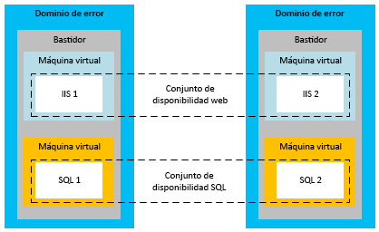
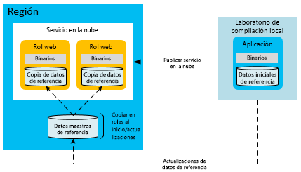
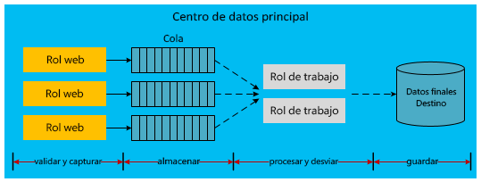

[!INCLUDE [header](../_includes/header.md)]

# Alta disponibilidad para aplicaciones creadas en Microsoft Azure
Una aplicación de alta disponibilidad asume las fluctuaciones en la disponibilidad y la carga, así como los errores temporales en los servicios dependientes y el hardware. La aplicación continúa funcionando de manera aceptable, según lo definido por los requisitos empresariales o en los Acuerdos de Nivel de Servicio (SLA) de la aplicación.

## Características de alta disponibilidad de Azure
Azure integra en su plataforma muchas características que admiten aplicaciones de alta disponibilidad. En esta sección se describen algunas de esas características clave.

### Controlador de tejido
El controlador de tejido de Azure se encarga del aprovisionamiento y la supervisión de la condición de las instancias de proceso de Azure. El controlador de tejido supervisa el estado del hardware y el software de las instancias de máquinas host e invitadas. Cuando detecta un error, mantiene los SLA mediante la reubicación automática de las instancias de máquina virtual. El concepto de dominios de error y de actualización apoya también el SLA de procesos.

Cuando se implementan varias instancias de rol de servicios en la nube, Azure las implementa en distintos dominios de error. Un límite de dominio de error es básicamente un bastidor de hardware diferente en la misma región. Los dominios de error reducen la probabilidad de que un error de hardware localizado interrumpa el servicio de una aplicación. No se puede administrar el número de dominios de error de los roles web o de trabajo. El controlador de tejido usa recursos dedicados que son independientes de las aplicaciones hospedadas en Azure. Requiere un tiempo de actividad del 100 % porque actúa como núcleo del sistema de Azure. Supervisa y administra las instancias de rol en los dominios de error.

En el siguiente diagrama, se muestran los recursos compartidos de Azure que implementa y administra el controlador de tejido en distintos dominios de error.

Mientras que los dominios de error son separaciones físicas para mitigar errores, los dominios de actualización son unidades lógicas de separación de instancias que determinan qué instancias de un servicio se actualizarán en un momento determinado. De forma predeterminada, se definen cinco dominios de actualización para la implementación del servicio hospedado. Aun así, puede cambiar ese valor en el archivo de definición de servicio. Por ejemplo, si tiene ocho instancias del rol web, hay dos instancias en tres dominios de actualización y dos instancias en un dominio de actualización. Azure define la secuencia de actualización según el número de dominios de actualización. Para más información, vea [Actualización de un servicio en la nube](/azure/cloud-services/cloud-services-update-azure-service/).

### Características de otros servicios
Además de estas características de plataforma que admiten una alta disponibilidad de los recursos de procesos, Azure inserta características de alta disponibilidad en sus demás servicios. Por ejemplo, Azure Storage mantiene al menos tres réplicas de todos los datos en la cuenta de almacenamiento de Azure. También permite la replicación geográfica para almacenar copias de los datos en una región secundaria. Azure Content Delivery Network permite que los blobs se almacenen en caché en todo el mundo por redundancia, escalabilidad y latencia más baja. Azure SQL Database también mantiene varias réplicas.

Para obtener información más detallada de las características de disponibilidad de la plataforma Azure, vea la [guía técnica sobre resistencia](index.md). Vea también [Best practices for designing large-scale services on Windows Azure](https://azure.microsoft.com/blog/best-practices-for-designing-large-scale-services-on-windows-azure/)(Procedimientos recomendados para el diseño de servicios a gran escala en Microsoft Azure).

Aunque Azure proporciona varias características que admiten la alta disponibilidad, es importante conocer sus limitaciones:

* Para los procesos, Azure garantiza que los roles estarán disponibles y en funcionamiento, pero no puede detectar si la aplicación está en ejecución o sobrecargada.
* Para Azure SQL Database, los datos se replican de forma sincrónica dentro de la región. Puede elegir la replicación geográfica activa, que permite hasta cuatro copias adicionales de la base de datos en la misma región (o en regiones diferentes). Aunque estas réplicas de base de datos no son copias de seguridad a partir de un momento dado, SQL Database proporciona funcionalidades de copia de seguridad a partir de un momento dado. Para más información, vea [Recuperación de una instancia de Azure SQL Database mediante copias de seguridad de datos automatizadas: Restauración a un momento dado](/azure/sql-database/sql-database-recovery-using-backups#point-in-time-restore).
* Para Azure Storage, los datos de blobs y tablas se replican de forma predeterminada en una región alternativa. Sin embargo, no puede acceder a las réplicas hasta que Microsoft conmute por error al sitio alternativo. Una conmutación por error de región solo se produce durante una interrupción prolongada del servicio en toda la región y no existe ningún SLA para el tiempo de conmutación por error geográfica. También es importante tener en cuenta que los daños en los datos se propagan rápidamente a las réplicas. Por estos motivos, debe complementar las características de disponibilidad de la plataforma con características de disponibilidad específicas de la aplicación, incluida la característica de instantánea de blobs para crear copias de seguridad de los datos de blobs a partir de un momento dado.

### Conjuntos de disponibilidad para Azure Virtual Machines
Este documento se centra principalmente en los servicios en la nube, que usan un modelo de plataforma como servicio (PaaS). También existen características de disponibilidad específicas para Azure Virtual Machines, que utilizan un modelo de infraestructura como servicio (IaaS). Para lograr una alta disponibilidad con Virtual Machines, debe usar conjuntos de disponibilidad, que sirven como una función similar para los dominios de error y de actualización. Dentro de un conjunto de disponibilidad, Azure coloca las máquinas virtuales de forma que se impida que los errores de hardware localizados y las actividades de mantenimiento dejen inactivas todas las máquinas de ese grupo. Los conjuntos de disponibilidad son necesarios para lograr el SLA de Azure para la disponibilidad de Máquinas virtuales.

En el siguiente diagrama se muestran dos conjuntos de disponibilidad para máquinas virtuales web y SQL Server, respectivamente.

> [!NOTE]
> En el diagrama anterior, SQL Server está instalado y ejecutándose en las máquinas virtuales. Esto difiere de Azure SQL Database, que proporciona una base de datos como servicio administrado.
> 
> 

## Estrategias de aplicación para la alta disponibilidad
La mayoría de las estrategias de aplicación para la alta disponibilidad conllevan redundancia o la eliminación de las dependencias físicas entre los componentes de la aplicación. El diseño de la aplicación debería admitir la tolerancia a errores durante el tiempo de inactividad esporádico de Azure o de servicios de terceros. En las secciones siguientes, se describen patrones de aplicación para aumentar la disponibilidad de los servicios en la nube.

### Comunicación asincrónica y colas duraderas
Considere la comunicación asincrónica entre servicios con acoplamiento flexible para aumentar la disponibilidad de las aplicaciones de Azure. En este patrón, los mensajes se escriben en colas de Storage o de Azure Service Bus para procesarlos después. Cuando se escribe el mensaje en la cola, se devuelve el control inmediatamente al remitente. Otro servicio de la aplicación (implementado normalmente como un rol de trabajo) procesa el mensaje. Si el servicio de procesamiento deja de funcionar, los mensajes se acumulan en la cola hasta que se restaure dicho servicio. No existe dependencia directa entre el remitente de front-end y el procesador de mensajes. Esto elimina las llamadas sincrónicas al servicio que pueden producir cuellos de botella en aplicaciones distribuidas.

Otra variación de este patrón almacena información sobre las llamadas a la base de datos con errores en Azure Storage (blobs, tablas o colas) o en las colas de Service Bus. Por ejemplo, una llamada sincrónica dentro de una aplicación a otro servicio (como Azure SQL Database) produce un error repetidamente. Es posible que pueda serializar dicha solicitud en un almacenamiento duradero. Más adelante, cuando el servicio o la base de datos vuelvan a estar en línea, la aplicación puede enviar de nuevo la solicitud desde el almacenamiento. La diferencia en este modelo es que la ubicación intermedia se usa solo durante los errores, no como una parte regular del flujo de trabajo de la aplicación.

En ambos escenarios, la comunicación asincrónica y el almacenamiento intermedio impiden que un servicio back-end inactivo haga que toda la aplicación deje de funcionar. Las colas actúan como intermediario lógico. Para más información sobre cómo elegir entre los servicios de cola, vea [Colas de Storage y de Service Bus: comparación y diferencias](/azure/service-bus-messaging/service-bus-azure-and-service-bus-queues-compared-contrasted/).

### Detección de errores y lógica de reintento
Un aspecto clave del diseño de una aplicación de alta disponibilidad es utilizar la lógica de reintento en el código para controlar correctamente un servicio que no está disponible temporalmente. Las versiones recientes de los SDK de Azure Storage y Azure Service Bus admiten los reintentos de forma nativa. Para más información sobre cómo proporcionar una lógica de reintento personalizada para la aplicación, vea el [patrón de reintento](../patterns/retry.md).

### Patrón de datos de referencia para la alta disponibilidad
Los datos de referencia son los datos de solo lectura de una aplicación. Proporcionan el contexto empresarial en que la aplicación genera datos transaccionales durante una operación empresarial. La integridad de los datos transaccionales depende de una instantánea de los datos de referencia en el momento en que se completó la transacción.

Los datos de referencia son necesarios para el correcto funcionamiento de la aplicación. Varias aplicaciones crean y mantienen datos de referencia; los sistemas de administración de datos maestros (MDM) suelen realizar esta función. Estos sistemas se encargan del ciclo de vida de los datos de referencia. Algunos ejemplos de datos de referencia son un catálogo de productos, un maestro de empleados, un maestro de piezas o un maestro de equipos. Los datos de referencia también se pueden originar fuera de la organización; por ejemplo, códigos postales o tipos impositivos. Las estrategias para aumentar la disponibilidad de los datos de referencia suelen ser menos complicadas que las de los datos transaccionales. La ventaja de los datos de referencia es que, por lo general, son inmutables.

Los roles web y de trabajo de Azure que consumen datos de referencia se pueden establecer como autónomos en tiempo de ejecución mediante la implementación de dichos datos junto con la aplicación. Este enfoque resulta ideal si el tamaño del almacenamiento local permite esa implementación. Las bases de datos SQL o NoSQL insertadas o los archivos XML implementados localmente contribuyen a la autonomía de las unidades de escalado de procesos de Azure. Sin embargo, debe poseer un mecanismo para actualizar los datos en cada rol sin necesidad de volver a implementarlos. Para ello, coloque las actualizaciones de los datos de referencia en un punto de conexión del almacenamiento en la nube (por ejemplo, Azure Blob Storage o SQL Database). Agregue código a cada rol que descarga las actualizaciones de datos en los nodos de proceso cuando se inicia el rol. Como alternativa, agregue código que permita a un administrador realizar una descarga forzada en las instancias de rol.

Para aumentar la disponibilidad, los roles también deben contener un conjunto de los datos de referencia por si el almacenamiento está inactivo. Los roles se pueden iniciar con un conjunto básico de datos de referencia hasta que el recurso de almacenamiento esté disponible para las actualizaciones.

Con este patrón, las nuevas implementaciones o instancias de rol pueden tardar más en iniciarse si va a implementar o descargar grandes volúmenes de datos de referencia. Este inconveniente puede ser aceptable a cambio de contar con la autonomía de disponer inmediatamente de los datos de referencia en cada rol, en lugar de depender de servicios de almacenamiento externos.

### Patrón de datos transaccionales para la alta disponibilidad
Los datos transaccionales son aquellos generados por la aplicación en un contexto empresarial. Se trata de una combinación del conjunto de procesos de negocio implementados por la aplicación y de los datos de referencia en que se sustentan. Algunos ejemplos de datos transaccionales son los pedidos, los avisos de envío avanzados, las facturas y las oportunidades de CRM. Los datos transaccionales se proporcionan a sistemas externos para mantener un registro o para procesarlos más adelante.

Los datos de referencia pueden cambiar dentro de los sistemas encargados de ellos. Por tanto, los datos transaccionales deben guardar el contexto de los datos de referencia en un momento dado, para minimizar las dependencias externas para su coherencia semántica. Por ejemplo, un producto puede eliminarse del catálogo unos meses después de que se haya entregado un pedido. Se recomienda almacenar el máximo contexto de datos de referencia posible con la transacción. Este enfoque conserva la semántica asociada a la transacción, incluso si los datos de referencia cambian una vez capturada la transacción.

Como se ha mencionado, las arquitecturas que usan el acoplamiento flexible y la comunicación asincrónica se proporcionan a niveles más altos de disponibilidad. Esto también es válido para los datos transaccionales, aunque la implementación es más compleja. Normalmente, los patrones transaccionales tradicionales confían en la base de datos para garantizar la transacción. Cuando se incluyen capas intermedias, el código de la aplicación debe administrar correctamente los datos en diversas capas para garantizar una coherencia y una durabilidad suficientes.

La secuencia siguiente describe un flujo de trabajo que separa la captura de los datos transaccionales de su procesamiento:

1. Nodo de proceso web: se presentan los datos de referencia.
2. Almacenamiento externo: se guardan los datos transaccionales intermedios.
3. Nodo de proceso web: se completa la transacción de usuario final.
4. Nodo de proceso web: se envían los datos transaccionales completados junto con el contexto de los datos de referencia a un almacenamiento duradero temporal cuya respuesta predecible está garantizada.
5. Nodo de proceso web: se señala al usuario final la finalización de la transacción.
6. Nodo de proceso en segundo plano: se extraen los datos transaccionales, se siguen procesando si es necesario y se envían a su ubicación final de almacenamiento en el sistema actual.

El siguiente diagrama muestra una posible implementación de este diseño en un servicio en la nube hospedado por Azure.

Las flechas discontinuas del diagrama anterior indican un procesamiento asincrónico. El rol web de front-end desconoce este procesamiento asincrónico. Esto lleva al almacenamiento de la transacción en su destino final con referencia al sistema actual. A consecuencia de la latencia aportada por este modelo asincrónico, los datos transaccionales no están disponibles de inmediato para la consulta. Por lo tanto, cada unidad de datos transaccionales necesita guardarse en caché o en una sesión de usuario para satisfacer los requisitos inmediatos de la interfaz de usuario.

Por consiguiente, el rol web es autónomo del resto de la infraestructura. Su perfil de disponibilidad es una combinación del rol web y la cola de Azure, y no de toda la infraestructura. Además de la alta disponibilidad, este enfoque permite que el rol web se escale horizontalmente, independientemente del almacenamiento back-end. Este modelo de alta disponibilidad puede afectar a la vertiente económica de las operaciones. Los componentes adicionales, como las colas de Azure y los roles de trabajo, pueden afectar al costo por uso mensual.

En el diagrama anterior se muestra una implementación de este enfoque desacoplado de datos transaccionales. pero existen muchas otras posibilidades. En la siguiente lista, se proporcionan algunas alternativas:

* Se puede colocar un rol de trabajo entre el rol web y la cola de almacenamiento.
* Se puede usar una cola de Service Bus en lugar de una cola de Azure Storage.
* El destino final podría ser Azure Storage o un proveedor de base de datos diferente.
* Se puede utilizar Caché de Azure en la capa web para proporcionar los requisitos inmediatos de almacenamiento en caché después de la transacción.

### Patrones de escalabilidad
Es importante tener en cuenta que la escalabilidad de un servicio en la nube afecta directamente a la disponibilidad. Si una carga mayor hace que el servicio no responda, la percepción del usuario es que la aplicación no está funcionando. Siga las prácticas demostradas para la escalabilidad en función de la carga esperada de la aplicación y sus expectativas futuras. Para maximizar la escala, se tienen en cuenta muchas consideraciones, como el uso de una única cuenta de almacenamiento o varias, el uso compartido entre varias bases de datos y las estrategias de almacenamiento en caché. Para obtener información detallada sobre estos patrones, vea [Best practices for designing large-scale services on Microsoft Azure](https://azure.microsoft.com/blog/best-practices-for-designing-large-scale-services-on-windows-azure/) (Procedimientos recomendados para diseñar servicios a gran escala en Microsoft Azure).

## Pasos siguientes
En esta serie de documentos se tratan la recuperación ante desastres y la alta disponibilidad para aplicaciones creadas en Microsoft Azure. El siguiente artículo de la serie es [Recuperación ante desastres para aplicaciones generadas en Microsoft Azure](disaster-recovery-azure-applications.md).

