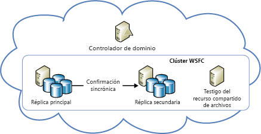
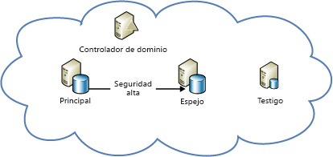

[!INCLUDE [header](../_includes/header.md)]

# Guía técnica sobre resistencia en Azure: recuperación ante errores locales en AzureAzure resiliency technical guidance: Recovery from local failures in Azure

Hay dos amenazas principales para la disponibilidad de las aplicaciones:There are two primary threats to application availability:

* El error de los dispositivos, como las unidades de disco y los servidoresThe failure of devices, such as drives and servers
* El agotamiento de los recursos críticos, como el proceso en condiciones de carga máximaThe exhaustion of critical resources, such as compute under peak load conditions

Azure ofrece una combinación de administración de recursos, elasticidad, equilibrio de carga y creación de particiones que habilita la alta disponibilidad en estas circunstancias.Azure provides a combination of resource management, elasticity, load balancing, and partitioning to enable high availability under these circumstances. Algunas de estas características se realizan automáticamente para todos los servicios de Azure.Some of these features are performed automatically for all Azure services. Sin embargo, en algunos casos, el desarrollador de aplicaciones debe realizar un trabajo adicional para beneficiarse de ellas.However, in some cases, the application developer must do some additional work to benefit from them.

## Cloud ServicesCloud Services
Azure Cloud Services consta de varias colecciones de uno o varios roles de trabajo o web.Azure Cloud Services consists of collections of one or more web or worker roles. Se pueden ejecutar una o varias instancias de un rol simultáneamente.One or more instances of a role can run concurrently. La configuración determina el número de instancias.The configuration determines the number of instances. Las instancias de rol se supervisan y administran mediante un componente denominado controlador de tejido.Role instances are monitored and managed through a component called the fabric controller. El controlador de tejido detecta y responde automáticamente ante los errores de software y de hardware.The fabric controller detects and responds to both software and hardware failures automatically.

Todas las instancias de rol se ejecutan en su propia máquina virtual (VM) y se comunica con su controlador de tejido a través de un agente invitado.Every role instance runs in its own virtual machine (VM) and communicates with its fabric controller through a guest agent. El agente invitado recopila métricas de nodos y de recursos, entre las que se incluye el uso, el estado, los registros, el uso de recursos, las excepciones y las condiciones de error de la máquina virtual.The guest agent collects resource and node metrics, including VM usage, status, logs, resource usage, exceptions, and failure conditions. El controlador de tejido consulta al agente invitado a intervalos configurables y reinicia la máquina virtual si el agente invitado no responde.The fabric controller queries the guest agent at configurable intervals, and it restarts the VM if the guest agent fails to respond. En caso de error de hardware, el controlador de tejido asociado mueve todas las instancias de rol afectadas a un nuevo nodo de hardware y vuelve a configurar la red para enrutar el tráfico que hay allí.In the event of hardware failure, the associated fabric controller moves all affected role instances to a new hardware node and reconfigures the network to route traffic there.

Para beneficiarse de estas características, los desarrolladores deben garantizar que todos los roles de servicio impiden almacenar el estado en las instancias de rol.To benefit from these features, developers should ensure that all service roles avoid storing state on the role instances. En su lugar, se debe acceder a todos los datos persistentes desde un almacenamiento duradero, como Azure Storage o Azure SQL Database.Instead, all persistent data should be accessed from durable storage, such as Azure Storage or Azure SQL Database. Esto permite que cualquier rol controle las solicitudes.This allows any roles to handle requests. También significa que las instancias de rol pueden dejar de funcionar en un momento dado sin que ello genere incoherencias en el estado transitorio o persistente del servicio.It also means that role instances can go down at any time without creating inconsistencies in the transient or persistent state of the service.

El requisito para almacenar el estado externamente en los roles tiene varias implicaciones.The requirement to store state externally to the roles has several implications. Por ejemplo, implica que todos los cambios relacionados con una tabla de Azure Storage deben realizarse, si es posible, en una única transacción de grupos de entidades.It implies, for example, that all related changes to an Azure Storage table should be changed in a single entity-group transaction, if possible. Por supuesto, no siempre es posible realizar todos los cambios en una sola transacción.Of course, it isn't always possible to make all changes in a single transaction. Debe tener especial cuidado de asegurarse de que los errores de instancias de rol no causan problemas cuando interrumpan operaciones de ejecución prolongada que abarcan dos o más actualizaciones en el estado persistente del servicio.You must take special care to ensure that role instance failures do not cause problems when they interrupt long-running operations that span two or more updates to the persistent state of the service. Si otro rol vuelve a intentar esta operación, debe anticiparse y controlar aquella situación en la que el trabajo se completó parcialmente.If another role attempts to retry such an operation, it should anticipate and handle the case where the work was partially completed.

Por ejemplo, considere un servicio que crea particiones de datos en varios almacenes.For example, consider a service that partitions data across multiple stores. Si un rol de trabajo deja de funcionar mientras se reubica una partición, es posible que dicha reubicación no finalice.If a worker role goes down while it's relocating a shard, the relocation of the shard might not finish. O bien, la reubicación se pueden repetir desde su concepción por parte de otro un rol de trabajo, lo que puede causar datos huérfanos o daños en los datos.Or the relocation might be repeated from its inception by a different worker role, potentially causing orphaned data or data corruption. Para evitar problemas, las operaciones de ejecución prolongada deben ser:To prevent problems, long-running operations must be one or both of the following:

* *Idempotente*: repetibles sin efectos secundarios.*Idempotent*: Repeatable without side effects. Para ser idempotente, una operación de ejecución prolongada debe tener el mismo efecto, independientemente de cuántas veces se ejecuta, incluso si la ejecución se interrumpe.To be idempotent, a long-running operation should have the same effect no matter how many times it's executed, even when it's interrupted during execution.
* *Reiniciable incrementalmente*: capaces de continuar desde el último punto de error.*Incrementally restartable*: Able to continue from the most recent point of failure. Para ser reiniciable incrementalmente, una operación de ejecución prolongada debe constar de una secuencia de operaciones atómicas menores.To be incrementally restartable, a long-running operation should consist of a sequence of smaller atomic operations. También debe registrar su progreso en un almacenamiento duradero, con el fin de que cada invocación posterior comience donde se detuvo su predecesora.It should also record its progress in durable storage, so that each subsequent invocation picks up where its predecessor stopped.

Por último, todas las operaciones de ejecución prolongada se deben invocar varias veces hasta que se realicen correctamente.Finally, all long-running operations should be invoked repeatedly until they succeed. Por ejemplo, un rol de trabajo puede colocar una operación de aprovisionamiento en una cola de Azure y, luego, quitarla de la cola solo cuando la operación se haya ejecutado correctamente.For example, a provisioning operation might be placed in an Azure queue, and then removed from the queue by a worker role only when it succeeds. Es posible que la recolección de elementos no utilizados sea necesaria para limpiar los datos que interrumpieron la creación de operaciones.Garbage collection might be necessary to clean up data that interrupted operations create.

### ElasticidadElasticity
El número inicial de instancias que se ejecutan para cada rol se determina en la configuración del mismo.The initial number of instances running for each role is determined in each role’s configuration. Los administradores deben configurar inicialmente cada uno de los roles para que se ejecute con dos o más instancias según la carga esperada.Administrators should initially configure each role to run with two or more instances based on expected load. Pero las instancias de rol pueden escalarse fácilmente de forma vertical u horizontal a medida que cambian los patrones de uso.But you can easily scale role instances up or down as usage patterns change. Esto se puede hacer manualmente en el Portal de Azure, o bien se puede automatizar el proceso con Windows PowerShell, Service Management API o herramientas de terceros.You can do this manually in the Azure portal, or you can automate the process by using Windows PowerShell, the Service Management API, or third-party tools. Para más información, consulte [Cómo escalar automáticamente un servicio en la nube](/azure/cloud-services/cloud-services-how-to-scale/).For more information, see [How to autoscale an application](/azure/cloud-services/cloud-services-how-to-scale/).

### Creación de particionesPartitioning
El controlador de tejido de Azure usa dos tipos de particiones:The Azure fabric controller uses two types of partitions:

* Se usa un *dominio de actualización* para actualizar las instancias de rol de un servicio en grupos.An *update domain* is used to upgrade a service’s role instances in groups. Azure implementa las instancias de servicio en varios dominios de actualización.Azure deploys service instances into multiple update domains. Para realizar una actualización en la ubicación, el controlador de tejido desactiva todas las instancias de un dominio de actualización, las actualiza y, después, las reinicia antes de pasar al siguiente dominio de actualización.For an in-place update, the fabric controller brings down all the instances in one update domain, updates them, and then restarts them before moving to the next update domain. Este método evita que todo el servicio se quede sin disponibilidad durante el proceso de actualización.This approach prevents the entire service from being unavailable during the update process.
* Un *dominio de error* define los potenciales puntos de error de hardware o de la red.A *fault domain* defines potential points of hardware or network failure. En el caso de los roles con más de una instancia, el controlador de tejido garantiza que las instancias se distribuyen entre varios dominios de error, lo que evitar que errores aislados de hardware interrumpan el servicio.For any role that has more than one instance, the fabric controller ensures that the instances are distributed across multiple fault domains, to prevent isolated hardware failures from disrupting service. Los dominios de error rigen toda la exposición a errores en el servidor y en el clúster.Fault domains govern all exposure to server and cluster failures.

El [Acuerdo de Nivel de Servicio (SLA) de Azure](https://azure.microsoft.com/support/legal/sla/) garantiza que cuando se implementan dos o más instancias de rol web en diferentes dominios de error y de actualización, tendrán conectividad externa al menos el 99,95 % del tiempo.The [Azure service-level agreement (SLA)](https://azure.microsoft.com/support/legal/sla/) guarantees that when two or more web role instances are deployed to different fault and upgrade domains, they'll have external connectivity at least 99.95 percent of the time. A diferencia de los dominios de actualización, no hay forma de controlar el número de dominios de error.Unlike update domains, there's no way to control the number of fault domains. Azure asigna automáticamente los dominios de error y distribuye las instancias de rol entre ellos.Azure automatically allocates fault domains and distributes role instances across them. Al menos las dos primeras instancias de cada rol se colocan en diferentes dominios de error y de actualización para garantizar que cualquier rol con un mínimo de dos instancias cumple el Acuerdo de Nivel de Servicio.At least the first two instances of every role are placed in different fault and upgrade domains to ensure that any role with at least two instances will satisfy the SLA. Esto se representa en el diagrama siguiente.This is represented in the following diagram.

### Equilibrio de cargaLoad balancing
Todo el tráfico entrante a un rol web pasa a través de un equilibrador de carga sin estado, que distribuye las solicitudes de clientes entre las instancias de rol.All inbound traffic to a web role passes through a stateless load balancer, which distributes client requests among the role instances. Las instancias de rol individuales no tienen direcciones IP públicas y no se pueden direccionar directamente desde Internet.Individual role instances do not have public IP addresses, and they are not directly addressable from the Internet. Los roles web no tienen estado, con el fin de que todas las solicitudes de clientes se puedan enrutar a cualquier instancia de rol.Web roles are stateless so that any client request can be routed to any role instance. Se desencadena un evento [StatusCheck](https://msdn.microsoft.com/library/microsoft.windowsazure.serviceruntime.roleenvironment.statuscheck.aspx) cada 15 segundos.A [StatusCheck](https://msdn.microsoft.com/library/microsoft.windowsazure.serviceruntime.roleenvironment.statuscheck.aspx) event is raised every 15 seconds. Esto se puede utilizar para indicar si el rol está listo para recibir tráfico o si está ocupado y debe quitarse de la rotación del equilibrador de carga.You can use this to indicate whether the role is ready to receive traffic, or whether it's busy and should be taken out of the load-balancer rotation.

## Virtual MachinesVirtual Machines
Azure Virtual Machines difiere de los roles de proceso de plataforma como servicio (PaaS) en varios aspectos relacionados con la alta disponibilidad.Azure Virtual Machines differs from platform as a service (PaaS) compute roles in several respects in relation to high availability. En algunos casos, deberá realizar tareas adicionales para garantizar una alta disponibilidad.In some instances, you must do additional work to ensure high availability.

### Durabilidad del discoDisk durability
A diferencia de las instancias de rol de PaaS, los datos almacenados en las unidades de máquinas virtuales son persistentes, aunque la máquina virtual se reasigne.Unlike PaaS role instances, data stored on virtual machine drives is persistent even when the virtual machine is relocated. Azure Virtual Machines usa discos de máquinas virtuales que existen como blobs en Azure Storage.Azure virtual machines use VM disks that exist as blobs in Azure Storage. Debido a las características de disponibilidad de Azure Storage, los datos almacenados en las unidades de una máquina virtual también presentan una alta disponibilidad.Because of the availability characteristics of Azure Storage, the data stored on a virtual machine’s drives is also highly available.

Tenga en cuenta que, en las máquinas virtuales de Windows, la unidad D es la excepción a esta regla.Note that drive D (in Windows VMs) is the exception to this rule. La unidad D es realmente un almacenamiento físico en el servidor en bastidor que hospeda la máquina virtual y sus datos se perderán si esta se recicla.Drive D is actually physical storage on the rack server that hosts the VM, and its data will be lost if the VM is recycled. La unidad D solo está prevista como almacenamiento temporal.Drive D is intended for temporary storage only. En Linux, Azure "normalmente" (pero no siempre) expone el disco local temporal como un dispositivo de bloques /dev/sdb.In Linux, Azure “usually” (but not always) exposes the local temporary disk as /dev/sdb block device. A menudo, el agente de Linux de Azure lo monta como los puntos de montaje /mnt/resource o /mnt (configurables mediante /etc/waagent.conf).It is often mounted by the Azure Linux Agent as /mnt/resource or /mnt mount points (configurable via /etc/waagent.conf).

### Creación de particionesPartitioning
Azure entiende de manera nativa los niveles de una aplicación PaaS (rol web y rol de trabajo) y, por consiguiente, puede distribuirlos correctamente entre dominios de error y de actualización.Azure natively understands the tiers in a PaaS application (web role and worker role) and thus can properly distribute them across fault and update domains. En cambio, los niveles de una aplicación de infraestructura como servicio (IaaS) se deben definir manualmente a través de conjuntos de disponibilidad.In contrast, the tiers in an infrastructure as a service (IaaS) application must be manually defined through availability sets. Los conjuntos de disponibilidad son necesarios para un Acuerdo de Nivel de Servicio en IaaS.Availability sets are required for an SLA under IaaS.

En el diagrama anterior, el nivel de Internet Information Services (IIS) (que funciona como nivel de aplicación web) y el nivel de SQL (que funciona como nivel de datos), se asignan a distintos conjuntos de disponibilidad.In the preceding diagram, the Internet Information Services (IIS) tier (which works as a web app tier) and the SQL tier (which works as a data tier) are assigned to different availability sets. Esto garantiza que todas las instancias de cada nivel tienen redundancia de hardware mediante la distribución de máquinas virtuales entre los dominios de error y que no se quitan capas completas durante una actualización.This ensures that all instances of each tier have hardware redundancy by distributing virtual machines across fault domains, and that entire tiers are not taken down during an update.

### Equilibrio de cargaLoad balancing
Si hay que distribuir el tráfico entre las máquinas virtuales, tendrá que agruparlas en una aplicación y equilibrar la carga mediante un punto de conexión TCP o UDP específico.If the VMs should have traffic distributed across them, you must group the VMs in an application and load balance across a specific TCP or UDP endpoint. Para más información, consulte [Equilibrio de carga para servicios de infraestructura de Azure](/azure/virtual-machines/virtual-machines-linux-load-balance/?toc=%2fazure%2fvirtual-machines%2flinux%2ftoc.json).For more information, see [Load balancing virtual machines](/azure/virtual-machines/virtual-machines-linux-load-balance/?toc=%2fazure%2fvirtual-machines%2flinux%2ftoc.json). Si las máquinas virtuales reciben entradas de otro origen (por ejemplo, un mecanismo de puesta en cola), no será necesario un equilibrador de carga.If the VMs receive input from another source (for example, a queuing mechanism), a load balancer is not required. El equilibrador de carga utiliza una comprobación básica de mantenimiento para determinar si se debe enviar tráfico al nodo.The load balancer uses a basic health check to determine whether traffic should be sent to the node. También es posible crear sondeos propios que implementen métricas de mantenimiento específicas de la aplicación que determinen si la máquina virtual debe recibir tráfico.It's also possible to create your own probes to implement application-specific health metrics that determine whether the VM should receive traffic.

## StorageStorage
Azure Storage es el servicio de datos duradero de línea de base de Azure.Azure Storage is the baseline durable data service for Azure. Proporciona almacenamiento en blobs, tablas, colas y discos de máquinas virtuales.It provides blob, table, queue, and VM disk storage. Utiliza una combinación de replicación y administración de recursos para proporcionar alta disponibilidad en un centro de datos individual.It uses a combination of replication and resource management to provide high availability within a single datacenter. El Acuerdo de Nivel de Servicio de disponibilidad de Azure Storage garantiza que al menos un 99,9% del tiempo:The Azure Storage availability SLA guarantees that at least 99.9 percent of the time:

* Se procesarán correctamente las solicitudes con el formato correcto para agregar, actualizar, leer y eliminar datos.Correctly formatted requests to add, update, read, and delete data will be successfully and correctly processed.
* Las cuentas de almacenamiento tendrán conectividad con la puerta de enlace de Internet.Storage accounts will have connectivity to the Internet gateway.

### ReplicaciónReplication
Azure Storage facilita la durabilidad de los datos, para lo que mantiene varias copias de todos los datos en diferentes unidades ubicadas en subsistemas de almacenamiento físico totalmente independientes dentro de la región.Azure Storage facilitates data durability by maintaining multiple copies of all data on different drives across fully independent physical storage subsystems within the region. Los datos se replican de forma sincrónica y todas las copias se confirman antes de que se reconoce la operación de escritura.Data is replicated synchronously, and all copies are committed before the write is acknowledged. Azure Storage es muy coherente, lo cual significa que se garantiza que las operaciones de lectura reflejan las operaciones de escritura más recientes.Azure Storage is strongly consistent, meaning that reads are guaranteed to reflect the most recent writes. Además, las copias de los datos se examinan continuamente para detectar y reparar la degradación de bits, una amenaza para la integridad de los datos almacenados que a menudo se pasa por alto.In addition, copies of data are continually scanned to detect and repair bit rot, an often overlooked threat to the integrity of stored data.

Los servicios se pueden beneficiar de la replicación solo con usar Azure Storage.Services benefit from replication just by using Azure Storage. El desarrollador del servicio no necesita hacer ningún trabajo adicional para que se realice la recuperación de un error local.The service developer doesn't need to do additional work to recover from a local failure.

### Administración de recursosResource management
Las cuentas de almacenamiento creadas después de mayo de 2014 pueden tener hasta 500 TB (el máximo anterior era de 200 TB).Storage accounts created after May 2014, can grow to up to 500 TB (the previous maximum was 200 TB). Si se requiere espacio adicional, las aplicaciones se deberán diseñar para que usen varias cuentas de almacenamiento.If additional space is required, applications must be designed to use multiple storage accounts.

### Discos de máquinas virtualesVirtual machine disks
Un disco de máquina virtual se almacena como un blob en páginas en Azure Storage, lo que le otorga las mismas propiedades de durabilidad y escalabilidad que a Blob Storage.A virtual machine’s disk is stored as a page blob in Azure Storage, giving it all the same durability and scalability properties as Blob storage. Este diseño hace que los datos de un disco de máquina virtual sean persistentes aunque se produzca un error en el servidor que ejecuta la máquina virtual y esta deba reiniciarse en otro servidor.This design makes the data on a virtual machine’s disk persistent, even if the server running the VM fails and the VM must be restarted on another server.

## Base de datosDatabase
### SQL DatabaseSQL Database
Azure SQL Database proporciona la base de datos como un servicio.Azure SQL Database provides database as a service. Permite que las aplicaciones se aprovisionen rápidamente bases de datos relacionales, inserten datos en ellas y las consulten.It allows applications to quickly provision, insert data into, and query relational databases. Proporciona muchas de las conocidas características y funcionalidades de SQL Server, al tiempo que reduce la carga de hardware, configuración, aplicación de revisiones y resistencia.It provides many of the familiar SQL Server features and functionality, while abstracting the burden of hardware, configuration, patching, and resiliency.

> [!NOTE]
> Azure SQL Database no proporciona una paridad de características uno a uno con SQL Server.Azure SQL Database does not provide one-to-one feature parity with SQL Server. Está pensada para satisfacer un conjunto diferente de requisitos, que es adecuado exclusivamente para aplicaciones en la nube (escala elástica, base de datos como servicio para reducir costos de mantenimiento, etc.).It's intended to fulfill a different set of requirements--one that's uniquely suited to cloud applications (elastic scale, database as a service to reduce maintenance costs, and so on). Para obtener más información, consulte [Selección de una opción de SQL Server en la nube: Base de datos (PaaS) SQL de Azure o SQL Server en máquinas virtuales de Azure (IaaS)](/azure/sql-database/sql-database-paas-vs-sql-server-iaas/).For more information, see [Choose a cloud SQL Server option: Azure SQL (PaaS) Database or SQL Server on Azure VMs (IaaS)](/azure/sql-database/sql-database-paas-vs-sql-server-iaas/).
> 
> 

#### ReplicaciónReplication
Azure SQL Database proporciona resistencia integrada a errores en el nivel de nodo.Azure SQL Database provides built-in resiliency to node-level failure. Todas las operaciones de escritura que se realizan en una base de datos se replican automáticamente en dos o más nodos en segundo plano mediante una técnica de confirmación de quórum.All writes into a database are automatically replicated to two or more background nodes through a quorum commit technique. (tanto el nodo principal como al menos un nodo secundario deben confirmar que la actividad se escribe en el registro de transacciones antes de que la transacción se considere correcta y se devuelve). En caso de error del nodo, la base de datos automáticamente se conmuta por error a una de las réplicas secundarias.(The primary and at least one secondary must confirm that the activity is written to the transaction log before the transaction is deemed successful and returns.) In the case of node failure, the database automatically fails over to one of the secondary replicas. Esto produce una interrupción de la conexión transitoria para las aplicaciones cliente.This causes a transient connection interruption for client applications. Por este motivo, todos los clientes de Azure SQL Database deben implementar alguna forma de control de conexiones transitorias.For this reason, all Azure SQL Database clients must implement some form of transient connection handling. Para más información, consulte [Vuelva a intentar la orientación específica del servicio](/azure/best-practices-retry-service-specific/).For more information, see [Retry service specific guidance](/azure/best-practices-retry-service-specific/).

#### Administración de recursosResource management
Cada base de datos, cuando se crea, se configura con un límite de tamaño superior.Each database, when created, is configured with an upper size limit. El tamaño máximo actualmente disponible es de 1 TB (los límites de tamaño varían según su nivel de servicio, consulte [Niveles de servicio y niveles de rendimiento de Azure SQL Database](/azure/sql-database/sql-database-resource-limits/#service-tiers-and-performance-levels).The currently available maximum size is 1 TB (size limits vary based on your service tier, see [service tiers and performance levels of Azure SQL Databases](/azure/sql-database/sql-database-resource-limits/#service-tiers-and-performance-levels). Cuando una base de datos alcanza su límite superior de tamaño, rechaza comandos INSERT o UPDATE adicionalesWhen a database hits its upper size limit, it rejects additional INSERT or UPDATE commands. (la consulta y eliminación de datos aún es posible).(Querying and deleting data is still possible.)

En una base de datos, Azure SQL Database usa un tejido para administrar los recursos.Within a database, Azure SQL Database uses a fabric to manage resources. No obstante, en lugar de un controlador de tejido, usa una topología en anillo para detectar errores.However, instead of a fabric controller, it uses a ring topology to detect failures. Cada réplica de un clúster tienen dos vecinos y es responsable de detectar cuándo estos dejan de funcionar.Every replica in a cluster has two neighbors and is responsible for detecting when they go down. Cuando una réplica deja de funcionar, sus vecinos desencadenan un agente de reconfiguración que la vuelve a crear en otra máquina.When a replica goes down, its neighbors trigger a reconfiguration agent to re-create it on another machine. Se proporciona limitación del motor para garantizar que un servidor lógico no usa demasiados recursos de una máquina ni supera los límites físicos de la misma.Engine throttling is provided to ensure that a logical server doesn't use too many resources on a machine or exceed the machine’s physical limits.

### ElasticidadElasticity
Si la aplicación requiere más espacio que el límite de 1 TB de la base de datos, deberá implementar un enfoque de escalado horizontal.If the application requires more than the 1 TB database limit, it must implement a scale-out approach. El escalado horizontal con Azure SQL Database se realiza mediante la creación manual de particiones, operación que también se denomina particionamiento, de datos en varias instancias de SQL Database.You scale out with Azure SQL Database by manually partitioning, also known as sharding, data across multiple SQL databases. Este enfoque de escalado horizontal brinda la oportunidad de lograr un crecimiento del costo casi lineal con la escala.This scale-out approach provides the opportunity to achieve nearly linear cost growth with scale. El crecimiento elástico o la capacidad a petición pueden aumentar según sea necesario, lo cual implicará un aumento de los costos, ya que las bases de datos se facturan según el tamaño real promedio usado cada día, y no según el tamaño máximo posible.Elastic growth or capacity on demand can grow with incremental costs as needed because databases are billed based on the average actual size used per day, not based on maximum possible size.

## SQL Server en máquinas virtualesSQL Server on Virtual Machines
Si instala SQL Server en (versión 2014 o posterior) Azure Virtual Machines, podrá sacar provecho de las características de disponibilidad tradicionales de SQL Server.By installing SQL Server (version 2014 or later) on Azure Virtual Machines, you can take advantage of the traditional availability features of SQL Server. Dichas características incluyen grupos de disponibilidad AlwaysOn y creación de reflejo de la base de datos.These features include AlwaysOn Availability Groups and database mirroring. Tenga en cuenta que las máquinas virtuales de Azure, el almacenamiento y las redes tienen características operativas diferentes de las de una infraestructura de TI local y no virtualizada.Note that Azure VMs, storage, and networking have different operational characteristics than an on-premises, non-virtualized IT infrastructure. Para implementar correctamente una solución de alta disponibilidad y recuperación ante desastres (HA/DR) de SQL Server en Azure es preciso conocer estas diferencias y diseñar la solución de tal forma que se adapte a ellas.A successful implementation of a high availability/disaster recovery (HA/DR) SQL Server solution in Azure requires that you understand these differences and design your solution to accommodate them.

### Nodos de alta disponibilidad en un conjunto de disponibilidadHigh-availability nodes in an availability set
Cuando implementa una solución de alta disponibilidad en Azure, se puede usar el conjunto de disponibilidad de Azure para colocar los nodos de alta disponibilidad en dominios de error y de actualización independientes.When you implement a high-availability solution in Azure, you can use the availability set in Azure to place the high-availability nodes into separate fault domains and upgrade domains. Para ser más precisos, "conjunto de disponibilidad" es un concepto de Azure.To be clear, the availability set is an Azure concept. Se trata de un procedimiento recomendado que debe seguir para asegurarse de que las bases de datos tienen realmente una alta disponibilidad, independientemente de que se utilicen grupos de disponibilidad AlwaysOn, creación de reflejo de la base de datos o cualquier otra característica.It's a best practice that you should follow to make sure that your databases are indeed highly available, whether you're using AlwaysOn Availability Groups, database mirroring, or something else. Si no sigue este procedimiento, es posible que tenga la certeza incorrecta de que su sistema tiene alta disponibilidad.If you don't follow this best practice, you might be under the false assumption that your system is highly available. Pero en realidad, todos los nodos pueden dejar de funcionar simultáneamente porque están colocados en el mismo dominio de error de la región de Azure.But in reality, your nodes can all fail simultaneously because they happen to be placed in the same fault domain in the Azure region.

Esta recomendación no tiene tanta validez con el trasvase de registros.This recommendation is not as applicable with log shipping. Al tratarse de una característica de recuperación ante desastres, debe asegurarse de que los servidores se ejecutan en regiones independientes de Azure.As a disaster recovery feature, you should ensure that the servers are running in separate Azure regions. Por definición, estas regiones son dominios de error independientes.By definition, these regions are separate fault domains.

En el caso de las máquinas virtuales en Azure Cloud Services implementadas mediante el portal clásico en el mismo conjunto de disponibilidad, debe implementarlas en el mismo servicio en la nube.For Azure Cloud Services VMs deployed through the classic portal to be in the same availability set, you must deploy them in the same Cloud Service. Las máquinas virtuales implementadas mediante Azure Resource Manager (el portal actual) no tienen esta limitación.VMs deployed through Azure Resource Manager (the current portal) do not have this limitation. En el caso de las máquinas virtuales implementadas mediante el portal clásico en el servicio en la nube de Azure, solo los nodos en el mismo servicio en la nube pueden participar en el mismo conjunto de disponibilidad.For classic portal deployed VMs in Azure Cloud Service, only nodes in the same Cloud Service can participate in the same availability set. Además, las máquinas virtuales en Cloud Services deben estar en la misma red virtual para asegurarse de que conservan sus direcciones IP incluso después de la recuperación del servicio,In addition, the Cloud Services VMs should be in the same virtual network to ensure that they maintain their IPs even after service healing. ya que esto evita las interrupciones de actualización de DNS.This avoids DNS update disruptions.

### Solo Azure: soluciones de alta disponibilidadAzure-only: High-availability solutions
Puede tener una solución de alta disponibilidad para sus bases de datos SQL Server en Azure mediante el uso de grupos de disponibilidad AlwaysOn o de creación de reflejo de la base de datos.You can have a high-availability solution for your SQL Server databases in Azure by using AlwaysOn Availability Groups or database mirroring.

El siguiente diagrama muestra la arquitectura de los grupos de disponibilidad AlwaysOn que se ejecutan en Azure Virtual Machines.The following diagram demonstrates the architecture of AlwaysOn Availability Groups running on Azure Virtual Machines. Este diagrama se ha tomado del artículo [Alta disponibilidad y recuperación ante desastres para SQL Server en Azure Virtual Machines](/azure/virtual-machines/windows/sql/virtual-machines-windows-sql-high-availability-dr/), en el que se analiza en profundidad este tema.This diagram was taken from the in-depth article on this subject, [High availability and disaster recovery for SQL Server on Azure Virtual Machines](/azure/virtual-machines/windows/sql/virtual-machines-windows-sql-high-availability-dr/).

También puede aprovisionar automáticamente una implementación de grupos de disponibilidad AlwaysOn de un extremo a otro en máquinas virtuales de Azure mediante el uso de la plantilla de AlwaysOn en el Portal de Azure.You can also automatically provision an AlwaysOn Availability Groups deployment end-to-end on Azure VMs by using the AlwaysOn template in the Azure portal. Para obtener más información, consulte [Oferta de AlwaysOn de SQL Server en la Galería de Microsoft Azure Portal](https://blogs.technet.microsoft.com/dataplatforminsider/2014/08/25/sql-server-alwayson-offering-in-microsoft-azure-portal-gallery/).For more information, see [SQL Server AlwaysOn Offering in Microsoft Azure Portal Gallery](https://blogs.technet.microsoft.com/dataplatforminsider/2014/08/25/sql-server-alwayson-offering-in-microsoft-azure-portal-gallery/).

El diagrama siguiente muestra el uso de creación de reflejo de la base de datos en Azure Virtual Machines.The following diagram demonstrates the use of database mirroring on Azure Virtual Machines. También se ha tomado del artículo [Alta disponibilidad y recuperación ante desastres para SQL Server en Azure Virtual Machines](/azure/virtual-machines/windows/sql/virtual-machines-windows-sql-high-availability-dr/).It was also taken from the in-depth topic [High availability and disaster recovery for SQL Server on Azure Virtual Machines](/azure/virtual-machines/windows/sql/virtual-machines-windows-sql-high-availability-dr/).

> [!NOTE]
> En ambas arquitecturas se requiere un controlador de dominio.Both architectures require a domain controller. Sin embargo, con creación de reflejo de la base de datos se pueden utilizar certificados de servidor para eliminar la necesidad de un controlador de dominio.However, with database mirroring, it's possible to use server certificates to eliminate the need for a domain controller.
> 
> 

## Otros servicios de la plataforma de AzureOther Azure platform services
Las aplicaciones que se basan en Azure se benefician de las capacidades de la plataforma para recuperarse de errores locales.Applications that are built on Azure benefit from platform capabilities to recover from local failures. En algunos casos, se pueden realizar acciones concretas para aumentar la disponibilidad de un escenario concreto.In some cases, you can take specific actions to increase availability for your specific scenario.

### Azure Service BusService Bus
Para mitigar una interrupción temporal de Azure Service Bus, considere la posibilidad de crear una cola duradera en el lado de cliente.To mitigate against a temporary outage of Azure Service Bus, consider creating a durable client-side queue. Con ello, utilizará temporalmente un mecanismo de almacenamiento local alternativo para almacenar los mensajes que no se puedan agregar a la cola de Service Bus.This temporarily uses an alternate, local storage mechanism to store messages that cannot be added to the Service Bus queue. La aplicación puede decidir cómo controlar los mensajes almacenados temporalmente una vez restaurado el servicio.The application can decide how to handle the temporarily stored messages after the service is restored. Para obtener más información, consulte [Prácticas recomendadas para la realización de mejoras con la mensajería asincrónica de Service Bus](/azure/service-bus-messaging/service-bus-performance-improvements/) y [Service Bus (recuperación ante desastres)](recovery-loss-azure-region.md#other-azure-platform-services).For more information, see [Best practices for performance improvements using Service Bus brokered messaging](/azure/service-bus-messaging/service-bus-performance-improvements/) and [Service Bus (disaster recovery)](recovery-loss-azure-region.md#other-azure-platform-services).

### HDInsightHDInsight
Los datos asociados a HDInsight de Azure se almacenan de forma predeterminada en el Almacenamiento de blobs de Azure.The data that's associated with Azure HDInsight is stored by default in Azure Blob storage. Azure Storage especifica las propiedades de durabilidad y alta disponibilidad de Blob Storage.Azure Storage specifies high-availability and durability properties for Blob storage. El procesamiento de varios nodos asociado a los trabajos MapReduce de Hadoop se realiza en un sistema de archivos distribuido Hadoop (HDFS) transitorio que se aprovisiona cuando HDInsight lo necesita.The multiple-node processing that's associated with Hadoop MapReduce jobs occurs on a transient Hadoop Distributed File System (HDFS) that is provisioned when HDInsight needs it. Los resultados de un trabajo MapReduce también se almacenan de forma predeterminada en Almacenamiento de blobs de Azure, con el fin de que los datos procesados sean duraderos y tengan una alta disponibilidad después de que el clúster de Hadoop se desaprovisione.Results from a MapReduce job are also stored by default in Azure Blob storage, so that the processed data is durable and remains highly available after the Hadoop cluster is deprovisioned. Para obtener más información, consulte [HDInsight (recuperación ante desastres)](recovery-loss-azure-region.md#other-azure-platform-services).For more information, see [HDInsight (disaster recovery)](recovery-loss-azure-region.md#other-azure-platform-services).

## Listas de comprobación para errores localesChecklists for local failures
### Cloud ServicesCloud Services
1. Revise la sección Cloud Services de este documento.Review the Cloud Services section of this document.
2. Configure al menos dos instancias para cada rol.Configure at least two instances for each role.
3. Conserve el estado en un almacenamiento durable, no en instancias de rol.Persist state in durable storage, not on role instances.
4. Controle correctamente el evento StatusCheck.Correctly handle the StatusCheck event.
5. Encapsule los cambios relacionados en transacciones siempre que sea posible.Wrap related changes in transactions when possible.
6. Compruebe que las tareas del rol de trabajo son idempotentes y reiniciables.Verify that worker role tasks are idempotent and restartable.
7. Continúe invocando las operaciones hasta que se completen satisfactoriamente.Continue to invoke operations until they succeed.
8. Considere estrategias de escalado automático.Consider autoscaling strategies.

### Virtual MachinesVirtual Machines
1. Revise la sección Máquinas virtuales de este documento.Review the Virtual Machines section of this document.
2. No utilice la unidad D para el almacenamiento persistente.Do not use drive D for persistent storage.
3. Agrupe las máquinas de un nivel de servicio en un conjunto de disponibilidad.Group machines in a service tier into an availability set.
4. Configure el equilibrio de carga y los sondeos opcionales.Configure load balancing and optional probes.

### StorageStorage
1. Revise la sección Almacenamiento de este documento.Review the Storage section of this document.
2. Utilice varias cuentas de almacenamiento cuando los datos o el ancho de banda superen las cuotas.Use multiple storage accounts when data or bandwidth exceeds quotas.

### SQL DatabaseSQL Database
1. Revise la sección SQL Database de este documento.Review the SQL Database section of this document.
2. Implemente una directiva de reintentos para controlar los errores transitorios.Implement a retry policy to handle transient errors.
3. Utilice el particionamiento como estrategia de escalado horizontal.Use partitioning/sharding as a scale-out strategy.

### SQL Server en máquinas virtualesSQL Server on Virtual Machines
1. Revise la sección SQL Server en máquinas virtuales de este documento.Review the SQL Server on Virtual Machines section of this document.
2. Siga las recomendaciones anteriores para Máquinas virtuales.Follow the previous recommendations for Virtual Machines.
3. Use las características de alta disponibilidad de SQL Server, como AlwaysOn.Use SQL Server high availability features, such as AlwaysOn.

### Azure Service BusService Bus
1. Revise la sección Service Bus de este documento.Review the Service Bus section of this document.
2. Considere la creación de una cola duradera en el lado del cliente como copia de seguridad.Consider creating a durable client-side queue as a backup.

### HDInsightHDInsight
1. Revise la sección HDInsight de este documento.Review the HDInsight section of this document.
2. Para los errores locales no se requieren más pasos de disponibilidad.No additional availability steps are required for local failures.

