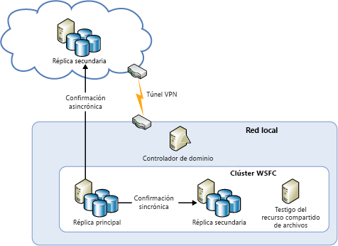
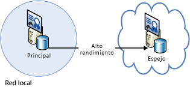
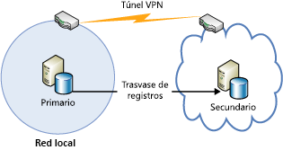
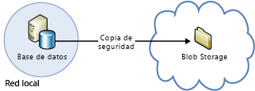

[!INCLUDE [header](../_includes/header.md)]

# Guía técnica sobre resistencia en Azure: recuperación desde un centro de datos local a Azure
Azure proporciona un completo conjunto de servicios para habilitar la extensión de un centro de datos local a Azure con fines de alta disponibilidad y recuperación ante desastres:

* **Redes**: con una red privada virtual puede ampliar de forma segura la red local en la nube.
* **Proceso**: los clientes que usan Hyper-V en local pueden "levantar y mover" las máquinas virtuales existentes a Azure.
* **Almacenamiento**: StorSimple extiende el sistema de archivos a Azure Storage. El servicio Azure Backup proporciona copias de seguridad de los archivos y Bases de datos SQL de Azure en Azure Storage.
* **Replicación de base de datos**: con los grupos de disponibilidad de SQL Server 2014 (o posterior) puede implementar las características de alta disponibilidad y de recuperación ante desastres para los datos locales.

## Redes
Puede usar Azure Virtual Network para crear una sección aislada lógicamente en Azure y conectarla de forma segura al centro de datos local o a un único equipo cliente mediante una conexión IPsec. Con Virtual Network puede sacarle todo el partido a la infraestructura escalable a petición de Azure, sin dejar de ofrecer conectividad a los datos y aplicaciones locales, incluidos los sistemas que se ejecutan en Windows Server, en grandes sistemas y en UNIX. Para más información, consulte la [documentación de redes de Azure](/azure/virtual-network/virtual-networks-overview/) .

## Proceso
Si está utilizando Hyper-V de forma local puede "levantar y mover" las máquinas virtuales existentes a Azure junto con los proveedores de servicios que ejecutan Windows Server 2012 (o posterior), sin realizar cambios en la máquina virtual ni convertir sus formatos. Para obtener más información, consulte [Acerca de los discos y los discos duros virtuales para máquinas virtuales de Azure](/azure/virtual-machines/virtual-machines-linux-about-disks-vhds/?toc=%2fazure%2fvirtual-machines%2flinux%2ftoc.json).

## Azure Site Recovery
Si desea obtener la recuperación ante desastres como servicio (DRaaS), Azure proporciona [Azure Site Recovery](https://azure.microsoft.com/services/site-recovery/). Azure Site Recovery ofrece protección completa para servidores de VMware, Hyper-V y físicos. Con Azure Site Recovery puede utilizar otro servidor local o el mismo Azure como sitio de recuperación. Para más información sobre Azure Site Recovery, consulte la [Documentación de Azure Site Recovery](https://azure.microsoft.com/documentation/services/site-recovery/).

## Storage
Hay varias opciones para usar Azure como sitio de copia de seguridad para los datos locales.

### StorSimple
StorSimple integra de forma segura y transparente el almacenamiento en la nube para las aplicaciones locales. También ofrece un único dispositivo que proporciona almacenamiento local en capas de alto rendimiento y almacenamiento en la nube, archivado activo, protección de datos basada en la nube y recuperación ante desastres. Para más información, consulte la [página de productos de StorSimple](https://azure.microsoft.com/services/storsimple/).

### Azure Backup
Azure Backup permite las copias de seguridad en la nube mediante las conocidas herramientas de copia de seguridad de Windows Server 2012 (o posterior), Windows Server 2012 Essentials (o posterior) y System Center 2012 Data Protection Manager (o posterior). Estas herramientas proporcionan un flujo de trabajo para la administración de copias de seguridad que es independiente de la ubicación de almacenamiento de estas, ya se trate de un disco local o de Azure Storage. Una vez que se realiza la copia de seguridad de los datos en la nube, los usuarios autorizados pueden recuperar fácilmente copias de seguridad en cualquier servidor.

Con las copias de seguridad incrementales, solo se transfieren a la nube los cambios en los archivos. Esto permite usar eficazmente el espacio de almacenamiento, reducir el consumo del ancho de banda y admitir la recuperación de estados anteriores de varias versiones de los datos. También puede usar características adicionales, como las directivas de retención de datos, la compresión de datos y la limitación de la transferencia de datos. El uso de Azure como ubicación de las copias de seguridad tiene la ventaja obvia de que las copias de seguridad están automáticamente en una ubicación remota. Esto elimina los requisitos adicionales para proteger los medios de copia de seguridad in situ.

Para obtener más información, consulte [¿Qué es Azure Backup?](/azure/backup/backup-introduction-to-azure-backup/) y [Configuración de Azure Backup para los datos DPM](https://technet.microsoft.com/library/jj728752.aspx).

## Base de datos
Puede tener una solución de recuperación ante desastres para las bases de datos de SQL Server en un entorno de TI híbrida usando grupos de disponibilidad AlwaysOn, creación de reflejo de base de datos, trasvase de registros y copias de seguridad y restauración con el Almacenamiento de blobs de Azure. Todas estas soluciones utilizan SQL Server que se ejecuta en Azure Virtual Machines.

Los grupos de disponibilidad AlwaysOn pueden utilizarse en un entorno de TI híbrida donde las réplicas de la base de datos existen tanto de forma local como en la nube. Esto se muestra en el diagrama siguiente.

La creación de reflejo de base de datos también puede abarcar servidores locales y en la nube en una instalación basada en certificados. En el siguiente diagrama, se ilustra este concepto.

El trasvase de registros se puede usar para sincronizar una base de datos local con una base de datos de SQL Server en una máquina virtual de Azure.

Por último, puede hacer una copia de una base de datos local directamente en Almacenamiento de blobs de Azure.

Para obtener más información, consulte [Alta disponibilidad y recuperación ante desastres para SQL Server en Azure Virtual Machines](/azure/virtual-machines/windows/sql/virtual-machines-windows-sql-high-availability-dr/) y [Copias de seguridad y restauración para SQL Server en Azure Virtual Machines](/azure/virtual-machines/windows/sql/virtual-machines-windows-sql-backup-recovery/).

## Listas de comprobación para la recuperación local en Microsoft Azure
### Redes
1. Revise la sección Redes de este documento.
2. Use la red virtual para conectar de forma segura la ubicación local a la nube.

### Proceso
1. Revise la sección Proceso de este documento.
2. Reubique las máquinas virtuales entre Hyper-V y Azure.

### Storage
1. Revise la sección Almacenamiento de este documento.
2. Aproveche las ventajas de los servicios de StorSimple para usar el almacenamiento en la nube.
3. Use los servicios de Azure Backup.

### Base de datos
1. Revise la sección Base de datos de este documento.
2. Considere la posibilidad de usar SQL Server en máquinas virtuales de Azure como copia de seguridad.
3. Configure los grupos de disponibilidad AlwaysOn.
4. Configure el reflejo de base de datos basado en certificados.
5. Use el trasvase de registros.
6. Realice una copia de seguridad de las bases de datos locales en Almacenamiento de blobs de Azure.

