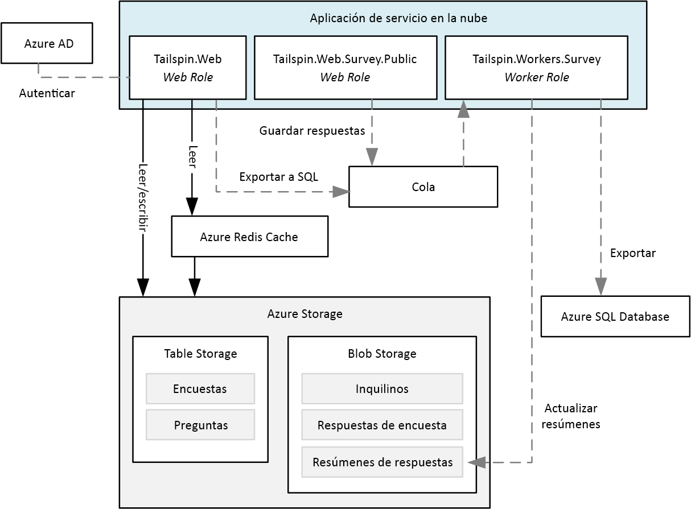
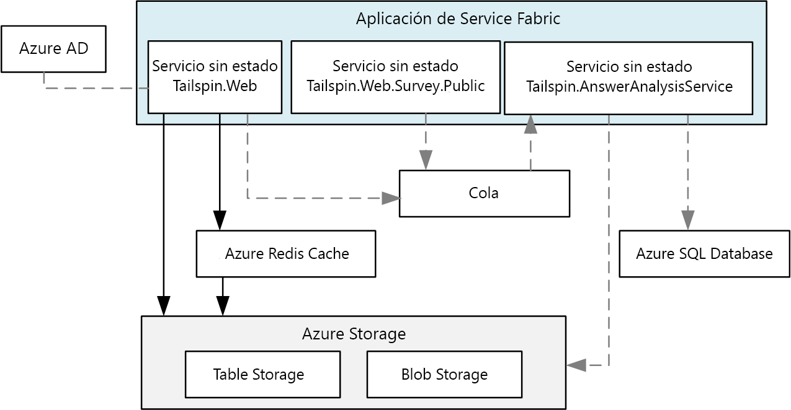
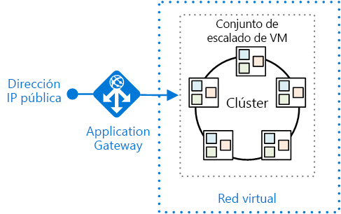
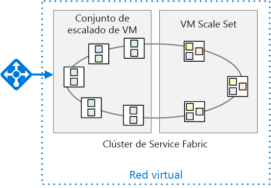

# <a name="migrate-an-azure-cloud-services-application-to-azure-service-fabric"></a>Migrar una aplicación de Azure Cloud Services a Azure Service Fabric 

[ Código de ejemplo][sample-code]

En este artículo se explica cómo migrar una aplicación de Azure Cloud Services a Azure Service Fabric. Se centra en las decisiones arquitectónicas y los procedimientos recomendados. 

Para este proyecto, empezamos con una aplicación de Cloud Services denominada Surveys y lo migramos a Service Fabric. El objetivo era migrar la aplicación con el menor número de cambios posible. En un artículo posterior, optimizaremos la aplicación para Service Fabric mediante la adopción de una arquitectura de microservicios.

Antes de leer este artículo, le resultará útil comprender los conceptos básicos de Service Fabric y de las arquitecturas de microservicios en general. Consulte los artículos siguientes:

- [Información general de Azure Service Fabric][sf-overview]
- [¿Por qué usar un enfoque de microservicios para crear aplicaciones?][sf-why-microservices]


## <a name="about-the-surveys-application"></a>Acerca de la aplicación Surveys

En 2012, el grupo de modelos y prácticas crea una aplicación denominada encuestas, para un libro denominado [desarrollar aplicaciones de varios inquilinos para la nube][tailspin-book]. En el libro se describe una compañía ficticia denominada Tailspin que diseña e implementa la aplicación Surveys.

Surveys es una aplicación multiinquilino que permite a los clientes crear encuestas. Cuando un cliente se registra en la aplicación, los miembros de la organización del cliente pueden crear y publicar encuestas, así como recopilar los resultados para el análisis. La aplicación incluye un sitio web público de donde los usuarios pueden extraer una encuesta. Obtenga más información sobre el escenario de Tailspin original [aquí][tailspin-scenario].

Ahora Tailspin quiere mover la aplicación Surveys a una arquitectura de microservicios, con Service Fabric ejecutándose en Azure. Dado que la aplicación ya está implementada como una aplicación de Cloud Services, Tailspin adopta un enfoque de varias fases:

1.  Migre los servicios en la nube a Service Fabric y minimice los cambios en la aplicación.
2.  Optimice la aplicación para Service Fabric mediante el cambio a una arquitectura de microservicios.

En este artículo se describe la primera fase. En un artículo posterior describiré la segunda fase. En un proyecto real, es probable que ambas fases se superpongan. Al realizar la migración a Service Fabric, también empezaría a rediseñar la aplicación en microservicios. Más adelante puede refinar aún más la arquitectura, quizás mediante la división de servicios generales en servicios más pequeños.  

El código de la aplicación está disponible en [GitHub][sample-code]. Este repositorio contiene la aplicación Cloud Services y la versión de Service Fabric. 

> Cloud Service es una versión actualizada de la aplicación original del libro *Developing Multi-tenant Applications* (Desarrollo de aplicaciones multiinquilino).

## <a name="why-microservices"></a>¿Por qué microservicios?

No se incluye una explicación detallada de los microservicios en este artículo, pero estas son algunas de las ventajas que Tailspin espera obtener con el cambio a una arquitectura de microservicios:

- **Actualizaciones de aplicaciones**. Los servicios se pueden implementar de manera independiente, por lo que puede seguir un enfoque incremental para actualizar una aplicación.
- **Resistencia y aislamiento de errores**. Si se produce un error en un servicio, otros servicios se siguen ejecutando.
- **Escalabilidad**. Los servicios pueden escalarse de manera independiente.
- **Flexibilidad**. Los servicios están diseñados alrededor de escenarios empresariales, no pilas de tecnología, lo que facilita la migración de servicios a nuevos almacenes de datos, marcos o tecnologías.
- **Desarrollo ágil**. Los servicios individuales tienen menos código que una aplicación monolítica, lo que hace que la base de código sea más fácil de comprender, razonar y probar.
- **Equipos pequeños y centrados**. Dado que la aplicación se desglosa en muchos servicios pequeños, cada servicio puede estar formado por un pequeño equipo centrado.

## <a name="why-service-fabric"></a>¿Por qué Service Fabric?
      
Service Fabric es una buena opción para una arquitectura de microservicios, ya que la mayoría de las características necesarias en un sistema distribuido está integrada en Service Fabric, como:

- **Administración de clústeres**. Service Fabric controla automáticamente la conmutación por error de nodo, el seguimiento de estado y otras funciones de administración del clúster.
- **Escalado horizontal**. Al agregar nodos a un clúster de Service Fabric, la aplicación se escala automáticamente, a medida que los servicios se distribuyen entre los nuevos nodos.
- **Detección de servicios**. Service Fabric proporciona un servicio de detección que puede resolver el punto de conexión para un servicio con nombre.
- **Servicios sin estado y con estado**. Los servicios con estado usan [colecciones confiables][sf-reliable-collections], que pueden ocupar el lugar de una memoria caché o una cola y pueden particionarse.
- **Administración del ciclo de vida de las aplicaciones**. Los servicios se pueden actualizar por separado y sin tiempo de inactividad de las aplicaciones.
- **Orquestación del servicio** en un clúster de máquinas.
- **Mayor densidad** para la optimización del consumo de recursos. Un solo nodo puede hospedar varios servicios.

Service Fabric usa varios servicios de Microsoft, incluidos Azure SQL Database, Cosmos DB, Azure Event Hubs, etc., que forman una plataforma probada para la compilación de aplicaciones en la nube distribuidas. 

## <a name="comparing-cloud-services-with-service-fabric"></a>Comparación de Cloud Services con Service Fabric

En la tabla siguiente se resumen algunas de las principales diferencias entre las aplicaciones Cloud Services y Service Fabric. Para ver una discusión más detallada, consulte [Obtenga información acerca de las diferencias entre Cloud Services y Service Fabric antes de migrar las aplicaciones][sf-compare-cloud-services].

|        | Cloud Services | Service Fabric |
|--------|---------------|----------------|
| Composición de la aplicación | Roles| Services |
| Densidad |Una instancia de rol por VM | Varios servicios en un solo nodo |
| Número mínimo de nodos | 2 por rol | 5 por clúster, para implementaciones de producción |
| Administración de estados | Sin estado | Con o sin estado* |
| Hospedaje | Azure | En la nube o local |
| Hospedaje web | IIS** | Autohospedaje |
| Modelo de implementación | [Modelo de implementación clásica][azure-deployment-models] | [Resource Manager][azure-deployment-models]  |
| Packaging | Archivos de paquete de servicios en la nube (.cspkg) | Paquetes de aplicaciones y servicios |
| Actualización de aplicaciones | Intercambio de VIP o actualización gradual | Actualización gradual |
| Escalado automático | [Servicio integrado][cloud-service-autoscale] | Conjuntos de escalado de máquinas virtuales para la escalabilidad horizontal automática |
| Depuración | Emulador local | Clúster local |


\* Los servicios con estado usan [colecciones confiables][sf-reliable-collections] para almacenar el estado entre réplicas, de modo que todas las lecturas sean locales para los nodos del clúster. Las escrituras se replican entre los nodos para mejorar la confiabilidad. Los servicios sin estado pueden tener un estado externo, bien con una base de datos u otro almacenamiento externo.

** Los roles de trabajo también pueden autohospedar ASP.NET Web API mediante OWIN.

## <a name="the-surveys-application-on-cloud-services"></a>Aplicación Surveys en Cloud Services

El siguiente diagrama muestra la arquitectura de la aplicación Surveys que se ejecuta en Cloud Services. 



La aplicación consta de dos roles web y un rol de trabajo.

- El rol web **Tailspin.Web** hospeda un sitio web de ASP.NET que los clientes de Tailspin usan para crear y administrar encuestas. Los clientes también usan este sitio web para registrarse en la aplicación y administrar sus suscripciones. Por último, los administradores de Tailspin pueden usarlo para ver la lista de los inquilinos y administrar sus datos. 

- El rol web **Tailspin.Web.Survey.Public** hospeda un sitio web de ASP.NET de donde los usuarios pueden extraer las encuestas que publican los clientes de Tailspin. 

- El rol de trabajo **Tailspin.Workers.Survey** realiza el procesamiento en segundo plano. Los roles web colocan los elementos de trabajo en una cola y el rol de trabajo procesa los elementos. Se definen dos tareas en segundo plano: exportación de las respuestas de las encuestas a Azure SQL Database y cálculo de las estadísticas de las respuestas de las encuestas.

Además de Cloud Services, la aplicación Surveys usa otros servicios de Azure:

- **Azure Storage** para almacenar encuestas, respuestas de encuestas e información de los inquilinos.

- **Azure Redis Cache** para almacenar en caché algunos de los datos que se almacenan en Azure Storage, a fin de acelerar el acceso de lectura. 

- **Azure Active Directory** (Azure AD) para autenticar clientes y administradores de Tailspin.

- **Azure SQL Database** para almacenar las respuestas de las encuestas para el análisis. 

## <a name="moving-to-service-fabric"></a>Migración a Service Fabric

Como ya mencioné, el objetivo de esta fase era la migración a Service Fabric con los mínimos cambios necesarios. Con ese fin, creamos servicios sin estado correspondientes a cada rol de servicio en la nube en la aplicación original:



De forma intencionada, esta arquitectura es muy similar a la aplicación original. Sin embargo, el diagrama oculta algunas diferencias importantes. En el resto de este artículo, exploraremos esas diferencias. 


## <a name="converting-the-cloud-service-roles-to-services"></a>Conversión de roles de servicio en la nube en servicios

Como ya mencioné, migramos cada uno de los roles de servicio en la nube a un servicio de Service Fabric. Dado que los roles de servicio en la nube no tienen estado, para esta fase tenía sentido crear servicios sin estado en Service Fabric. 

Para la migración, seguimos los pasos descritos en [Guía de conversión de roles web y de trabajo a servicios sin estado de Service Fabric][sf-migration]. 

### <a name="creating-the-web-front-end-services"></a>Creación de servicios front-end web

En Service Fabric, un servicio se ejecuta dentro de un proceso creado por el tiempo de ejecución de Service Fabric. Para un front-end web, eso significa que el servicio no se está ejecutando en IIS. En su lugar, el servicio debe hospedar un servidor web. Este enfoque se denomina *autohospedaje*, porque el código que se ejecuta en el proceso actúa como el host del servidor web. 

El requisito de autohospedaje significa que un servicio de Service Fabric no puede usar ASP.NET MVC ni Web Forms de ASP.NET, porque esos marcos requieren IIS y no admiten el autohospedaje. Las opciones de autohospedaje incluyen:

- [ASP.NET Core][aspnet-core], autohospedado mediante el servidor web [Kestrel][kestrel]. 
- [ASP.NET Web API][aspnet-webapi], autohospedado mediante [OWIN][owin].
- Marcos de terceros, como [Nancy](http://nancyfx.org/).

La aplicación Surveys original usa ASP.NET MVC. Dado que ASP.NET MVC no se puede autohospedar en Service Fabric, consideramos las siguientes opciones de migración:

- Migre los roles web a ASP.NET Core, que puede autohospedarse.
- Convierta el sitio web en una aplicación de una sola página (SPA) que llame a una API web implementada mediante ASP.NET Web API. Esto habría requerido volver a diseñar completamente el front-end web.
- Mantenga el código existente de ASP.NET MVC e implemente IIS en un contenedor de Windows Server para Service Fabric. Este enfoque requeriría pocos cambios en el código o ninguno. Sin embargo, la [compatibilidad con contenedores][sf-containers] de Service Fabric está todavía en versión preliminar.

En función de estas consideraciones, seleccionamos la primera opción, migrar a ASP.NET Core. Para ello, seguimos los pasos descritos en [Migrating From ASP.NET MVC to ASP.NET Core MVC][aspnet-migration] (Migración de ASP.NET MVC a ASP.NET Core MVC). 

> [!NOTE]
> Por motivos de seguridad, al usar ASP.NET Core con Kestrel, debe colocar a un proxy inverso delante de Kestrel para controlar el tráfico de Internet. Para obtener más información, consulte [Kestrel web server implementation in ASP.NET Core][kestrel] (Implementación del servidor web Kestrel en ASP.NET Core). En la sección [Implementación de la aplicación](#deploying-the-application) se describe una implementación de Azure recomendada.

### <a name="http-listeners"></a>Agentes de escucha HTTP

En Cloud Services, un rol web o de trabajo declara un punto de conexión HTTP en el [archivo de definición de servicio][cloud-service-endpoints] para su exposición. El rol web de tener, al menos, un punto de conexión.

```xml
<!-- Cloud service endpoint -->
<Endpoints>
    <InputEndpoint name="HttpIn" protocol="http" port="80" />
</Endpoints>
```

De igual forma, los puntos de conexión de Service Fabric se declaran en un manifiesto de servicio: 

```xml
<!-- Service Fabric endpoint -->
<Endpoints>
    <Endpoint Protocol="http" Name="ServiceEndpoint" Type="Input" Port="8002" />
</Endpoints>
```

Sin embargo, a diferencia de un rol de servicio en la nube, los servicios de Service Fabric pueden colocarse en el mismo nodo. Por lo tanto, cada servicio debe escuchar en un puerto distinto. Más adelante en este artículo, analizaremos cómo se enrutan las solicitudes de cliente en el puerto 80 o el puerto 443 al puerto correcto del servicio.

Un servicio debe crear explícitamente los agentes de escucha para cada punto de conexión. La razón es que Service Fabric es agnóstico en cuanto a las pilas de comunicación. Para obtener más información, consulte [Creación de un front-end de servicio web para una aplicación mediante ASP.NET Core][sf-aspnet-core].

## <a name="packaging-and-configuration"></a>Empaquetado y configuración

 Un servicio en la nube contiene los archivos de paquete y de configuración siguientes:

| Archivo | DESCRIPCIÓN |
|------|-------------|
| Definición de servicio (.csdef) | Configuración que usa Azure para configurar el servicio en la nube. Define los roles, los puntos de conexión, las tareas de inicio y los nombres de los valores de configuración. |
| Configuración del servicio (.cscfg) | Configuración por implementación, incluido el número de instancias de rol, los números de puerto de los puntos de conexión y los valores de configuración. 
| Paquete de servicio (.cspkg) | Contiene el código y las configuraciones de la aplicación, así como el archivo de definición de servicio.  |

Hay un archivo .csdef para toda la aplicación. Puede tener varios archivos .cscfg para diferentes entornos, como local, de prueba y de producción. Cuando el servicio se está ejecutando, puede actualizar el archivo .cscfg, pero no el archivo .csdef. Para obtener más información, consulte [¿Qué es el modelo de servicio en la nube y cómo se empaqueta?][cloud-service-config]

Service Fabric tiene una división similar entre la *definición* de servicio y la *configuración* de servicio, pero la estructura más granular. Para entender el modelo de configuración de Service Fabric, resulta útil comprender cómo se empaqueta una aplicación de Service Fabric. La estructura es la siguiente:

```
Application package
  - Service packages
    - Code package
    - Configuration package
    - Data package (optional)
```

El paquete de aplicación es lo que se implementa. Contiene uno o varios paquetes de servicio. Un paquete de servicio contiene paquetes de código, configuración y datos. El paquete de código contiene los archivos binarios de los servicios y el paquete de configuración contiene las opciones de configuración. Este modelo permite actualizar servicios individuales sin tener que volver a implementar toda la aplicación. También permite actualizar solo los valores de configuración, sin tener que volver a implementar el código o reiniciar el servicio.

Una aplicación de Service Fabric contiene los archivos de configuración siguientes:

| Archivo | La ubicación | DESCRIPCIÓN |
|------|----------|-------------|
| ApplicationManifest.xml | Paquete de aplicación | Define los servicios que componen la aplicación. |
| ServiceManifest.xml | Paquete de servicio| Describe uno o varios servicios. |
| Settings.xml | Paquete de configuración | Contiene los valores de configuración de los servicios definidos en el paquete de servicio. |

Para más información, consulte [Modelar una aplicación en Service Fabric][sf-application-model].

Para admitir distintas opciones de configuración para varios entornos, emplee el siguiente enfoque, que se describe en [Administración de los parámetros de la aplicación en varios entornos][sf-multiple-environments]:

1. Defina el valor de configuración en el archivo Setting.xml del servicio.
2. En el manifiesto de la aplicación, defina una invalidación para el valor de configuración.
3. Coloque los valores de configuración específicos del entorno en archivos de parámetros de la aplicación.


## <a name="deploying-the-application"></a>Implementación de la aplicación

Mientras que Azure Cloud Services es un servicio administrado, Service Fabric es un motor en tiempo de ejecución. Puede crear clústeres de Service Fabric en muchos entornos, incluido Azure y entornos locales. En este artículo, nos centramos en la implementación en Azure. 

En el diagrama siguiente se muestra una implementación recomendada:



El clúster de Service Fabric se implementa en un [conjunto de escalado de máquinas virtuales][vm-scale-sets]. Los conjuntos de escalado de máquinas virtuales son un recurso de Azure Compute que se usa para implementar y administrar un conjunto de máquinas virtuales idénticas. 

Como ya mencioné, el servidor web Kestrel requiere a un proxy inverso por motivos de seguridad. Este diagrama muestra [Azure Application Gateway][application-gateway], que es un servicio de Azure que ofrece distintas funcionalidades de equilibrio de carga de capa 7. Actúa como un servicio de proxy inverso, que termina la conexión de cliente y reenvía las solicitudes de vuelta a los puntos de conexión de back-end. Puede usar una solución de proxy inverso diferente, como nginx.  

### <a name="layer-7-routing"></a>Enrutamiento de capa 7

En la [aplicación Surveys original](https://msdn.microsoft.com/library/hh534477.aspx#sec21), un rol web escuchaba en el puerto 80 y el otro, en el puerto 443. 

| Sitio público | Sitio de administración de encuestas |
|-------------|------------------------|
| `http://tailspin.cloudapp.net` | `https://tailspin.cloudapp.net` |

Otra opción es usar el enrutamiento de capa 7. En este enfoque, las distintas rutas de dirección URL se enrutan a números de puerto diferentes en el back-end. Por ejemplo, el sitio público podría usar rutas de dirección URL que empiecen por `/public/`. 

Las opciones para el enrutamiento de capa 7 incluyen:

- Usar Application Gateway. 

- Usar un dispositivo virtual de red (NVA), como nginx.

- Escribir una puerta de enlace personalizada como un servicio sin estado.

Tenga en cuenta este enfoque si tiene dos o más servicios con puntos de conexión HTTP públicos, pero quiere que aparezcan como un sitio con un nombre de dominio único.

> Un enfoque que *no* se recomienda es permitir que los clientes externos envíen solicitudes a través del [proxy inverso][sf-reverse-proxy] de Service Fabric. Aunque esto es posible, el proxy inverso está destinado a la comunicación entre servicios. Abrirlo a clientes externos expondría *cualquier* servicio que se ejecute en el clúster con un punto de conexión HTTP.

### <a name="node-types-and-placement-constraints"></a>Restricciones de colocación y tipos de nodo

En la implementación anterior, todos los servicios se ejecutan en todos los nodos. Sin embargo, también puede agrupar los servicios, para que determinados servicios se ejecuten solo en determinados nodos en el clúster. Los motivos para usar este enfoque incluyen:

- Ejecutar algunos servicios en distintos tipos de máquina virtual. Por ejemplo, algunos servicios podrían ejecutar procesos intensivos o requerir unidades GPU. Puede tener una combinación de tipos de máquinas virtuales en el clúster de Service Fabric.
- Aislar servicios front-end de servicios back-end por motivos de seguridad. Todos los servicios front-end se ejecutarán en un conjunto de nodos y los servicios back-end se ejecutarán en nodos diferentes del mismo clúster.
- Requisitos de escala diferentes. Es posible que algunos servicios tengan que ejecutarse en más nodos que otros. Por ejemplo, si define nodos front-end y nodos back-end, cada conjunto se puede escalar de manera independiente.

El siguiente diagrama muestra un clúster que separa los servicios front-end y back-end:



Para implementar este enfoque:

1.  Al crear el clúster, defina dos o más tipos de nodo. 
2.  Para cada servicio, use [restricciones de colocación][sf-placement-constraints] para asignar el servicio a un tipo de nodo.

Al realizar la implementación en Azure, cada tipo de nodo se implementa en un conjunto de escalado de máquinas virtuales independiente. El clúster de Service Fabric abarca todos los tipos de nodo. Para obtener más información, consulte [Relación entre los tipos de nodos de Service Fabric y los conjuntos de escalado de máquinas virtuales][sf-node-types].

> Si un clúster tiene varios tipos de nodo, un tipo de nodo se designa como el tipo de nodo *principal*. Los servicios de tiempo de ejecución de Service Fabric, como el servicio de administración del clúster, se ejecutan en el tipo de nodo principal. Aprovisione al menos 5 nodos para el tipo de nodo principal en un entorno de producción. El otro tipo de nodo debe tener al menos 2 nodos.

## <a name="configuring-and-managing-the-cluster"></a>Configuración y administración del clúster

Para evitar que usuarios no autorizados se conecten a su clúster, los clústeres deben protegerse. Se recomienda usar Azure AD para autenticar clientes y certificados X.509 para la seguridad entre nodos. Para más información, consulte [Escenarios de seguridad de los clústeres de Service Fabric][sf-security].

Para configurar un punto de conexión HTTPS público, consulte [Especificación de recursos en un manifiesto de servicio][sf-manifest-resources].

Puede escalar horizontalmente la aplicación mediante la adición de máquinas virtuales al clúster. Los conjuntos de escalado de máquinas virtuales admiten el escalado automático mediante la aplicación de reglas de escalado automático basadas en contadores de rendimiento. Para más información, consulte [Escalado o reducción horizontal de un clúster de Service Fabric usando reglas de escalado automático][sf-auto-scale].

Mientras el clúster se está ejecutando, debe recopilar registros de todos los nodos en una ubicación central. Para más información, consulte [Collect logs by using Azure Diagnostics][sf-logs] (Recopilar registros con Azure Diagnostics).   


## <a name="conclusion"></a>Conclusión

La migración de la aplicación Surveys a Service Fabric era un proceso bastante sencillo. En resumen, hicimos lo siguiente:

- Convertimos los roles en servicios sin estado.
- Convertimos los servidores front-end web a ASP.NET Core.
- Cambiamos los archivos de empaquetado y configuración al modelo de Service Fabric.

Además, la implementación cambió de Cloud Services a un clúster de Service Fabric que se ejecutaba en un conjunto de escalado de máquinas virtuales.

## <a name="next-steps"></a>pasos siguientes

Una vez portada correctamente la aplicación Surveys, Tailspin desea aprovechar las características de Service Fabric, como el control de versiones y la implementación de servicios independientes. Vea cómo Tailspin ha descompuesto estos servicios en una arquitectura más pormenorizada para aprovechar estas características de Service Fabric en [Refactorización de una aplicación de Azure Service Fabric migrada de Azure Cloud Services][refactor-surveys].

<!-- links -->

[application-gateway]: /azure/application-gateway/
[aspnet-core]: /aspnet/core/
[aspnet-webapi]: https://www.asp.net/web-api
[aspnet-migration]: /aspnet/core/migration/mvc
[aspnet-hosting]: /aspnet/core/fundamentals/hosting
[aspnet-webapi]: https://www.asp.net/web-api
[azure-deployment-models]: /azure/azure-resource-manager/resource-manager-deployment-model
[cloud-service-autoscale]: /azure/cloud-services/cloud-services-how-to-scale-portal
[cloud-service-config]: /azure/cloud-services/cloud-services-model-and-package
[cloud-service-endpoints]: /azure/cloud-services/cloud-services-enable-communication-role-instances#worker-roles-vs-web-roles
[kestrel]: https://docs.microsoft.com/aspnet/core/fundamentals/servers/kestrel
[lb-probes]: /azure/load-balancer/load-balancer-custom-probe-overview
[owin]: https://www.asp.net/aspnet/overview/owin-and-katana
[refactor-surveys]: refactor-migrated-app.md
[sample-code]: https://github.com/mspnp/cloud-services-to-service-fabric
[sf-application-model]: /azure/service-fabric/service-fabric-application-model
[sf-aspnet-core]: /azure/service-fabric/service-fabric-add-a-web-frontend
[sf-auto-scale]: /azure/service-fabric/service-fabric-cluster-scale-up-down
[sf-compare-cloud-services]: /azure/service-fabric/service-fabric-cloud-services-migration-differences
[sf-connect-and-communicate]: /azure/service-fabric/service-fabric-connect-and-communicate-with-services
[sf-containers]: /azure/service-fabric/service-fabric-containers-overview
[sf-logs]: /azure/service-fabric/service-fabric-diagnostics-how-to-setup-wad
[sf-manifest-resources]: /azure/service-fabric/service-fabric-service-manifest-resources
[sf-migration]: /azure/service-fabric/service-fabric-cloud-services-migration-worker-role-stateless-service
[sf-multiple-environments]: /azure/service-fabric/service-fabric-manage-multiple-environment-app-configuration
[sf-node-types]: /azure/service-fabric/service-fabric-cluster-nodetypes
[sf-overview]: /azure/service-fabric/service-fabric-overview
[sf-placement-constraints]: /azure/service-fabric/service-fabric-cluster-resource-manager-cluster-description
[sf-reliable-collections]: /azure/service-fabric/service-fabric-reliable-services-reliable-collections
[sf-reliable-services]: /azure/service-fabric/service-fabric-reliable-services-introduction
[sf-reverse-proxy]: /azure/service-fabric/service-fabric-reverseproxy
[sf-security]: /azure/service-fabric/service-fabric-cluster-security
[sf-why-microservices]: /azure/service-fabric/service-fabric-overview-microservices
[tailspin-book]: https://msdn.microsoft.com/library/ff966499.aspx
[tailspin-scenario]: https://msdn.microsoft.com/library/hh534482.aspx
[unity]: https://msdn.microsoft.com/library/ff647202.aspx
[vm-scale-sets]: /azure/virtual-machine-scale-sets/virtual-machine-scale-sets-overview
