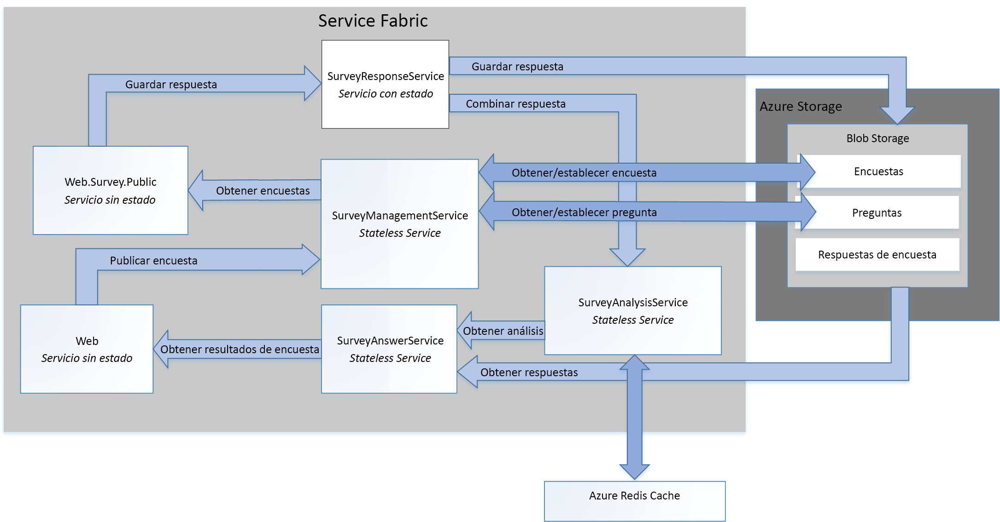

# <a name="refactor-an-azure-service-fabric-application-migrated-from-azure-cloud-services"></a><span data-ttu-id="e282f-103">Refactorización de una aplicación de Azure Service Fabric migrada de Azure Cloud Services</span><span class="sxs-lookup"><span data-stu-id="e282f-103">Refactor an Azure Service Fabric Application migrated from Azure Cloud Services</span></span>

<span data-ttu-id="e282f-104">[ Código de ejemplo][sample-code]</span><span class="sxs-lookup"><span data-stu-id="e282f-104">[ Sample code][sample-code]</span></span>

<span data-ttu-id="e282f-105">En este artículo se describe cómo refactorizar una aplicación de Azure Service Fabric para obtener una arquitectura más pormenorizada.</span><span class="sxs-lookup"><span data-stu-id="e282f-105">This article describes refactoring an existing Azure Service Fabric application to a more granular architecture.</span></span> <span data-ttu-id="e282f-106">Este artículo aborda cuestiones sobre el diseño, el empaquetado, el rendimiento y la implementación de la aplicación de Service Fabric refactorizada.</span><span class="sxs-lookup"><span data-stu-id="e282f-106">This article focuses on the design, packaging, performance, and deployment considerations of the refactored Service Fabric application.</span></span>

## <a name="scenario"></a><span data-ttu-id="e282f-107">Escenario</span><span class="sxs-lookup"><span data-stu-id="e282f-107">Scenario</span></span>

<span data-ttu-id="e282f-108">Tal y como se describe en el artículo anterior, [Migración de una aplicación de Azure Cloud Services a Azure Service Fabric][migrate-from-cloud-services], el grupo de modelos y prácticas creó un libro en 2012 que documentaba el proceso de diseño e implementación de una aplicación de Cloud Services en Azure.</span><span class="sxs-lookup"><span data-stu-id="e282f-108">As discussed in the previous article, [Migrating an Azure Cloud Services application to Azure Service Fabric][migrate-from-cloud-services], the patterns & practices team authored a book in 2012 that documented the process for designing and implementing a Cloud Services application in Azure.</span></span> <span data-ttu-id="e282f-109">En este libro se describe una compañía ficticia denominada Tailspin que desea crear una aplicación de Cloud Services llamada **Surveys**.</span><span class="sxs-lookup"><span data-stu-id="e282f-109">The book describes a fictitious company named Tailspin that wants to create a Cloud Services application named **Surveys**.</span></span> <span data-ttu-id="e282f-110">La aplicación Surveys permite a los usuarios crear y publicar encuestas que el público puede responder.</span><span class="sxs-lookup"><span data-stu-id="e282f-110">The Surveys application allows users to create and publish surveys that can be answered by the public.</span></span> <span data-ttu-id="e282f-111">El siguiente diagrama muestra la arquitectura de esta versión de la aplicación Surveys:</span><span class="sxs-lookup"><span data-stu-id="e282f-111">The following diagram shows the architecture of this version of the Surveys application:</span></span>


<span data-ttu-id="e282f-112">El rol web **Tailspin.Web** hospeda un sitio de ASP.NET MVC que los clientes de Tailspin usan para:</span><span class="sxs-lookup"><span data-stu-id="e282f-112">The **Tailspin.Web** web role hosts an ASP.NET MVC site that Tailspin customers use to:</span></span>
* <span data-ttu-id="e282f-113">registrarse en la aplicación Surveys;</span><span class="sxs-lookup"><span data-stu-id="e282f-113">sign up for the Surveys application,</span></span>
* <span data-ttu-id="e282f-114">crear o eliminar una única encuesta;</span><span class="sxs-lookup"><span data-stu-id="e282f-114">create or delete a single survey,</span></span>
* <span data-ttu-id="e282f-115">ver los resultados de una única encuesta;</span><span class="sxs-lookup"><span data-stu-id="e282f-115">view results for a single survey,</span></span>
* <span data-ttu-id="e282f-116">solicitar que los resultados de la encuesta se exporten a SQL;</span><span class="sxs-lookup"><span data-stu-id="e282f-116">request that survey results be exported to SQL, and</span></span>
* <span data-ttu-id="e282f-117">ver los resultados y análisis agregados de las encuestas.</span><span class="sxs-lookup"><span data-stu-id="e282f-117">view aggregated survey results and analysis.</span></span>

<span data-ttu-id="e282f-118">El rol web **Tailspin.Web.Survey.Public** también hospeda un sitio de ASP.NET MVC que el público visita para completar las encuestas.</span><span class="sxs-lookup"><span data-stu-id="e282f-118">The **Tailspin.Web.Survey.Public** web role also hosts an ASP.NET MVC site that the public visits to fill out the surveys.</span></span> <span data-ttu-id="e282f-119">Estas respuestas se ponen en cola para guardarse.</span><span class="sxs-lookup"><span data-stu-id="e282f-119">These responses are put in a queue to be saved.</span></span>

<span data-ttu-id="e282f-120">El rol de trabajo **Tailspin.Workers.Survey** recoge solicitudes de varias colas para realizar el procesamiento en segundo plano.</span><span class="sxs-lookup"><span data-stu-id="e282f-120">The **Tailspin.Workers.Survey** worker role performs background processing by picking up requests from multiple queues.</span></span>

<span data-ttu-id="e282f-121">El grupo de modelos y prácticas creó después un nuevo proyecto para portar esta aplicación a Azure Service Fabric.</span><span class="sxs-lookup"><span data-stu-id="e282f-121">The patterns & practices team then created a new project to port this application to Azure Service Fabric.</span></span> <span data-ttu-id="e282f-122">El objetivo de este proyecto era realizar únicamente las modificaciones necesarias en el código para poder ejecutar la aplicación en un clúster de Azure Service Fabric.</span><span class="sxs-lookup"><span data-stu-id="e282f-122">The goal of this project was to make only the necessary code changes to get the application running in an Azure Service Fabric cluster.</span></span> <span data-ttu-id="e282f-123">En consecuencia, los roles web y de trabajo originales no se descompusieron en una arquitectura más pormenorizada.</span><span class="sxs-lookup"><span data-stu-id="e282f-123">As a result, the original web and worker roles were not decomposed into a more granular architecture.</span></span> <span data-ttu-id="e282f-124">La arquitectura resultante es muy similar a la versión de la aplicación para el servicio en la nube:</span><span class="sxs-lookup"><span data-stu-id="e282f-124">The resulting architecture is very similar to the Cloud Service version of the application:</span></span>


<span data-ttu-id="e282f-125">El servicio **Tailspin.Web** se porta desde el rol web *Tailspin.Web* original.</span><span class="sxs-lookup"><span data-stu-id="e282f-125">The **Tailspin.Web** service is ported from the original *Tailspin.Web* web role.</span></span>

<span data-ttu-id="e282f-126">El servicio **Tailspin.Web.Survey.Public** se porta desde el rol web *Tailspin.Web.Survey.Public* original.</span><span class="sxs-lookup"><span data-stu-id="e282f-126">The **Tailspin.Web.Survey.Public** service is ported from the original *Tailspin.Web.Survey.Public* web role.</span></span>

<span data-ttu-id="e282f-127">El servicio **Tailspin.AnswerAnalysisService** se porta desde el rol de trabajo *Tailspin.Workers.Survey* original.</span><span class="sxs-lookup"><span data-stu-id="e282f-127">The **Tailspin.AnswerAnalysisService** service is ported from the original *Tailspin.Workers.Survey* worker role.</span></span>

> [!NOTE] 
> <span data-ttu-id="e282f-128">Aunque apenas se realizaron cambios en el código en cada uno de los roles web y de trabajo, **Tailspin.Web** y **Tailspin.Web.Survey.Public** se modificaron para autohospedar un servidor web [Kestrel].</span><span class="sxs-lookup"><span data-stu-id="e282f-128">While minimal code changes were made to each of the web and worker roles, **Tailspin.Web** and **Tailspin.Web.Survey.Public** were modified to self-host a [Kestrel] web server.</span></span> <span data-ttu-id="e282f-129">La aplicación Surveys anterior es una aplicación ASP.NET que se hospedaba mediante Internet Information Services (IIS), pero no es posible ejecutar IIS como un servicio en Service Fabric.</span><span class="sxs-lookup"><span data-stu-id="e282f-129">The earlier Surveys application is an ASP.NET application that was hosted using Interet Information Services (IIS), but it is not possible to run IIS as a service in Service Fabric.</span></span> <span data-ttu-id="e282f-130">Por lo tanto, cualquier servidor web debe ser capaz de autohospedarse, como [Kestrel].</span><span class="sxs-lookup"><span data-stu-id="e282f-130">Therefore, any web server must be capable of being self-hosted, such as [Kestrel].</span></span> <span data-ttu-id="e282f-131">En ciertos casos, es posible ejecutar IIS en un contenedor en Service Fabric.</span><span class="sxs-lookup"><span data-stu-id="e282f-131">It is possible to run IIS in a container in Service Fabric in some situations.</span></span> <span data-ttu-id="e282f-132">Consulte los [escenarios para usar contenedores][container-scenarios] para más información.</span><span class="sxs-lookup"><span data-stu-id="e282f-132">See [scenarios for using containers][container-scenarios] for more information.</span></span>  

<span data-ttu-id="e282f-133">Ahora, Tailspin refactoriza la aplicación Surveys a una arquitectura más pormenorizada.</span><span class="sxs-lookup"><span data-stu-id="e282f-133">Now, Tailspin is refactoring the Surveys application to a more granular architecture.</span></span> <span data-ttu-id="e282f-134">El objetivo de Tailspin al refactorizar es facilitar el desarrollo, la compilación y la implementación de la aplicación Surveys.</span><span class="sxs-lookup"><span data-stu-id="e282f-134">Tailspin's motivation for refactoring is to make it easier to develop, build, and deploy the Surveys application.</span></span> <span data-ttu-id="e282f-135">Al descomponer los roles web y de trabajo existentes en una arquitectura más pormenorizada, Tailspin busca eliminar las dependencias de comunicación y datos estrechamente acopladas existentes entre estos roles.</span><span class="sxs-lookup"><span data-stu-id="e282f-135">By decomposing the existing web and worker roles to a more granular architecture, Tailspin wants to remove the existing tightly coupled communication and data dependencies between these roles.</span></span>

<span data-ttu-id="e282f-136">Tailspin encuentra otras ventajas al trasladar la aplicación Surveys a una arquitectura más pormenorizada:</span><span class="sxs-lookup"><span data-stu-id="e282f-136">Tailspin sees other benefits in moving the Surveys application to a more granular architecture:</span></span>
* <span data-ttu-id="e282f-137">Cada servicio se puede empaquetar en proyectos independientes con un ámbito lo suficientemente pequeño como para que un equipo reducido pueda administrarlo.</span><span class="sxs-lookup"><span data-stu-id="e282f-137">Each service can be packaged into independent projects with a scope small enough to be managed by a small team.</span></span>
* <span data-ttu-id="e282f-138">El control de versiones y la implementación de cada servicio pueden realizarse de manera independiente.</span><span class="sxs-lookup"><span data-stu-id="e282f-138">Each service can be independently versioned and deployed.</span></span>
* <span data-ttu-id="e282f-139">Cada servicio puede implementarse mediante la tecnología óptima para ese servicio.</span><span class="sxs-lookup"><span data-stu-id="e282f-139">Each service can be implemented using the best technology for that service.</span></span> <span data-ttu-id="e282f-140">Por ejemplo, un clúster de Service Fabric puede incluir servicios creados con distintas versiones de .Net Framework, Java u otros lenguajes como C o C++.</span><span class="sxs-lookup"><span data-stu-id="e282f-140">For example, a service fabric cluster can include services built using different versions of the .Net Frameworks, Java, or other languages such as C or C++.</span></span>
* <span data-ttu-id="e282f-141">Cada servicio se puede escalar independientemente para responder a aumentos y disminuciones de carga.</span><span class="sxs-lookup"><span data-stu-id="e282f-141">Each service can be independently scaled to respond to increases and decreases in load.</span></span>

> [!NOTE] 
> <span data-ttu-id="e282f-142">La arquitectura multiinquilino está fuera del ámbito de la refactorización de esta aplicación.</span><span class="sxs-lookup"><span data-stu-id="e282f-142">Multitenancy is out of scope for the refactoring of this application.</span></span> <span data-ttu-id="e282f-143">Tailspin dispone de varias opciones para admitir la arquitectura multiinquilino y puede tomar estas decisiones de diseño más adelante sin que ello afecte al diseño inicial.</span><span class="sxs-lookup"><span data-stu-id="e282f-143">Tailspin has several options to support multitenancy and can make these design decisions later without affecting the initial design.</span></span> <span data-ttu-id="e282f-144">Por ejemplo, Tailspin puede crear instancias independientes de los servicios para cada inquilino dentro de un clúster o crear un clúster independiente para cada inquilino.</span><span class="sxs-lookup"><span data-stu-id="e282f-144">For example, Tailspin can create separate instances of the services for each tenant within a cluster or create a separate cluster for each tenant.</span></span>

## <a name="design-considerations"></a><span data-ttu-id="e282f-145">Consideraciones de diseño</span><span class="sxs-lookup"><span data-stu-id="e282f-145">Design considerations</span></span>
 
<span data-ttu-id="e282f-146">El siguiente diagrama muestra la arquitectura de la aplicación Surveys refactorizada para obtener una arquitectura más pormenorizada:</span><span class="sxs-lookup"><span data-stu-id="e282f-146">The following diagram shows the architecture of the Surveys application refactored to a more granular architecture:</span></span>



<span data-ttu-id="e282f-147">**Tailspin.Web** es un servicio sin estado que autohospeda una aplicación de ASP.NET MVC que los clientes de Tailspin visitan para crear encuestas y ver resultados de encuestas.</span><span class="sxs-lookup"><span data-stu-id="e282f-147">**Tailspin.Web** is a stateless service self-hosting an ASP.NET MVC application that Tailspin customers visit to create surveys and view survey results.</span></span> <span data-ttu-id="e282f-148">Este servicio comparte la mayor parte de su código con el servicio *Tailspin.Web* de la aplicación de Service Fabric portada.</span><span class="sxs-lookup"><span data-stu-id="e282f-148">This service shares most of its code with the *Tailspin.Web* service from the ported Service Fabric application.</span></span> <span data-ttu-id="e282f-149">Como se mencionó anteriormente, este servicio utiliza ASP.NET Core y pasa de utilizar Kestrel como front-end web a implementar WebListener.</span><span class="sxs-lookup"><span data-stu-id="e282f-149">As mentioned earlier, this service uses ASP.NET core and switches from using Kestrel as web frontend to implementing a WebListener.</span></span>

<span data-ttu-id="e282f-150">**Tailspin.Web.Survey.Public** es un servicio sin estado que también autohospeda un sitio de ASP.NET MVC.</span><span class="sxs-lookup"><span data-stu-id="e282f-150">**Tailspin.Web.Survey.Public** is a stateless service also self-hosting an ASP.NET MVC site.</span></span> <span data-ttu-id="e282f-151">Los usuarios visitan este sitio para seleccionar encuestas de una lista y completarlas. Este servicio comparte la mayor parte de su código con el servicio *Tailspin.Web.Survey.Public* de la aplicación de Service Fabric portada.</span><span class="sxs-lookup"><span data-stu-id="e282f-151">Users visit this site to select surveys from a list and then fill them out. This service shares most of its code with the *Tailspin.Web.Survey.Public* service from the ported Service Fabric application.</span></span> <span data-ttu-id="e282f-152">Este servicio también utiliza ASP.NET Core y pasa de utilizar Kestrel como front-end web a implementar WebListener.</span><span class="sxs-lookup"><span data-stu-id="e282f-152">This service also uses ASP.NET Core and also switches from using Kestrel as web frontend to implementing a WebListener.</span></span>

<span data-ttu-id="e282f-153">**Tailspin.SurveyResponseService** es un servicio con estado que almacena las respuestas de las encuestas en Azure Blob Storage.</span><span class="sxs-lookup"><span data-stu-id="e282f-153">**Tailspin.SurveyResponseService** is a stateful service that stores survey answers in Azure Blob Storage.</span></span> <span data-ttu-id="e282f-154">También combina respuestas en los datos de análisis de encuestas.</span><span class="sxs-lookup"><span data-stu-id="e282f-154">It also merges answers into the survey analysis data.</span></span> <span data-ttu-id="e282f-155">El servicio se implementa como un servicio con estado porque utiliza [ReliableConcurrentQueue][reliable-concurrent-queue] para procesar respuestas de encuesta en lotes.</span><span class="sxs-lookup"><span data-stu-id="e282f-155">The service is implemented as a stateful service because it uses a [ReliableConcurrentQueue][reliable-concurrent-queue] to process survey answers in batches.</span></span> <span data-ttu-id="e282f-156">Esta funcionalidad estaba implementada originalmente en el servicio *Tailspin.AnswerAnalysisService* en la aplicación de Service Fabric portada.</span><span class="sxs-lookup"><span data-stu-id="e282f-156">This functionality was originally implemented in the *Tailspin.AnswerAnalysisService* service in the ported Service Fabric application.</span></span>

<span data-ttu-id="e282f-157">**Tailspin.SurveyManagementService** es un servicio sin estado que almacena y recupera encuestas y preguntas de encuesta.</span><span class="sxs-lookup"><span data-stu-id="e282f-157">**Tailspin.SurveyManagementService** is a stateless service that stores and retrieves surveys and survey questions.</span></span> <span data-ttu-id="e282f-158">El servicio utiliza Azure Blob Storage.</span><span class="sxs-lookup"><span data-stu-id="e282f-158">The service uses Azure Blob storage.</span></span> <span data-ttu-id="e282f-159">Esta funcionalidad estaba también implementada originalmente en los componentes de acceso a datos de los servicios *Tailspin.Web* y *Tailspin.Web.Survey.Public* en la aplicación de Service Fabric portada.</span><span class="sxs-lookup"><span data-stu-id="e282f-159">This functionality was also originally implemented in the data access components of the *Tailspin.Web* and *Tailspin.Web.Survey.Public* services in the ported Service Fabric application.</span></span> <span data-ttu-id="e282f-160">Tailspin refactorizó la funcionalidad original en este servicio para que pueda escalarse de forma independiente.</span><span class="sxs-lookup"><span data-stu-id="e282f-160">Tailspin refactored the original functionality into this service to allow it to scale independently.</span></span>

<span data-ttu-id="e282f-161">**Tailspin.SurveyAnswerService** es un servicio sin estado que recupera respuestas y análisis de encuestas.</span><span class="sxs-lookup"><span data-stu-id="e282f-161">**Tailspin.SurveyAnswerService** is a stateless service that retrieves survey answers and survey analysis.</span></span> <span data-ttu-id="e282f-162">El servicio también utiliza Azure Blob Storage.</span><span class="sxs-lookup"><span data-stu-id="e282f-162">The service also uses Azure Blob storage.</span></span> <span data-ttu-id="e282f-163">Esta funcionalidad estaba también implementada originalmente en los componentes de acceso a datos del servicio *Tailspin.Web* en la aplicación de Service Fabric portada.</span><span class="sxs-lookup"><span data-stu-id="e282f-163">This functionality was also originally implemented in the data access components of the *Tailspin.Web* service in the ported Service Fabric application.</span></span> <span data-ttu-id="e282f-164">Tailspin refactorizó la funcionalidad original en este servicio porque espera menos carga y desea usar menos instancias para conservar recursos.</span><span class="sxs-lookup"><span data-stu-id="e282f-164">Tailspin refactored the original functionality into this service because it expects less load and wants to use fewer instances to conserve resources.</span></span>

<span data-ttu-id="e282f-165">**Tailspin.SurveyAnalysisService** es un servicio sin estado que conserva datos de resumen de respuestas de encuestas en una instancia de Redis Cache para recuperarlos rápidamente.</span><span class="sxs-lookup"><span data-stu-id="e282f-165">**Tailspin.SurveyAnalysisService** is a stateless service that persists survey answer summary data in a Redis cache for quick retrieval.</span></span> <span data-ttu-id="e282f-166">Mediante *Tailspin.SurveyResponseService*, se llama a este servicio cada vez que se responde una encuesta y los nuevos datos de respuesta de la encuesta se combinan en los datos de resumen.</span><span class="sxs-lookup"><span data-stu-id="e282f-166">This service is called by the *Tailspin.SurveyResponseService* each time a survey is answered and the new survey answer data is merged in the summary data.</span></span> <span data-ttu-id="e282f-167">Este servicio incluye la funcionalidad implementada originalmente en el servicio *Tailspin.AnswerAnalysisService* en la aplicación de Service Fabric portada.</span><span class="sxs-lookup"><span data-stu-id="e282f-167">This service includes the functionality originally implemented in the *Tailspin.AnswerAnalysisService* service from the ported Service Fabric application.</span></span>

## <a name="stateless-versus-stateful-services"></a><span data-ttu-id="e282f-168">Servicios sin estado y con estado</span><span class="sxs-lookup"><span data-stu-id="e282f-168">Stateless versus stateful services</span></span>

<span data-ttu-id="e282f-169">Azure Service Fabric admite los siguientes modelos de programación:</span><span class="sxs-lookup"><span data-stu-id="e282f-169">Azure Service Fabric supports the following programming models:</span></span>
* <span data-ttu-id="e282f-170">El modelo de ejecutable invitado permite que cualquier ejecutable se empaquete como un servicio y se implemente en un clúster de Service Fabric.</span><span class="sxs-lookup"><span data-stu-id="e282f-170">The guest executable model allows any executable to be packaged as a service and deployed to a Service Fabric cluster.</span></span> <span data-ttu-id="e282f-171">Service Fabric organiza y administra la ejecución del ejecutable invitado.</span><span class="sxs-lookup"><span data-stu-id="e282f-171">Service Fabric orchestrates and manages execution of the guest executable.</span></span>
* <span data-ttu-id="e282f-172">El modelo de contenedor permite la implementación de servicios en imágenes de contenedor.</span><span class="sxs-lookup"><span data-stu-id="e282f-172">The container model allows for deployment of services in container images.</span></span> <span data-ttu-id="e282f-173">Service Fabric permite crear y administrar contenedores sobre contenedores del kernel de Linux, así como sobre contenedores de Windows Server.</span><span class="sxs-lookup"><span data-stu-id="e282f-173">Service Fabric supports creation and management of containers on top of Linux kernel containers as well as Windows Server containers.</span></span> 
* <span data-ttu-id="e282f-174">El modelo de programación de Reliable Services permite crear servicios con o sin estado que se integran con todas las características de la plataforma de Service Fabric.</span><span class="sxs-lookup"><span data-stu-id="e282f-174">The reliable services programming model allows for the creation of stateless or stateful services that integrate with all Service Fabric platform features.</span></span> <span data-ttu-id="e282f-175">Los servicios con estado permiten almacenar el estado replicado en el clúster de Service Fabric,</span><span class="sxs-lookup"><span data-stu-id="e282f-175">Stateful services allow for replicated state to be stored in the Service Fabric cluster.</span></span> <span data-ttu-id="e282f-176">mientras que los servicios sin estado no lo permiten.</span><span class="sxs-lookup"><span data-stu-id="e282f-176">Stateless services do not.</span></span>
* <span data-ttu-id="e282f-177">El modelo de programación de Reliable Actors permite crear servicios que implementan el patrón de actor virtual.</span><span class="sxs-lookup"><span data-stu-id="e282f-177">The reliable actors programming model allows for the creation of services that implement the virtual actor pattern.</span></span>

<span data-ttu-id="e282f-178">Todos los servicios de la aplicación Surveys son servicios confiables sin estado, excepto el servicio *Tailspin.SurveyResponseService*.</span><span class="sxs-lookup"><span data-stu-id="e282f-178">All the services in the Surveys application are stateless reliable services, except for the *Tailspin.SurveyResponseService* service.</span></span> <span data-ttu-id="e282f-179">Este servicio implementa [ReliableConcurrentQueue][reliable-concurrent-queue] para procesar respuestas de encuesta al recibirlas.</span><span class="sxs-lookup"><span data-stu-id="e282f-179">This service implements a [ReliableConcurrentQueue][reliable-concurrent-queue] to process survey answers when they are received.</span></span> <span data-ttu-id="e282f-180">Las respuestas en ReliableConcurrentQueue se guardan en Azure Blob Storage y se transfieren a *Tailspin.SurveyAnalysisService* para su análisis.</span><span class="sxs-lookup"><span data-stu-id="e282f-180">Responses in the ReliableConcurrentQueue are saved into Azure Blob Storage and passed to the *Tailspin.SurveyAnalysisService* for analysis.</span></span> <span data-ttu-id="e282f-181">Tailspin elige ReliableConcurrentQueue porque las respuestas no requieren el orden estricto "primero en entrar, primero en salir" que proporciona una cola, como Azure Service Bus.</span><span class="sxs-lookup"><span data-stu-id="e282f-181">Tailspin chooses a ReliableConcurrentQueue because responses do not require strict first-in-first-out (FIFO) ordering provided by a queue such as Azure Service Bus.</span></span> <span data-ttu-id="e282f-182">ReliableConcurrentQueue también está diseñado para ofrecer un alto rendimiento y una baja latencia para las operaciones de puesta en cola y eliminación de cola.</span><span class="sxs-lookup"><span data-stu-id="e282f-182">A ReliableConcurrentQueue is also designed to deliver high throughput and low latency for queue and dequeue operations.</span></span>

<span data-ttu-id="e282f-183">Tenga en cuenta que, idealmente, las operaciones para conservar elementos quitados de la cola de ReliableConcurrentQueue deberían ser idempotentes.</span><span class="sxs-lookup"><span data-stu-id="e282f-183">Note that operations to persist dequeued items from a ReliableConcurrentQueue should ideally be idempotent.</span></span> <span data-ttu-id="e282f-184">Si se produce una excepción durante el procesamiento de un elemento de la cola, el mismo elemento se puede procesar más de una vez.</span><span class="sxs-lookup"><span data-stu-id="e282f-184">If an exception is thrown during the processing of an item from the queue, the same item may be processed more than once.</span></span> <span data-ttu-id="e282f-185">En la aplicación Surveys, la operación para combinar respuestas de encuesta en el servicio *Tailspin.SurveyAnalysisService* no es idempotente, ya que Tailspin decidió que los datos de análisis de encuestas sean únicamente una instantánea actual de los datos de análisis y no es necesario que sean coherentes.</span><span class="sxs-lookup"><span data-stu-id="e282f-185">In the Surveys application, the operation to merge survey answers to the *Tailspin.SurveyAnalysisService* is not idempotent because Tailspin decided that the survey analysis data is only a current snapshot of the analysis data and does not need to be consistent.</span></span> <span data-ttu-id="e282f-186">Las respuestas de encuesta que se guardan en Azure Blob Storage son coherentes en última instancia, por lo que el análisis de encuestas final siempre se puede recalcular correctamente a partir de estos datos.</span><span class="sxs-lookup"><span data-stu-id="e282f-186">The survey answers saved to Azure Blob Storage are eventually consistent, so the survey final analysis can always be recalculated correctly from this data.</span></span>

## <a name="communication-framework"></a><span data-ttu-id="e282f-187">Marco de comunicación</span><span class="sxs-lookup"><span data-stu-id="e282f-187">Communication framework</span></span>

<span data-ttu-id="e282f-188">Cada servicio de la aplicación Surveys se comunica mediante una API web de RESTful.</span><span class="sxs-lookup"><span data-stu-id="e282f-188">Each service in the Surveys application communicates using a RESTful web API.</span></span> <span data-ttu-id="e282f-189">Las API de RESTful proporcionan las siguientes ventajas:</span><span class="sxs-lookup"><span data-stu-id="e282f-189">RESTful APIs offer the following benefits:</span></span>
* <span data-ttu-id="e282f-190">Facilidad de uso: cada servicio se basa en ASP.Net Core MVC, que admite de forma nativa la creación de API web.</span><span class="sxs-lookup"><span data-stu-id="e282f-190">Ease of use: each service is built using ASP.NET Core MVC, which natively supports the creation of Web APIs.</span></span>
* <span data-ttu-id="e282f-191">Seguridad: aunque los servicios no requieren capa de sockets seguros, Tailspin podría determinar que cada servicio lo requiera.</span><span class="sxs-lookup"><span data-stu-id="e282f-191">Security: While each service does not require SSL, Tailspin could require each service to do so.</span></span> 
* <span data-ttu-id="e282f-192">Control de versiones: los clientes se pueden escribir y probar en una versión específica de una API web.</span><span class="sxs-lookup"><span data-stu-id="e282f-192">Versioning: clients can be written and tested against a specific version of a web API.</span></span>

<span data-ttu-id="e282f-193">Los servicios de la aplicación Surveys usan el [proxy inverso][reverse-proxy] implementado por Service Fabric.</span><span class="sxs-lookup"><span data-stu-id="e282f-193">Services in the Survey application make use of the [reverse proxy][reverse-proxy] implemented by Service Fabric.</span></span> <span data-ttu-id="e282f-194">El proxy inverso es un servicio que se ejecuta en cada nodo del clúster de Service Fabric y gestiona la resolución de puntos de conexión, el reintento automático y otros tipos de errores de conexión.</span><span class="sxs-lookup"><span data-stu-id="e282f-194">Reverse proxy is a service that runs on each node in the Service Fabric cluster and provides endpoint resolution, automatic retry, and handles other types of connection failures.</span></span> <span data-ttu-id="e282f-195">Para usar al proxy inverso, cada llamada de API de RESTful a un servicio específico se realiza mediante un puerto de proxy inverso predefinido.</span><span class="sxs-lookup"><span data-stu-id="e282f-195">To use the reverse proxy, each RESTful API call to a specific service is made using a predefined reverse proxy port.</span></span>  <span data-ttu-id="e282f-196">Por ejemplo, si se ha establecido el puerto de proxy inverso en **19081**, una llamada a *Tailspin.SurveyAnswerService* puede realizarse de la siguiente manera:</span><span class="sxs-lookup"><span data-stu-id="e282f-196">For example, if the reverse proxy port has been set to **19081**, a call to the *Tailspin.SurveyAnswerService* can be made as follows:</span></span>

```csharp
static SurveyAnswerService()
{
    httpClient = new HttpClient
    {
        BaseAddress = new Uri("http://localhost:19081/Tailspin/SurveyAnswerService/")
    };
}
```
<span data-ttu-id="e282f-197">Para habilitar el proxy inverso, especifique un puerto de proxy inverso durante la creación del clúster de Service Fabric.</span><span class="sxs-lookup"><span data-stu-id="e282f-197">To enable reverse proxy, specify a reverse proxy port during creation of the Service Fabric cluster.</span></span> <span data-ttu-id="e282f-198">Para más información, consulte [Proxy inverso][reverse-proxy] de Azure Service Fabric.</span><span class="sxs-lookup"><span data-stu-id="e282f-198">For more information, see [reverse proxy][reverse-proxy] in Azure Service Fabric.</span></span>

## <a name="performance-considerations"></a><span data-ttu-id="e282f-199">Consideraciones sobre rendimiento</span><span class="sxs-lookup"><span data-stu-id="e282f-199">Performance considerations</span></span>

<span data-ttu-id="e282f-200">Tailspin creó servicios de ASP.NET Core para *Tailspin.Web* y *Tailspin.Web.Surveys.Public* mediante plantillas de Visual Studio.</span><span class="sxs-lookup"><span data-stu-id="e282f-200">Tailspin created the ASP.NET Core services for *Tailspin.Web* and *Tailspin.Web.Surveys.Public* using Visual Studio templates.</span></span> <span data-ttu-id="e282f-201">De forma predeterminada, estas plantillas incluyen el registro en la consola.</span><span class="sxs-lookup"><span data-stu-id="e282f-201">By default, these templates include logging to the console.</span></span> <span data-ttu-id="e282f-202">El registro en la consola puede realizarse durante el desarrollo y la depuración, pero todos los registros de la consola deben eliminarse cuando la aplicación se implementa en producción.</span><span class="sxs-lookup"><span data-stu-id="e282f-202">Logging to the console may be done during development and debugging, but all logging to the console should be removed when the application is deployed to production.</span></span>

> [!NOTE]
> <span data-ttu-id="e282f-203">Para más información sobre la configuración de supervisión y diagnóstico para aplicaciones de Service Fabric que se ejecutan en producción, consulte [Supervisión y diagnóstico][monitoring-diagnostics] para Azure Service Fabric.</span><span class="sxs-lookup"><span data-stu-id="e282f-203">For more information about setting up monitoring and diagnostics for Service Fabric applications running in production, see [monitoring and diagnostics][monitoring-diagnostics] for Azure Service Fabric.</span></span>

<span data-ttu-id="e282f-204">Por ejemplo, las siguientes líneas en *startup.cs* para cada uno de los servicios front-end web deben convertirse en comentarios:</span><span class="sxs-lookup"><span data-stu-id="e282f-204">For example, the following lines in *startup.cs* for each of the web front end services should be commented out:</span></span>

```csharp
// This method gets called by the runtime. Use this method to configure the HTTP request pipeline.
public void Configure(IApplicationBuilder app, IHostingEnvironment env, ILoggerFactory loggerFactory)
{
    //loggerFactory.AddConsole(Configuration.GetSection("Logging"));
    //loggerFactory.AddDebug();

    app.UseMvc();
}
```

> [!NOTE]
> <span data-ttu-id="e282f-205">Estas líneas pueden excluirse condicionalmente cuando Visual Studio se establece en "Liberar" al publicar.</span><span class="sxs-lookup"><span data-stu-id="e282f-205">These lines may be conditionally excluded when Visual Studio is set to “release” when publishing.</span></span>

<span data-ttu-id="e282f-206">Por último, cuando Tailspin implementa la aplicación Tailspin en producción, cambia el modo de Visual Studio a **Liberar**.</span><span class="sxs-lookup"><span data-stu-id="e282f-206">Finally, when Tailspin deploys the Tailspin application to production, they switch Visual Studio to **release** mode.</span></span>

## <a name="deployment-considerations"></a><span data-ttu-id="e282f-207">Consideraciones de la implementación</span><span class="sxs-lookup"><span data-stu-id="e282f-207">Deployment considerations</span></span>

<span data-ttu-id="e282f-208">La aplicación Surveys refactorizada se compone de cinco servicios sin estado y un servicio con estado, por lo que el planeamiento de clústeres se limita a determinar el tamaño correcto de la máquina virtual y el número de nodos.</span><span class="sxs-lookup"><span data-stu-id="e282f-208">The refactored Surveys application is composed of five stateless services and one stateful service, so cluster planning is limited to determining the correct VM size and number of nodes.</span></span> <span data-ttu-id="e282f-209">En el archivo *applicationmanifest.xml* que describe el clúster, Tailspin establece el atributo *InstanceCount* de la etiqueta *StatelessService* en -1 para cada uno de los servicios.</span><span class="sxs-lookup"><span data-stu-id="e282f-209">In the *applicationmanifest.xml* file that describes the cluster, Tailspin sets the *InstanceCount* attribute of the *StatelessService* tag to -1 for each of the services.</span></span> <span data-ttu-id="e282f-210">Un valor de -1 indica a Service Fabric que cree una instancia del servicio en cada nodo del clúster.</span><span class="sxs-lookup"><span data-stu-id="e282f-210">A value of -1 directs Service Fabric to create an instance of the service on each node in the cluster.</span></span>

> [!NOTE]
> <span data-ttu-id="e282f-211">Los servicios con estado requieren el paso adicional de planear el número correcto de particiones y réplicas de sus datos.</span><span class="sxs-lookup"><span data-stu-id="e282f-211">Stateful services require the additional step of planning the correct number of partitions and replicas for their data.</span></span>

<span data-ttu-id="e282f-212">Tailspin implementa el clúster mediante Azure Portal.</span><span class="sxs-lookup"><span data-stu-id="e282f-212">Tailspin deploys the cluster using the Azure Portal.</span></span> <span data-ttu-id="e282f-213">El tipo de recurso de clúster de Service Fabric implementa toda la infraestructura necesaria, incluidos los conjuntos de escalado de la máquina virtual y un equilibrador de carga.</span><span class="sxs-lookup"><span data-stu-id="e282f-213">The Service Fabric Cluster resource type deploys all of the necessary infrastructure, including VM scale sets and a load balancer.</span></span> <span data-ttu-id="e282f-214">Los tamaños de máquina virtual recomendados se muestran en Azure Portal durante el proceso de aprovisionamiento para el clúster de Service Fabric.</span><span class="sxs-lookup"><span data-stu-id="e282f-214">The recommended VM sizes are displayed in the Azure portal during the provisioning process for the Service Fabric cluster.</span></span> <span data-ttu-id="e282f-215">Tenga en cuenta que dado que las máquinas virtuales se implementan en un conjunto de escalado de máquina virtual, se pueden escalar tanto vertical como horizontalmente a medida que aumente la carga de usuarios.</span><span class="sxs-lookup"><span data-stu-id="e282f-215">Note that because the VMs are deployed in a VM scale set, they can be both scaled up and out as user load increases.</span></span>

> [!NOTE]
> <span data-ttu-id="e282f-216">Tal y como se indicó anteriormente, en la versión migrada de la aplicación Surveys, los dos servidores de front-end web estaban autohospedados con ASP.Net Core y Kestrel como servidor web.</span><span class="sxs-lookup"><span data-stu-id="e282f-216">As discussed earlier, in the migrated version of the Surveys application the two web front ends were self-hosted using ASP.NET Core and Kestrel as a web server.</span></span> <span data-ttu-id="e282f-217">Aunque la versión migrada de la aplicación Surveys no utiliza un proxy inverso, se recomienda encarecidamente usar uno, como IIS, Nginx o Apache.</span><span class="sxs-lookup"><span data-stu-id="e282f-217">While the migrated version of the Survey application does not use a reverse proxy, it is strongly recommended to use a reverse proxy such as IIS, Nginx, or Apache.</span></span> <span data-ttu-id="e282f-218">Para más información, consulte la [introducción a la implementación del servidor web Kestrel en ASP.NET Core][kestrel-intro].</span><span class="sxs-lookup"><span data-stu-id="e282f-218">For more information see [introduction to Kestrel web server implementation in ASP.NET core][kestrel-intro].</span></span>
> <span data-ttu-id="e282f-219">En la aplicación Surveys refactorizada, los dos servidores de front-end web se autohospedan mediante ASP.NET Core con [WebListener][weblistener] como servidor web, por lo que no es necesario un proxy inverso.</span><span class="sxs-lookup"><span data-stu-id="e282f-219">In the refactored Surveys application, the two web front ends are self-hosted using ASP.NET Core with [WebListener][weblistener] as a web server so a reverse proxy is not necessary.</span></span>

## <a name="next-steps"></a><span data-ttu-id="e282f-220">Pasos siguientes</span><span class="sxs-lookup"><span data-stu-id="e282f-220">Next steps</span></span>

<span data-ttu-id="e282f-221">El código de la aplicación Surveys está disponible en [GitHub][sample-code].</span><span class="sxs-lookup"><span data-stu-id="e282f-221">The Surveys application code is available on [GitHub][sample-code].</span></span>

<span data-ttu-id="e282f-222">Si es la primera vez que usa [Azure Service Fabric][service-fabric], primero configure el entorno de desarrollo y, a continuación, descargue la versión más reciente del [SDK de Azure][azure-sdk] y del [SDK de Azure Service Fabric][service-fabric-sdk].</span><span class="sxs-lookup"><span data-stu-id="e282f-222">If you are just getting started with [Azure Service Fabric][service-fabric], first set up your development environment then download the latest [Azure SDK][azure-sdk] and the [Azure Service Fabric SDK][service-fabric-sdk].</span></span> <span data-ttu-id="e282f-223">El SDK incluye el administrador de clústeres OneBox, de forma que puede implementar y probar la aplicación Surveys localmente con depuración de F5 completa.</span><span class="sxs-lookup"><span data-stu-id="e282f-223">The SDK includes the OneBox cluster manager so you can deploy and test the Surveys application locally with full F5 debugging.</span></span>

<!-- links -->
[azure-sdk]: https://azure.microsoft.com/downloads/archive-net-downloads/
[container-scenarios]: /azure/service-fabric/service-fabric-containers-overview
[kestrel]: https://docs.microsoft.com/aspnet/core/fundamentals/servers/kestrel?tabs=aspnetcore2x
[kestrel-intro]: https://docs.microsoft.com/aspnet/core/fundamentals/servers/kestrel?tabs=aspnetcore1x
[migrate-from-cloud-services]: migrate-from-cloud-services.md
[monitoring-diagnostics]: /azure/service-fabric/service-fabric-diagnostics-overview
[reliable-concurrent-queue]: /azure/service-fabric/service-fabric-reliable-services-reliable-concurrent-queue
[reverse-proxy]: /azure/service-fabric/service-fabric-reverseproxy
[sample-code]: https://github.com/mspnp/cloud-services-to-service-fabric/tree/master/servicefabric-phase-2
[service-fabric]: /azure/service-fabric/service-fabric-get-started
[service-fabric-sdk]: /azure/service-fabric/service-fabric-get-started
[weblistener]: https://docs.microsoft.com/aspnet/core/fundamentals/servers/weblistener
